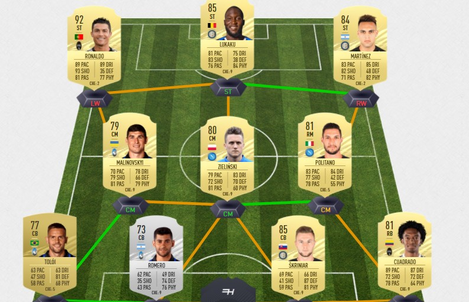

```{r setup, include=FALSE}
knitr::opts_chunk$set(echo = TRUE)
```

```{r}
library(tidyverse)
library(tidymodels)
library(lubridate)
library(vip)
library(stacks)
library(DALEX)
library(DALEXtra)
library(themis)
```


#Serie A

```{r}
fifa19_modeling_serie_a2 <- fifa19_modeling_serie_a %>%
  mutate(Player = paste(Player, '19'))

fifa18_modeling_serie_a2 <- fifa18_modeling_serie_a %>%
  mutate(Player = paste(Player, '18'))

fifa17_modeling_serie_a2 <- fifa17_modeling_serie_a %>%
  mutate(Player = paste(Player, '17'))


serie_a_modeling <- fifa17_modeling_serie_a2%>% 
  bind_rows(fifa18_modeling_serie_a2, fifa19_modeling_serie_a2) %>% 
  mutate(revision = as.factor(revision), Nation = as.factor(Nation))
```

```{r}
serie_a_modeling %>% 
  select(where(is.numeric)) %>% 
  pivot_longer(cols = everything(),
               names_to = "variable", 
               values_to = "value") %>% 
  ggplot(aes(x = value)) +
  geom_histogram(bins = 30) +
  facet_wrap(vars(variable), 
             scales = "free")
```

```{r}
serie_a_modeling %>% 
  ggplot(aes(x = revision, fill = revision)) +
  geom_bar() +
  scale_fill_manual(values = c("TOTS" = "blue", "Normal" = "gold"))
```


```{r}
serie_a_modeling %>% 
  ggplot(aes(x = Gls, fill = revision)) +
  geom_density(alpha = 0.5) +
  scale_fill_manual(values = c("TOTS" = "blue", "Normal" = "gold")) +
  xlab("Goals")
```

```{r}
serie_a_modeling %>% 
  ggplot(aes(x = Rk, fill = revision)) +
  geom_density(alpha = 0.5) +
  scale_fill_manual(values = c("TOTS" = "blue", "Normal" = "gold")) +
  xlab("Table Position")
```
```{r}
serie_a_modeling %>% 
  ggplot(aes(x = minutes_played_divided_by90, fill = revision)) +
  geom_density(alpha = 0.5) +
  scale_fill_manual(values = c("TOTS" = "blue", "Normal" = "gold")) +
  xlab("Total Minutes Played Dived by 90 (Full Games Played)")
```
```{r}
serie_a_modeling %>% 
  ggplot(aes(x = position, fill = revision)) +
  geom_bar(position = "dodge") +
  scale_fill_manual(values = c("TOTS" = "blue", "Normal" = "gold"))
```


```{r}
serie_a_modeling_outfield <- serie_a_modeling %>% 
  filter(position != "GK") %>% 
  #filter(position %in% c("ST", "LW", "RW", "CF", "CAM")) %>% 
  filter(minutes_played_divided_by90 >= 19) %>% 
  mutate(position = ifelse(position == "RWB", "RB", ifelse(position == "LWB", "LB", position))) %>%  
  select(-Goals_allowed, -GA90, -SoTA, -Saves, -Save_percent, -W, -L, -D, -CS, -CS_percent, -Pkatt_against, -PKA, -PKsv, -Pk_Save_percent, -PKm)
```


```{r}
set.seed(494)
serie_a_split <- initial_split(serie_a_modeling_outfield, prop = .75, strata = "revision")
serie_a_training <- training(serie_a_split)
serie_a_testing <- testing(serie_a_split)
```

```{r}
serie_a_ranger_recipe <- recipe(revision ~., data = serie_a_training) %>% 
  step_rm(Player, Nation, Squad, Born, G_per90, A_per90, minutes_played_divided_by90, Attendance) %>% 
  step_upsample(revision, over_ratio = .4) %>% 
  step_mutate_at(all_numeric(), fn = ~as.numeric(.))

serie_a_ranger_recipe %>% 
  prep(serie_a_training) %>% 
  juice()
```


```{r}
serie_a_ranger <- rand_forest(mtry = tune(), 
              min_n = tune(), 
              trees = 100) %>% 
  set_mode("classification") %>% 
  set_engine("ranger")

serie_a_ranger_wf <- 
  workflow() %>% 
  add_recipe(serie_a_ranger_recipe) %>% 
  add_model(serie_a_ranger) 

serie_a_ranger_wf
```


```{r}
set.seed(494)
serie_a_cv <- vfold_cv(serie_a_training, v = 5)

serie_a_rf_grid <- grid_regular(min_n(), finalize(mtry(), serie_a_training %>% select(-revision)), levels = 3)

ctrl_res <- control_stack_grid()

serie_a_ranger_cv <- serie_a_ranger_wf %>% 
  tune_grid(resamples = serie_a_cv,
           grid = serie_a_rf_grid,
           control = ctrl_res)

collect_metrics(serie_a_ranger_cv)
```


```{r}
serie_a_best1 <- serie_a_ranger_cv %>% 
  select_best(metric = "accuracy")

serie_a_ranger_final_wf<- serie_a_ranger_wf %>% 
  finalize_workflow(serie_a_best1)
```

```{r}
set.seed(494)
serie_a_ranger_fit <- serie_a_ranger_final_wf %>% 
  fit(serie_a_training)


serie_a_rf_explain <- 
  explain_tidymodels(
    model = serie_a_ranger_fit,
    data = serie_a_training %>% select(-revision), 
    y = as.numeric(serie_a_training$revision == "TOTS"),
    label = "rf"
  )
```

```{r}
serie_a_rf_var_imp <- 
  model_parts(
    serie_a_rf_explain
    )

plot(serie_a_rf_var_imp)
```


```{r}
serie_a_ranger_test <- serie_a_ranger_final_wf %>% 
  last_fit(serie_a_split)

serie_a_ranger_test %>% 
  collect_metrics()
```

```{r}
preds1 <- serie_a_ranger_test %>% 
  collect_predictions()

preds1 %>% 
  conf_mat(revision, .pred_class)
```

```{r}
serie_a_ranger_test <- serie_a_testing %>% 
  bind_cols(predict(serie_a_ranger_fit, new_data = serie_a_testing, type = "prob")) %>% 
  bind_cols(predict(serie_a_ranger_fit, new_data = serie_a_testing)) 
```

```{r}
serie_a_ranger_test %>% 
  conf_mat(revision, .pred_class)
```

```{r}
serie_a_ranger_test %>% 
  filter(revision != .pred_class)
```


```{r}
serie_a_modeling21 <- fifa21_modeling_serie_a %>% 
  mutate(revision = as.factor(revision), Nation = as.factor(Nation), Age = as.integer(Age))
```

```{r}
serie_a_modeling_outfield21 <- serie_a_modeling21 %>% 
  filter(position != "GK") %>% 
  #filter(position %in% c("ST", "LW", "RW", "CF", "CAM")) %>% 
  filter(minutes_played_divided_by90 >= 14) %>% 
  mutate(position = ifelse(position == "RWB", "RB", ifelse(position == "LWB", "LB", position)))
```


```{r}
serie_a_ranger_test21 <- serie_a_modeling_outfield21 %>% 
  bind_cols(predict(serie_a_ranger_fit, new_data = serie_a_modeling_outfield21, type = "prob")) %>% 
  bind_cols(predict(serie_a_ranger_fit, new_data = serie_a_modeling_outfield21)) 
```

```{r}
serie_a_ranger_test21 %>% 
  filter(position %in% c("ST", "RW", "CF", "LW")) %>% 
  arrange(desc(.pred_TOTS)) %>% 
  head(5)
```
```{r}
serie_a_ranger_test21 %>% 
  filter(position %in% c("CAM", "CM", "CDM", "LM", "RM")) %>% 
  arrange(desc(.pred_TOTS)) %>% 
  head(5)
```


```{r}
serie_a_ranger_test21 %>% 
  filter(position %in% c("LB", "CB", "RB")) %>% 
  arrange(desc(.pred_TOTS)) %>% 
  head(5)
```


#Prem

```{r}
fifa19_modeling2 <- fifa19_modeling %>%
  mutate(Player = paste(Player, '19'))

fifa18_modeling2 <- fifa18_modeling %>%
  mutate(Player = paste(Player, '18'))

fifa17_modeling2 <- fifa17_modeling %>%
  mutate(Player = paste(Player, '17'))


prem_modeling <- fifa17_modeling2 %>% 
  bind_rows(fifa18_modeling2, fifa19_modeling2) %>% 
  mutate(revision = as.factor(revision), Nation = as.factor(Nation))
```

```{r}
prem_modeling %>% 
  select(where(is.numeric)) %>% 
  pivot_longer(cols = everything(),
               names_to = "variable", 
               values_to = "value") %>% 
  ggplot(aes(x = value)) +
  geom_histogram(bins = 30) +
  facet_wrap(vars(variable), 
             scales = "free")
```

```{r}
prem_modeling %>% 
  ggplot(aes(x = revision, fill = revision)) +
  geom_bar() +
  scale_fill_manual(values = c("TOTS" = "blue", "Normal" = "gold"))
```


```{r}
prem_modeling %>% 
  ggplot(aes(x = Gls, fill = revision)) +
  geom_density(alpha = 0.5) +
  scale_fill_manual(values = c("TOTS" = "blue", "Normal" = "gold")) +
  xlab("Goals")
```

```{r}
prem_modeling %>% 
  ggplot(aes(x = Rk, fill = revision)) +
  geom_density(alpha = 0.5) +
  scale_fill_manual(values = c("TOTS" = "blue", "Normal" = "gold")) +
  xlab("Table Position")
```
```{r}
prem_modeling %>% 
  ggplot(aes(x = minutes_played_divided_by90, fill = revision)) +
  geom_density(alpha = 0.5) +
  scale_fill_manual(values = c("TOTS" = "blue", "Normal" = "gold")) +
  xlab("Total Minutes Played Dived by 90 (Full Games Played)")
```
```{r}
prem_modeling %>% 
  ggplot(aes(x = position, fill = revision)) +
  geom_bar(position = "dodge") +
  scale_fill_manual(values = c("TOTS" = "blue", "Normal" = "gold"))
```


```{r}
prem_modeling_outfield <- prem_modeling %>% 
  filter(position != "GK") %>% 
  #filter(position %in% c("ST", "LW", "RW", "CF", "CAM")) %>% 
  filter(minutes_played_divided_by90 >= 19) %>% 
  mutate(position = ifelse(position == "RWB", "RB", ifelse(position == "LWB", "LB", position))) %>% 
  select(-Goals_allowed, -GA90, -SoTA, -Saves, -Save_percent, -W, -L, -D, -CS, -CS_percent, -Pkatt_against, -PKA, -PKsv, -Pk_Save_percent, -PKm)
```


```{r}
set.seed(494)
prem_split <- initial_split(prem_modeling_outfield, prop = .75, strata = "revision")
prem_training <- training(prem_split)
prem_testing <- testing(prem_split)
```

```{r}
prem_ranger_recipe <- recipe(revision ~., data = prem_training) %>% 
  step_rm(Player, Nation, Squad, G_per90, A_per90, minutes_played_divided_by90, Attendance, Born) %>% 
  step_upsample(revision, over_ratio = .33) %>% 
  step_mutate_at(all_numeric(), fn = ~as.numeric(.))

prem_ranger_recipe %>% 
  prep(prem_training) %>% 
  juice()
```


```{r}
prem_ranger <- rand_forest(mtry = tune(), 
              min_n = tune(), 
              trees = 100) %>% 
  set_mode("classification") %>% 
  set_engine("ranger")

prem_ranger_wf <- 
  workflow() %>% 
  add_recipe(prem_ranger_recipe) %>% 
  add_model(prem_ranger) 

prem_ranger_wf
```


```{r}
set.seed(494)
prem_cv <- vfold_cv(prem_training, v = 5)

prem_rf_grid <- grid_regular(min_n(), finalize(mtry(), prem_training %>% select(-revision)), levels = 3)

ctrl_res <- control_stack_grid()

prem_ranger_cv <- prem_ranger_wf %>% 
  tune_grid(resamples = prem_cv,
           grid = prem_rf_grid,
           control = ctrl_res)

collect_metrics(prem_ranger_cv)
```


```{r}
prem_best1 <- prem_ranger_cv %>% 
  select_best(metric = "accuracy")

prem_ranger_final_wf<- prem_ranger_wf %>% 
  finalize_workflow(prem_best1)
```

```{r}
set.seed(494)
prem_ranger_fit <- prem_ranger_final_wf %>% 
  fit(prem_training)


prem_rf_explain <- 
  explain_tidymodels(
    model = prem_ranger_fit,
    data = prem_training %>% select(-revision), 
    y = as.numeric(prem_training$revision == "TOTS"),
    label = "rf"
  )
```

```{r}
prem_rf_var_imp <- 
  model_parts(
    prem_rf_explain
    )

plot(prem_rf_var_imp)
```


```{r}
prem_ranger_test <- prem_ranger_final_wf %>% 
  last_fit(prem_split)

prem_ranger_test %>% 
  collect_metrics()
```

```{r}
prem_preds1 <- prem_ranger_test %>% 
  collect_predictions()

prem_preds1 %>% 
  conf_mat(revision, .pred_class)
```

```{r}
prem_ranger_test <- prem_testing %>% 
  bind_cols(predict(prem_ranger_fit, new_data = prem_testing, type = "prob")) %>% 
  bind_cols(predict(prem_ranger_fit, new_data = prem_testing)) 
```

```{r}
prem_ranger_test %>% 
  conf_mat(revision, .pred_class)
```

```{r}
prem_ranger_test %>% 
  filter(revision != .pred_class)
```


```{r}
prem_modeling21 <- fifa21_modeling %>% 
  mutate(revision = as.factor(revision), Nation = as.factor(Nation), Age = as.integer(Age))
```

```{r}
prem_modeling_outfield21 <- prem_modeling21 %>% 
  filter(position != "GK") %>% 
  #filter(position %in% c("ST", "LW", "RW", "CF", "CAM")) %>% 
  filter(minutes_played_divided_by90 >= 19) %>% 
  mutate(position = ifelse(position == "RWB", "RB", ifelse(position == "LWB", "LB", position)))
```


```{r}
prem_ranger_test21 <- prem_modeling_outfield21 %>% 
  bind_cols(predict(prem_ranger_fit, new_data = prem_modeling_outfield21, type = "prob")) %>% 
  bind_cols(predict(prem_ranger_fit, new_data = prem_modeling_outfield21)) 
```

```{r}
prem_ranger_test21 %>% 
  filter(position %in% c("ST", "RW", "CF", "LW")) %>% 
  arrange(desc(.pred_TOTS)) %>% 
  head(5)
```
```{r}
prem_ranger_test21 %>% 
  filter(position %in% c("CAM", "CM", "CDM", "LM", "RM")) %>% 
  arrange(desc(.pred_TOTS)) %>% 
  head(5)
```


```{r}
prem_ranger_test21 %>% 
  filter(position %in% c("LB", "CB", "RB")) %>% 
  arrange(desc(.pred_TOTS)) %>% 
  head(5)
```


#LaLiga
```{r}
fifa19_modeling_la_liga2 <- fifa19_modeling_la_liga %>%
  mutate(Player = paste(Player, '19'))

fifa18_modeling_la_liga2 <- fifa18_modeling_la_liga %>%
  mutate(Player = paste(Player, '18'))

fifa17_modeling_la_liga2 <- fifa17_modeling_la_liga %>%
  mutate(Player = paste(Player, '17'))


la_liga_modeling <- fifa17_modeling_la_liga2%>% 
  bind_rows(fifa18_modeling_la_liga2, fifa19_modeling_la_liga2) %>% 
  select(-Starts) %>% 
  mutate(revision = as.factor(revision), Nation = as.factor(Nation))
```

```{r}
la_liga_modeling %>% 
  select(where(is.numeric)) %>% 
  pivot_longer(cols = everything(),
               names_to = "variable", 
               values_to = "value") %>% 
  ggplot(aes(x = value)) +
  geom_histogram(bins = 30) +
  facet_wrap(vars(variable), 
             scales = "free")
```

```{r}
la_liga_modeling %>% 
  ggplot(aes(x = revision, fill = revision)) +
  geom_bar() +
  scale_fill_manual(values = c("TOTS" = "blue", "Normal" = "gold"))
```


```{r}
la_liga_modeling %>% 
  ggplot(aes(x = Gls, fill = revision)) +
  geom_density(alpha = 0.5) +
  scale_fill_manual(values = c("TOTS" = "blue", "Normal" = "gold")) +
  xlab("Goals")
```

```{r}
la_liga_modeling %>% 
  ggplot(aes(x = Rk, fill = revision)) +
  geom_density(alpha = 0.5) +
  scale_fill_manual(values = c("TOTS" = "blue", "Normal" = "gold")) +
  xlab("Table Position")
```
```{r}
la_liga_modeling %>% 
  ggplot(aes(x = minutes_played_divided_by90, fill = revision)) +
  geom_density(alpha = 0.5) +
  scale_fill_manual(values = c("TOTS" = "blue", "Normal" = "gold")) +
  xlab("Total Minutes Played Dived by 90 (Full Games Played)")
```
```{r}
la_liga_modeling %>% 
  ggplot(aes(x = position, fill = revision)) +
  geom_bar(position = "dodge") +
  scale_fill_manual(values = c("TOTS" = "blue", "Normal" = "gold"))
```


```{r}
la_liga_modeling_outfield <- la_liga_modeling %>% 
  filter(position != "GK") %>% 
  #filter(position %in% c("ST", "LW", "RW", "CF", "CAM")) %>% 
  filter(minutes_played_divided_by90 >= 19) %>% 
  mutate(position = ifelse(position == "RWB", "RB", ifelse(position == "LWB", "LB", ifelse(position == "CF", "ST", position)))) %>% 
  select(-Goals_allowed, -GA90, -SoTA, -Saves, -Save_percent, -W, -L, -D, -CS, -CS_percent, -Pkatt_against, -PKA, -PKsv, -Pk_Save_percent, -PKm)
```


```{r}
set.seed(494)
la_liga_split <- initial_split(la_liga_modeling_outfield, prop = .75, strata = "revision")
la_liga_training <- training(la_liga_split)
la_liga_testing <- testing(la_liga_split)
```
```{r}
la_liga_ranger_recipe <- recipe(revision ~., data = la_liga_training) %>% 
  step_rm(Player, Nation, Squad, Born, G_per90, A_per90, minutes_played_divided_by90, OG, Attendance) %>% 
  step_upsample(revision, over_ratio = .5) %>% 
  step_mutate_at(all_numeric(), fn = ~as.numeric(.))

la_liga_ranger_recipe %>% 
  prep(la_liga_training) %>% 
  juice()
```


```{r}
la_liga_ranger <- rand_forest(mtry = tune(), 
              min_n = tune(), 
              trees = 100) %>% 
  set_mode("classification") %>% 
  set_engine("ranger")

la_liga_ranger_wf <- 
  workflow() %>% 
  add_recipe(la_liga_ranger_recipe) %>% 
  add_model(la_liga_ranger) 

la_liga_ranger_wf
```


```{r}
set.seed(494)
la_liga_cv <- vfold_cv(la_liga_training, v = 5)

la_liga_rf_grid <- grid_regular(min_n(), finalize(mtry(), la_liga_training %>% select(-revision)), levels = 3)

ctrl_res <- control_stack_grid()

la_liga_ranger_cv <- la_liga_ranger_wf %>% 
  tune_grid(resamples = la_liga_cv,
           grid = la_liga_rf_grid,
           control = ctrl_res)

collect_metrics(la_liga_ranger_cv)
```


```{r}
la_liga_best1 <- la_liga_ranger_cv %>% 
  select_best(metric = "accuracy")

la_liga_ranger_final_wf<- la_liga_ranger_wf %>% 
  finalize_workflow(la_liga_best1)
```

```{r}
set.seed(494)
la_liga_ranger_fit <- la_liga_ranger_final_wf %>% 
  fit(la_liga_training)


la_liga_rf_explain <- 
  explain_tidymodels(
    model = la_liga_ranger_fit,
    data = la_liga_training %>% select(-revision), 
    y = as.numeric(la_liga_training$revision == "TOTS"),
    label = "rf"
  )
```

```{r}
la_liga_rf_var_imp <- 
  model_parts(
    la_liga_rf_explain
    )

plot(la_liga_rf_var_imp)
```


```{r}
la_liga_ranger_test <- la_liga_ranger_final_wf %>% 
  last_fit(la_liga_split)

la_liga_ranger_test %>% 
  collect_metrics()
```

```{r}
preds1 <- la_liga_ranger_test %>% 
  collect_predictions()

preds1 %>% 
  conf_mat(revision, .pred_class)
```

```{r}
la_liga_ranger_test <- la_liga_testing %>% 
  bind_cols(predict(la_liga_ranger_fit, new_data = la_liga_testing, type = "prob")) %>% 
  bind_cols(predict(la_liga_ranger_fit, new_data = la_liga_testing)) 
```

```{r}
la_liga_ranger_test %>% 
  conf_mat(revision, .pred_class)
```

```{r}
la_liga_ranger_test %>% 
  filter(revision != .pred_class)
```


```{r}
la_liga_modeling21 <- fifa21_modeling_la_liga %>% 
  mutate(revision = as.factor(revision), Nation = as.factor(Nation), Age = as.integer(Age))
```

```{r}
la_liga_modeling_outfield21 <- la_liga_modeling21 %>% 
  filter(position != "GK") %>% 
  #filter(position %in% c("ST", "LW", "RW", "CF", "CAM")) %>% 
  filter(minutes_played_divided_by90 >= 14) %>% 
  mutate(position = ifelse(position == "RWB", "RB", ifelse(position == "LWB", "LB", ifelse(position == "CF", "ST", position))))
```


```{r}
la_liga_ranger_test21 <- la_liga_modeling_outfield21 %>% 
  bind_cols(predict(la_liga_ranger_fit, new_data = la_liga_modeling_outfield21, type = "prob")) %>% 
  bind_cols(predict(la_liga_ranger_fit, new_data = la_liga_modeling_outfield21)) 
```


```{r}
la_liga_ranger_test21 %>% 
  filter(position %in% c("ST", "RW", "CF", "LW")) %>% 
  arrange(desc(.pred_TOTS)) %>% 
  head(5)
```
```{r}
la_liga_ranger_test21 %>% 
  filter(position %in% c("CAM", "CM", "CDM", "LM", "RM")) %>% 
  arrange(desc(.pred_TOTS)) %>% 
  head(5)
```


```{r}
la_liga_ranger_test21 %>% 
  filter(position %in% c("LB", "CB", "RB")) %>% 
  arrange(desc(.pred_TOTS)) %>% 
  head(5)
```


#Bundesliga

```{r}
fifa19_modeling_bundesliga2 <- fifa19_modeling_bundesliga %>%
  mutate(Player = paste(Player, '19'))

fifa18_modeling_bundesliga2 <- fifa18_modeling_bundesliga %>%
  mutate(Player = paste(Player, '18'))

fifa17_modeling_bundesliga2 <- fifa17_modeling_bundesliga %>%
  mutate(Player = paste(Player, '17'))


bundesliga_modeling <- fifa17_modeling_bundesliga2%>% 
  bind_rows(fifa18_modeling_bundesliga2, fifa19_modeling_bundesliga2) %>% 
  mutate(revision = as.factor(revision), Nation = as.factor(Nation))
```

```{r}
bundesliga_modeling %>% 
  select(where(is.numeric)) %>% 
  pivot_longer(cols = everything(),
               names_to = "variable", 
               values_to = "value") %>% 
  ggplot(aes(x = value)) +
  geom_histogram(bins = 30) +
  facet_wrap(vars(variable), 
             scales = "free")
```

```{r}
bundesliga_modeling %>% 
  ggplot(aes(x = revision, fill = revision)) +
  geom_bar() +
  scale_fill_manual(values = c("TOTS" = "blue", "Normal" = "gold"))
```


```{r}
bundesliga_modeling %>% 
  ggplot(aes(x = Gls, fill = revision)) +
  geom_density(alpha = 0.5) +
  scale_fill_manual(values = c("TOTS" = "blue", "Normal" = "gold")) +
  xlab("Goals")
```

```{r}
bundesliga_modeling %>% 
  ggplot(aes(x = Rk, fill = revision)) +
  geom_density(alpha = 0.5) +
  scale_fill_manual(values = c("TOTS" = "blue", "Normal" = "gold")) +
  xlab("Table Position")
```
```{r}
bundesliga_modeling %>% 
  ggplot(aes(x = minutes_played_divided_by90, fill = revision)) +
  geom_density(alpha = 0.5) +
  scale_fill_manual(values = c("TOTS" = "blue", "Normal" = "gold")) +
  xlab("Total Minutes Played Dived by 90 (Full Games Played)")
```
```{r}
bundesliga_modeling %>% 
  ggplot(aes(x = position, fill = revision)) +
  geom_bar(position = "dodge") +
  scale_fill_manual(values = c("TOTS" = "blue", "Normal" = "gold"))
```


```{r}
bundesliga_modeling_outfield <- bundesliga_modeling %>% 
  filter(position != "GK") %>% 
  #filter(position %in% c("ST", "LW", "RW", "CF", "CAM")) %>% 
  filter(minutes_played_divided_by90 >= 19) %>% 
  mutate(position = ifelse(position == "RWB", "RB", ifelse(position == "LWB", "LB", ifelse(position == "RW", "RM", ifelse(position == "LW", "LM", position))))) %>% 
  select(-Goals_allowed, -GA90, -SoTA, -Saves, -Save_percent, -W, -L, -D, -CS, -CS_percent, -Pkatt_against, -PKA, -PKsv, -Pk_Save_percent, -PKm)
```


```{r}
set.seed(494)
bundesliga_split <- initial_split(bundesliga_modeling_outfield, prop = .75, strata = "revision")
bundesliga_training <- training(bundesliga_split)
bundesliga_testing <- testing(bundesliga_split)
```

```{r}
bundesliga_ranger_recipe <- recipe(revision ~., data = bundesliga_training) %>% 
  step_rm(Player, Nation, Squad, G_per90, A_per90, minutes_played_divided_by90, Attendance, Born) %>% 
  step_upsample(revision, over_ratio = .55) %>% 
  step_mutate_at(all_numeric(), fn = ~as.numeric(.))

bundesliga_ranger_recipe %>% 
  prep(bundesliga_training) %>% 
  juice()
```


```{r}
bundesliga_ranger <- rand_forest(mtry = tune(), 
              min_n = tune(), 
              trees = 100) %>% 
  set_mode("classification") %>% 
  set_engine("ranger")

bundesliga_ranger_wf <- 
  workflow() %>% 
  add_recipe(bundesliga_ranger_recipe) %>% 
  add_model(bundesliga_ranger) 

bundesliga_ranger_wf
```


```{r}
set.seed(494)
bundesliga_cv <- vfold_cv(bundesliga_training, v = 5)

bundesliga_rf_grid <- grid_regular(min_n(), finalize(mtry(), bundesliga_training %>% select(-revision)), levels = 3)

ctrl_res <- control_stack_grid()

bundesliga_ranger_cv <- bundesliga_ranger_wf %>% 
  tune_grid(resamples = bundesliga_cv,
           grid = bundesliga_rf_grid,
           control = ctrl_res)

collect_metrics(bundesliga_ranger_cv)
```


```{r}
bundesliga_best1 <- bundesliga_ranger_cv %>% 
  select_best(metric = "accuracy")

bundesliga_ranger_final_wf<- bundesliga_ranger_wf %>% 
  finalize_workflow(bundesliga_best1)
```

```{r}
set.seed(494)
bundesliga_ranger_fit <- bundesliga_ranger_final_wf %>% 
  fit(bundesliga_training)


bundesliga_rf_explain <- 
  explain_tidymodels(
    model = bundesliga_ranger_fit,
    data = bundesliga_training %>% select(-revision), 
    y = as.numeric(bundesliga_training$revision == "TOTS"),
    label = "rf"
  )
```

```{r}
bundesliga_rf_var_imp <- 
  model_parts(
    bundesliga_rf_explain
    )

plot(bundesliga_rf_var_imp)
```


```{r}
bundesliga_ranger_test <- bundesliga_ranger_final_wf %>% 
  last_fit(bundesliga_split)

bundesliga_ranger_test %>% 
  collect_metrics()
```

```{r}
preds1 <- bundesliga_ranger_test %>% 
  collect_predictions()

preds1 %>% 
  conf_mat(revision, .pred_class)
```

```{r}
bundesliga_ranger_test <- bundesliga_testing %>% 
  bind_cols(predict(bundesliga_ranger_fit, new_data = bundesliga_testing, type = "prob")) %>% 
  bind_cols(predict(bundesliga_ranger_fit, new_data = bundesliga_testing)) 
```

```{r}
bundesliga_ranger_test %>% 
  conf_mat(revision, .pred_class)
```

```{r}
bundesliga_ranger_test %>% 
  filter(revision != .pred_class)
```

```{r}
bundesliga_modeling21 <- fifa21_modeling_bundesliga %>% 
  mutate(revision = as.factor(revision), Nation = as.factor(Nation), Age = as.integer(Age))
```

```{r}
bundesliga_modeling_outfield21 <- bundesliga_modeling21 %>% 
  filter(position != "GK") %>% 
  #filter(position %in% c("ST", "LW", "RW", "CF", "CAM")) %>% 
  filter(minutes_played_divided_by90 >= 18) %>% 
  mutate(position = ifelse(position == "RWB", "RB", ifelse(position == "LWB", "LB", ifelse(position == "RW", "RM", ifelse(position == "LW", "LM", position)))))
```


```{r}
bundesliga_ranger_test21 <- bundesliga_modeling_outfield21 %>% 
  bind_cols(predict(bundesliga_ranger_fit, new_data = bundesliga_modeling_outfield21, type = "prob")) %>% 
  bind_cols(predict(bundesliga_ranger_fit, new_data = bundesliga_modeling_outfield21)) 
```


```{r}
bundesliga_ranger_test21 %>% 
  filter(position %in% c("ST", "RW", "CF", "LW")) %>% 
  arrange(desc(.pred_TOTS)) %>% 
  head(5)
```
```{r}
bundesliga_ranger_test21 %>% 
  filter(position %in% c("CAM", "CM", "CDM", "LM", "RM")) %>% 
  arrange(desc(.pred_TOTS)) %>% 
  head(5)
```


```{r}
bundesliga_ranger_test21 %>% 
  filter(position %in% c("LB", "CB", "RB")) %>% 
  arrange(desc(.pred_TOTS)) %>% 
  head(5)
```


#Ligue1

```{r}
ligue1_modeling <- ligue1_fifa17_modeling %>% 
  bind_rows(ligue1_fifa18_modeling, ligue1_fifa19_modeling) %>% 
  mutate(revision = as.factor(revision), Nation = as.factor(Nation))
```


```{r}
ligue1_modeling %>% 
  ggplot(aes(x = Gls, fill = revision)) +
  geom_density(alpha = 0.5)
```

```{r}
ligue1_modeling %>% 
  ggplot(aes(x = Rk, fill = revision)) +
  geom_density(alpha = 0.5)
```

```{r}
ligue1_modeling %>% 
  ggplot(aes(x = minutes_played_divided_by90, fill = revision)) +
  geom_density(alpha = 0.5)
```


```{r}
ligue1_modeling_outfield <- ligue1_modeling %>% 
  filter(position != "GK") %>% 
  filter(minutes_played_divided_by90 >= 19) %>% 
  mutate(position = ifelse(position == "RWB", "RB", ifelse(position == "LWB", "LB", position))) %>% 
  select(-Goals_allowed, -GA90, -SoTA, -Saves, -Save_percent, -W, -L, -D, -CS, -CS_percent, -Pkatt_against, -PKA, -PKsv, -Pk_Save_percent, -PKm)
```


```{r}
set.seed(494)
ligue1_split <- initial_split(ligue1_modeling_outfield, prop = .75, strata = "revision")
ligue1_training <- training(ligue1_split)
ligue1_testing <- testing(ligue1_split)
```

```{r}
ligue1_ranger_recipe <- recipe(revision ~., data = ligue1_training) %>% 
  step_rm(Player, Nation, Squad, Born, minutes_played_divided_by90, G_per90, A_per90, Attendance) %>% 
  step_upsample(revision, over_ratio = .4) %>% 
  step_mutate_at(all_numeric(), fn = ~as.numeric(.))

ligue1_ranger_recipe %>% 
  prep(ligue1_training) %>% 
  juice()
```


```{r}
ligue1_ranger <- rand_forest(mtry = tune(), 
              min_n = tune(), 
              trees = 100) %>% 
  set_mode("classification") %>% 
  set_engine("ranger")

ligue1_ranger_wf <- 
  workflow() %>% 
  add_recipe(ligue1_ranger_recipe) %>% 
  add_model(ligue1_ranger) 

ligue1_ranger_wf
```


```{r}
set.seed(494)
ligue1_cv <- vfold_cv(ligue1_training, v = 5)

ligue1_rf_grid <- grid_regular(min_n(), finalize(mtry(), ligue1_training %>% select(-revision)), levels = 3)

ligue1_ctrl_res <- control_stack_grid()

ligue1_ranger_cv <- ligue1_ranger_wf %>% 
  tune_grid(resamples = ligue1_cv,
           grid = ligue1_rf_grid,
           control = ligue1_ctrl_res)

collect_metrics(ligue1_ranger_cv)
```


```{r}
ligue1_best1 <- ligue1_ranger_cv %>% 
  select_best(metric = "accuracy")

ligue1_ranger_final_wf<- ligue1_ranger_wf %>% 
  finalize_workflow(ligue1_best1)
```

```{r}
ligue1_ranger_fit <- ligue1_ranger_final_wf %>% 
  fit(ligue1_training)


ligue1_rf_explain <- 
  explain_tidymodels(
    model = ligue1_ranger_fit,
    data = ligue1_training %>% select(-revision), 
    y = as.numeric(ligue1_training$revision == "TOTS"),
    label = "rf"
  )
```

```{r}
ligue1_rf_var_imp <- 
  model_parts(
    ligue1_rf_explain
    )

plot(ligue1_rf_var_imp)
```


```{r}
ligue1_ranger_test <- ligue1_ranger_final_wf %>% 
  last_fit(ligue1_split)

ligue1_ranger_test %>% 
  collect_metrics()
```

```{r}
ligue1_preds1 <- ligue1_ranger_test %>% 
  collect_predictions()

ligue1_preds1 %>% 
  conf_mat(revision, .pred_class)
```

```{r}
ligue1_ranger_test <- ligue1_testing %>% 
  bind_cols(predict(ligue1_ranger_fit, new_data = ligue1_testing, type = "prob")) %>% 
  bind_cols(predict(ligue1_ranger_fit, new_data = ligue1_testing)) 
```

```{r}
ligue1_ranger_test %>% 
  conf_mat(revision, .pred_class)
```

```{r}
ligue1_ranger_test %>% 
  filter(revision != .pred_class)
```


```{r}
ligue1_modeling21 <- fifa21_modeling_ligue1 %>% 
  mutate(revision = as.factor(revision), Nation = as.factor(Nation), Age = as.integer(Age))
```

```{r}
ligue1_modeling_outfield21 <- ligue1_modeling21 %>% 
  filter(position != "GK") %>% 
  #filter(position %in% c("ST", "LW", "RW", "CF", "CAM")) %>% 
  filter(minutes_played_divided_by90 >= 14) %>% 
  mutate(position = ifelse(position == "RWB", "RB", ifelse(position == "LWB", "LB", position)))
```


```{r}
ligue1_ranger_test21 <- ligue1_modeling_outfield21 %>% 
  bind_cols(predict(ligue1_ranger_fit, new_data = ligue1_modeling_outfield21, type = "prob")) %>% 
  bind_cols(predict(ligue1_ranger_fit, new_data = ligue1_modeling_outfield21)) 
```


```{r}
ligue1_ranger_test21 %>% 
  filter(position %in% c("ST", "RW", "CF", "LW")) %>% 
  arrange(desc(.pred_TOTS)) %>% 
  head(5)
```
```{r}
ligue1_ranger_test21 %>% 
  filter(position %in% c("CAM", "CM", "CDM", "LM", "RM")) %>% 
  arrange(desc(.pred_TOTS)) %>% 
  head(5)
```


```{r}
ligue1_ranger_test21 %>% 
  filter(position %in% c("LB", "CB", "RB")) %>% 
  arrange(desc(.pred_TOTS)) %>% 
  head(5)
```


#Variable Legend

Revision: Whether the card is "Normal" or "Team of the Season (TOTS)"
\
Int : Interceptions
\
TklW : Tackles Won
\
OG : Own Goals
\
Pkcon : Penalties Conceded
\
MP: Matches Played
\
Min : Minutes
\
Gls : Goals
\
Ast: Assists
\
Non_Pk_G : Non Penalty Goals (Goals from Open Play or Free Kicks)
\
Pk: Penalty Kicks
\
Pkatt: Penalty Attempts
\
CrdY : Yellow Cards
\
CrdR : Red Cards
\
G_per90 : Goals per 90 minutes 
\
A_per90 : Assists per 90 minutes
\
G_plus_A_per90 : Goals plus Assists per 90 minutes
\
G_minus_pk_per90 : Non Penalty Goals per 90 minutes
\
Rk : Table Position
\
GF : Goals For (Goals your team has scored)
\
GA : Goals Against (Goals your team has conceded)
\
GD : Goal Difference (GF-GA)
\
Pts : Team Points for the Season (3 for a win, 1 for a draw, 0 for a loss)