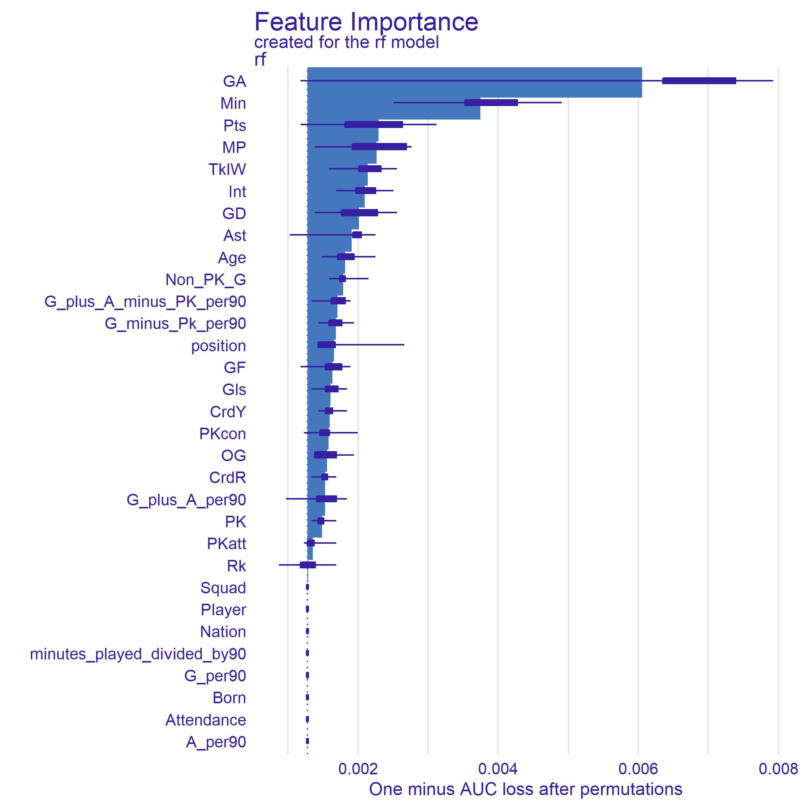

```{r setup, include = FALSE}
knitr::opts_chunk$set(include = TRUE, echo = FALSE)
set.seed(494)
```

```{r libraries, include = FALSE}
library(tidyverse)
library(tidymodels)
library(lubridate)
library(vip)
library(stacks)
library(DALEX)
library(DALEXtra)
library(themis)
library(formattable)
library(kableExtra)
library(cowplot)
library(formattable)
library(kableExtra)
library(cvms)
```

```{r base models, echo = FALSE}
fifa17_modeling <- readRDS("prem17mod")
fifa18_modeling <- readRDS("prem18mod")
fifa19_modeling <- readRDS("prem19mod")
fifa21_modeling <- readRDS("prem21mod")
fifa17_modeling_la_liga <- readRDS("laliga17mod")
fifa18_modeling_la_liga <- readRDS("laliga18mod")
fifa19_modeling_la_liga <- readRDS("laliga19mod")
fifa21_modeling_la_liga <- readRDS("laliga21mod")
ligue1_fifa17_modeling <- readRDS("ligue1_17mod")
ligue1_fifa18_modeling <- readRDS("ligue1_18mod")
ligue1_fifa19_modeling <- readRDS("ligue1_19mod")
fifa21_modeling_ligue1 <- readRDS("ligue1_21mod")
fifa17_modeling_serie_a <- readRDS("seriea17mod")
fifa18_modeling_serie_a <- readRDS("seriea18mod")
fifa19_modeling_serie_a <- readRDS("seriea19mod")
fifa21_modeling_serie_a <- readRDS("seriea21mod")
fifa17_modeling_bundesliga <- readRDS("bundesliga17mod")
fifa18_modeling_bundesliga <- readRDS("bundesliga18mod")
fifa19_modeling_bundesliga <- readRDS("bundesliga19mod")
fifa21_modeling_bundesliga <- readRDS("bundesliga21mod")
```

```{r premmod1, echo = FALSE}
fifa19_modeling2 <- fifa19_modeling %>%
  mutate(Player = paste(Player, '19'))

fifa18_modeling2 <- fifa18_modeling %>%
  mutate(Player = paste(Player, '18'))

fifa17_modeling2 <- fifa17_modeling %>%
  mutate(Player = paste(Player, '17'))


prem_modeling <- fifa17_modeling2 %>% 
  bind_rows(fifa18_modeling2, fifa19_modeling2) %>% 
  mutate(revision = as.factor(revision), Nation = as.factor(Nation))
```

```{r premmod3, echo = FALSE}
prem_modeling_outfield <- prem_modeling %>% 
  filter(position != "GK") %>% 
  filter(minutes_played_divided_by90 >= 19) %>% 
  mutate(position = ifelse(position == "RWB", "RB", ifelse(position == "LWB", "LB", position))) %>% 
  select(-Goals_allowed, -GA90, -SoTA, -Saves, -Save_percent, -W, -L, -D, -CS, -CS_percent, -Pkatt_against, -PKA, -PKsv, -Pk_Save_percent, -PKm)
```

```{r premmod4, echo = FALSE}
set.seed(494)
prem_split <- initial_split(prem_modeling_outfield, prop = .75, strata = "revision")
prem_training <- training(prem_split)
prem_testing <- testing(prem_split)
```

```{r message = FALSE, warning = FALSE, echo = FALSE}
prem_train_metrics <- prem_training %>% 
  mutate(Type = "Training") %>% 
  rename(Revision = revision) %>% 
  group_by(Revision, Type) %>% 
  summarize(Goals = mean(Gls, na.rm = T), Assists = mean(Ast, na.rm = T), `Non PK Goals` = mean(Non_PK_G, na.rm = T), PK = mean(PK, na.rm = T), `Team Rank` = mean(Rk, na.rm = T), `Minutes Per 90` = mean(Min, na.rm = T)/90 , `Goals SD` = sd(Gls, na.rm = T), `Assists SD` = sd(Ast, na.rm = T), `Non PK Goals SD` = sd(Non_PK_G, na.rm = T),`Team Rank SD` = sd(Rk, na.rm = T), `Minutes Per 90 SD` = sd(Min, na.rm = T)/90)

prem_test_metrics <- prem_testing %>% 
  mutate(Type = "Testing") %>% 
  rename(Revision = revision) %>% 
  group_by(Revision, Type) %>% 
  summarize(Goals = mean(Gls, na.rm = T), Assists = mean(Ast, na.rm = T), `Non PK Goals` = mean(Non_PK_G, na.rm = T), PK = mean(PK, na.rm = T), `Team Rank` = mean(Rk, na.rm = T), `Minutes Per 90` = mean(Min, na.rm = T)/90 , `Goals SD` = sd(Gls, na.rm = T), `Assists SD` = sd(Ast, na.rm = T), `Non PK Goals SD` = sd(Non_PK_G, na.rm = T),`Team Rank SD` = sd(Rk, na.rm = T), `Minutes Per 90 SD` = sd(Min, na.rm = T)/90)


prem_rebound_split <- rbind(prem_train_metrics, prem_test_metrics) %>% arrange(Revision)

prem_metrics_table <- formattable(prem_rebound_split[1:4,1:13])

kable(prem_metrics_table, align = c(rep('c', 1))) %>% 
  row_spec(0) %>% 
  kable_styling(full_width = F) %>% 
  add_header_above(c("Premier League Training and Testing Group Comparison for Suspected KPIs" = 13), background = "purple", color = "white")
```

```{r premranger1, include = FALSE}
prem_ranger_recipe <- recipe(revision ~., data = prem_training) %>% 
  step_rm(Player, Nation, Squad, G_per90, A_per90, minutes_played_divided_by90, Attendance, Born) %>% 
  step_upsample(revision, over_ratio = .33) %>% 
  step_mutate_at(all_numeric(), fn = ~as.numeric(.))

prem_ranger_recipe %>% 
  prep(prem_training) %>% 
  juice()
```


```{r premranger2, include = FALSE}
prem_ranger <- rand_forest(mtry = tune(), 
              min_n = tune(), 
              trees = 100) %>% 
  set_mode("classification") %>% 
  set_engine("ranger")

prem_ranger_wf <- 
  workflow() %>% 
  add_recipe(prem_ranger_recipe) %>% 
  add_model(prem_ranger) 

prem_ranger_wf
```

```{r premranger3, include = FALSE}
set.seed(494)
prem_cv <- vfold_cv(prem_training, v = 5)

prem_rf_grid <- grid_regular(min_n(), finalize(mtry(), prem_training %>% select(-revision)), levels = 3)

ctrl_res <- control_stack_grid()

prem_ranger_cv <- prem_ranger_wf %>% 
  tune_grid(resamples = prem_cv,
           grid = prem_rf_grid,
           control = ctrl_res)

collect_metrics(prem_ranger_cv)
```

```{r premranger4, echo = FALSE}
prem_best1 <- prem_ranger_cv %>% 
  select_best(metric = "accuracy")

prem_ranger_final_wf<- prem_ranger_wf %>% 
  finalize_workflow(prem_best1)
```

```{r premranger5, include = FALSE}
set.seed(494)
prem_ranger_fit <- prem_ranger_final_wf %>% 
  fit(prem_training)
```

```{r premranger5.1, echo = FALSE}
set.seed(494)

prem_rf_explain <- 
  explain_tidymodels(
    model = prem_ranger_fit,
    data = prem_training %>% select(-revision), 
    y = as.numeric(prem_training$revision == "TOTS"),
    label = "rf"
  )
```

```{r premvip1, echo = FALSE, eval=FALSE}
set.seed(494)

prem_rf_var_imp <- 
  model_parts(
    prem_rf_explain
    )

plot(prem_rf_var_imp)
```




```{r premranger6, include = FALSE}
prem_ranger_test <- prem_ranger_final_wf %>% 
  last_fit(prem_split)

prem_ranger_test %>% 
  collect_metrics()
```

```{r premconfuse1, include = FALSE}
prem_preds1 <- prem_ranger_test %>% 
  collect_predictions()

prem_preds1 %>% 
  conf_mat(`revision`, .pred_class)
```

The confusion matrix below shows that 17 players were classified as TOTS. 10 of these players were correctly classified, while the model felt that 7 players who were not given TOTS cards should have been given one. It also felt that 7 players who were given TOTS cards should not have been given one.


```{r premranger7, message = FALSE, echo = FALSE}
prem_ranger_test <- prem_testing %>% 
  bind_cols(predict(prem_ranger_fit, new_data = prem_testing, type = "prob")) %>% 
  bind_cols(predict(prem_ranger_fit, new_data = prem_testing)) 

prem_rf_preds <- prem_ranger_test %>% 
  conf_mat(revision, .pred_class)

prem_rf_ggconfusion <- autoplot(prem_rf_preds, type = "heatmap") + labs(title = "Confusion Matrix of Premier League Random Forest Model") + scale_fill_gradient(low = "blue", high = "red") + theme(plot.title = element_text(hjust = .5, size = 15))


prem_rf_final_confusion <- ggdraw() + draw_image("https://www.fifplay.com/img/public/premier-league-2-logo.png", x = -.43, y = .4, scale = .18) + 
  draw_plot(prem_rf_ggconfusion)

prem_rf_final_confusion 
```

```{r premconfuse2, echo = FALSE}
prem_ranger_test %>% 
  conf_mat(revision, .pred_class)
```

Below are the players that our testing model incorrectly classified. Many of these players were either undervalued or overvalued based on the performance of their team. It is clear that the choices for TOTS are someone subjective.

```{r premwrong1, echo = FALSE}
prem_ranger_test %>% 
  filter(revision != .pred_class)
```

```{r 21prem, echo = FALSE}
prem_modeling21 <- fifa21_modeling %>% 
  mutate(revision = as.factor(revision), Nation = as.factor(Nation), Age = as.integer(Age))
```

```{r 21premoutfield, echo = FALSE}
prem_modeling_outfield21 <- prem_modeling21 %>% 
  filter(position != "GK") %>% 
  filter(minutes_played_divided_by90 >= 19) %>% 
  mutate(position = ifelse(position == "RWB", "RB", ifelse(position == "LWB", "LB", position)))
```

```{r 21premranger1_1, echo = FALSE}
prem_ranger_test21 <- prem_modeling_outfield21 %>% 
  bind_cols(predict(prem_ranger_fit, new_data = prem_modeling_outfield21, type = "prob")) %>% 
  bind_cols(predict(prem_ranger_fit, new_data = prem_modeling_outfield21)) 
```

```{r, 21prempredictATT, echo = FALSE}
prem_ranger_test_att <- prem_ranger_test21 %>% 
  filter(position %in% c("ST", "RW", "CF", "LW")) %>% 
  arrange(desc(.pred_TOTS)) %>% 
  head(5) %>% 
  mutate(Role = ifelse(rank(.pred_TOTS, ties.method = c("first")) >= 3, "Starter", "Bench"), Position = 1)
```

```{r 21prempredictMID, echo = FALSE}
prem_ranger_test_mid <- prem_ranger_test21 %>% 
  filter(position %in% c("CAM", "CM", "CDM", "LM", "RM")) %>% 
  arrange(desc(.pred_TOTS)) %>% 
  head(5) %>% 
  mutate(Role = ifelse(rank(.pred_TOTS, ties.method = c("first")) >= 3, "Starter", "Bench"), Position = 2)
```

```{r 21prempredictDEF, echo = FALSE}
prem_ranger_test_def <- prem_ranger_test21 %>% 
  filter(position %in% c("LB", "CB", "RB")) %>% 
  arrange(desc(.pred_TOTS)) %>% 
  head(5)  %>% 
    mutate(Role = ifelse(rank(.pred_TOTS, ties.method = c("first")) >= 2, "Starter", "Bench"), Position = 3)
```

```{r 21prempredictALL}
prem_tots_21 <- rbind(prem_ranger_test_att, prem_ranger_test_mid, prem_ranger_test_def) %>% 
  arrange(desc(Role), Position) %>% 
  distinct(Player, Role, position, Squad, Gls, Ast, Pts, Rk, MP, Starts, Min, .pred_TOTS) %>% 
  rename(Position = position, Goals = Gls, Assists = Ast, Points = Pts, `Team Rank` = Rk, `Minutes Played` = MP, `Predicted TOTS Probability` = .pred_TOTS, `Projected Role` = Role)

prem_tots_formatted <- formattable(prem_tots_21[1:15,1:12])

kable(prem_tots_formatted, align = c(rep('c',12)))  %>% 
  row_spec(0) %>% 
  kable_styling(full_width = F) %>% 
  add_header_above(c("Premier League 2021 Predicted TOTS" = 12), background = "purple", color = "white") %>% 
  row_spec(1:10, background = "green", color = "white") %>% 
  row_spec(11:15, background = "red", color = "white") 
```

```{r laligamod1, echo = FALSE}
fifa19_modeling_la_liga2 <- fifa19_modeling_la_liga %>%
  mutate(Player = paste(Player, '19'))

fifa18_modeling_la_liga2 <- fifa18_modeling_la_liga %>%
  mutate(Player = paste(Player, '18'))

fifa17_modeling_la_liga2 <- fifa17_modeling_la_liga %>%
  mutate(Player = paste(Player, '17'))


la_liga_modeling <- fifa17_modeling_la_liga2%>% 
  bind_rows(fifa18_modeling_la_liga2, fifa19_modeling_la_liga2) %>% 
  select(-Starts) %>% 
  mutate(revision = as.factor(revision), Nation = as.factor(Nation))
```

```{r laligamod3, echo = FALSE}
la_liga_modeling_outfield <- la_liga_modeling %>% 
  filter(position != "GK") %>% 
  filter(minutes_played_divided_by90 >= 19) %>% 
  mutate(position = ifelse(position == "RWB", "RB", ifelse(position == "LWB", "LB", ifelse(position == "CF", "ST", position)))) %>% 
  select(-Goals_allowed, -GA90, -SoTA, -Saves, -Save_percent, -W, -L, -D, -CS, -CS_percent, -Pkatt_against, -PKA, -PKsv, -Pk_Save_percent, -PKm)
```

```{r laligamod4, echo = FALSE}
set.seed(494)
la_liga_split <- initial_split(la_liga_modeling_outfield, prop = .75, strata = "revision")
la_liga_training <- training(la_liga_split)
la_liga_testing <- testing(la_liga_split)
```

```{r message = FALSE, warning = FALSE, echo = FALSE}
la_liga_train_metrics <- la_liga_training %>% 
  mutate(Type = "Training") %>% 
  rename(Revision = revision) %>% 
  group_by(Revision, Type) %>% 
  summarize(Goals = mean(Gls, na.rm = T), Assists = mean(Ast, na.rm = T), `Non PK Goals` = mean(Non_PK_G, na.rm = T), PK = mean(PK, na.rm = T), `Team Rank` = mean(Rk, na.rm = T), `Minutes Per 90` = mean(Min, na.rm = T)/90 , `Goals SD` = sd(Gls, na.rm = T), `Assists SD` = sd(Ast, na.rm = T), `Non PK Goals SD` = sd(Non_PK_G, na.rm = T),`Team Rank SD` = sd(Rk, na.rm = T), `Minutes Per 90 SD` = sd(Min, na.rm = T)/90)

la_liga_test_metrics <- la_liga_testing %>% 
  mutate(Type = "Testing") %>% 
  rename(Revision = revision) %>% 
  group_by(Revision, Type) %>% 
  summarize(Goals = mean(Gls, na.rm = T), Assists = mean(Ast, na.rm = T), `Non PK Goals` = mean(Non_PK_G, na.rm = T), PK = mean(PK, na.rm = T),`Team Rank` = mean(Rk, na.rm = T), `Minutes Per 90` = mean(Min, na.rm = T)/90, `Goals SD` = sd(Gls, na.rm = T), `Assists SD` = sd(Ast, na.rm = T), `Non PK Goals SD` = sd(Non_PK_G, na.rm = T),`Team Rank SD` = sd(Rk, na.rm = T), `Minutes Per 90 SD` = sd(Min, na.rm = T)/90)

la_liga_rebound_split <- rbind(la_liga_train_metrics, la_liga_test_metrics) %>% arrange(Revision)

la_liga_metrics_table <- formattable(la_liga_rebound_split[1:4,1:13])

kable(la_liga_metrics_table, align = c(rep('c', 1))) %>% 
  row_spec(0) %>% 
  kable_styling(full_width = F) %>% 
  add_header_above(c("La Liga Training and Testing Group Comparison for Suspected KPIs" = 13), background = "navy", color = "red")
```

```{r laligaranger1, echo = FALSE, include=FALSE}
la_liga_ranger_recipe <- recipe(revision ~., data = la_liga_training) %>% 
  step_rm(Player, Nation, Squad, Born, G_per90, A_per90, minutes_played_divided_by90, OG, Attendance) %>% 
  step_upsample(revision, over_ratio = .5) %>% 
  step_mutate_at(all_numeric(), fn = ~as.numeric(.))

la_liga_ranger_recipe %>% 
  prep(la_liga_training) %>% 
  juice()
```


```{r laligaranger2, echo = FALSE, include=FALSE}
la_liga_ranger <- rand_forest(mtry = tune(), 
              min_n = tune(), 
              trees = 100) %>% 
  set_mode("classification") %>% 
  set_engine("ranger")

la_liga_ranger_wf <- 
  workflow() %>% 
  add_recipe(la_liga_ranger_recipe) %>% 
  add_model(la_liga_ranger) 

la_liga_ranger_wf
```


```{r laligaranger3, echo = FALSE, include=FALSE}
set.seed(494)
la_liga_cv <- vfold_cv(la_liga_training, v = 5)

la_liga_rf_grid <- grid_regular(min_n(), finalize(mtry(), la_liga_training %>% select(-revision)), levels = 3)

ctrl_res <- control_stack_grid()

la_liga_ranger_cv <- la_liga_ranger_wf %>% 
  tune_grid(resamples = la_liga_cv,
           grid = la_liga_rf_grid,
           control = ctrl_res)

collect_metrics(la_liga_ranger_cv)
```

```{r laligaranger4, echo = FALSE}
la_liga_best1 <- la_liga_ranger_cv %>% 
  select_best(metric = "accuracy")

la_liga_ranger_final_wf<- la_liga_ranger_wf %>% 
  finalize_workflow(la_liga_best1)
```

```{r laligaranger5, echo = FALSE, include=FALSE}
set.seed(494)
la_liga_ranger_fit <- la_liga_ranger_final_wf %>% 
  fit(la_liga_training)


la_liga_rf_explain <- 
  explain_tidymodels(
    model = la_liga_ranger_fit,
    data = la_liga_training %>% select(-revision), 
    y = as.numeric(la_liga_training$revision == "TOTS"),
    label = "rf"
  )
```

```{r laligavip1, echo = FALSE}
la_liga_rf_var_imp <- 
  model_parts(
    la_liga_rf_explain
    )

plot(la_liga_rf_var_imp)
```

```{r laligaranger6, echo = FALSE, include=FALSE}
la_liga_ranger_test <- la_liga_ranger_final_wf %>% 
  last_fit(la_liga_split)

la_liga_ranger_test %>% 
  collect_metrics()
```

```{r laligaconfuse1, echo = FALSE, include=FALSE}
preds1 <- la_liga_ranger_test %>% 
  collect_predictions()

preds1 %>% 
  conf_mat(revision, .pred_class)
```

```{r laligaranger7, echo = FALSE}
la_liga_ranger_test <- la_liga_testing %>% 
  bind_cols(predict(la_liga_ranger_fit, new_data = la_liga_testing, type = "prob")) %>% 
  bind_cols(predict(la_liga_ranger_fit, new_data = la_liga_testing)) 
```

```{r laligaconfuse2, echo = FALSE, include=FALSE}
la_liga_ranger_test %>% 
  conf_mat(revision, .pred_class)
```

```{r message = FALSE, echo = FALSE}
la_liga_ranger_test <- la_liga_testing %>% 
  bind_cols(predict(la_liga_ranger_fit, new_data = la_liga_testing, type = "prob")) %>% 
  bind_cols(predict(la_liga_ranger_fit, new_data = la_liga_testing)) 

la_liga_rf_preds <- la_liga_ranger_test %>% 
  conf_mat(revision, .pred_class)

la_liga_rf_ggconfusion <- autoplot(la_liga_rf_preds, type = "heatmap") + labs(title = "Confusion Matrix of La Liga Random Forest Model") + scale_fill_gradient(low = "blue", high = "red") + theme(plot.title = element_text(hjust = .5, size = 15))

la_liga_rf_final_confusion <- ggdraw() + draw_image("https://upload.wikimedia.org/wikipedia/commons/thumb/1/13/LaLiga.svg/1200px-LaLiga.svg.png", x = -.43, y = .4, scale = .18) + 
  draw_plot(la_liga_rf_ggconfusion)

la_liga_rf_final_confusion 
```

```{r laligawrong1, echo = FALSE, include=FALSE}
la_liga_ranger_test %>% 
  filter(revision != .pred_class)
```

```{r 21laligamod1, echo = FALSE}
la_liga_modeling21 <- fifa21_modeling_la_liga %>% 
  mutate(revision = as.factor(revision), Nation = as.factor(Nation), Age = as.integer(Age))
```

```{r 21laligaoutfield, echo = FALSE}
la_liga_modeling_outfield21 <- la_liga_modeling21 %>% 
  filter(position != "GK") %>% 
  filter(minutes_played_divided_by90 >= 14) %>% 
  mutate(position = ifelse(position == "RWB", "RB", ifelse(position == "LWB", "LB", ifelse(position == "CF", "ST", position))))
```

```{r 21laligaranger1, echo = FALSE}
la_liga_ranger_test21 <- la_liga_modeling_outfield21 %>% 
  bind_cols(predict(la_liga_ranger_fit, new_data = la_liga_modeling_outfield21, type = "prob")) %>% 
  bind_cols(predict(la_liga_ranger_fit, new_data = la_liga_modeling_outfield21)) 
```

```{r 21laligapredictATT, echo = FALSE}
la_liga_ranger_test_att <- la_liga_ranger_test21 %>% 
  filter(position %in% c("ST", "RW", "CF", "LW")) %>% 
  arrange(desc(.pred_TOTS)) %>% 
  head(5) %>% 
  mutate(Role = ifelse(rank(.pred_TOTS, ties.method = c("first")) >= 3, "Starter", "Bench"), Position = 1)
```

```{r 21laligapredictMID, echo = FALSE}
la_liga_ranger_test_mid <- la_liga_ranger_test21 %>% 
  filter(position %in% c("CAM", "CM", "CDM", "LM", "RM")) %>% 
  arrange(desc(.pred_TOTS)) %>% 
  head(5) %>% 
  mutate(Role = ifelse(rank(.pred_TOTS, ties.method = c("first")) >= 3, "Starter", "Bench"), Position = 2)
```

```{r 21laligapredictDEF, echo = FALSE}
la_liga_ranger_test_def <- la_liga_ranger_test21 %>% 
  filter(position %in% c("LB", "CB", "RB")) %>% 
  arrange(desc(.pred_TOTS)) %>% 
  head(5) %>% 
  mutate(Role = ifelse(rank(.pred_TOTS, ties.method = c("first")) >= 2, "Starter", "Bench"), Position = 3)
```

```{r 21laligapredictALL}
la_liga_tots_21 <- rbind(la_liga_ranger_test_att, la_liga_ranger_test_mid, la_liga_ranger_test_def) %>% 
  arrange(desc(Role), Position) %>% 
  distinct(Player, Role, position, Squad, Gls, Ast, Pts, Rk, MP, Min, .pred_TOTS) %>% 
  rename(Position = position, Goals = Gls, Assists = Ast, Points = Pts, `Team Rank` = Rk, `Minutes Played` = MP, `Predicted TOTS Probability` = .pred_TOTS, `Projected Role` = Role)

la_liga_tots_formatted <- formattable(la_liga_tots_21[1:15,1:11])

# kable(la_liga_tots_formatted, align = c(rep('c',11)))  %>% 
#   row_spec(0) %>% 
#   kable_styling(full_width = F) %>% 
#   add_header_above(c("La Liga 2021 Predicted TOTS" = 11), background = "navy", color = "red") %>% 
#   row_spec(1:10, background = "green", color = "white") %>% 
#   row_spec(11:15, background = "red", color = "white") 
```

```{r ligue1mod, echo = FALSE}
ligue1_fifa19_modeling <- ligue1_fifa19_modeling %>%
  mutate(Player = paste(Player, '19'))

ligue1_fifa18_modeling <- ligue1_fifa18_modeling %>%
  mutate(Player = paste(Player, '18'))

ligue1_fifa17_modeling <- ligue1_fifa17_modeling %>%
  mutate(Player = paste(Player, '17'))

ligue1_modeling <- ligue1_fifa17_modeling %>% 
  bind_rows(ligue1_fifa18_modeling, ligue1_fifa19_modeling) %>% 
  mutate(revision = as.factor(revision), Nation = as.factor(Nation))
```

```{r ligue1mod2, echo = FALSE}
ligue1_modeling_outfield <- ligue1_modeling %>% 
  filter(position != "GK") %>% 
  filter(minutes_played_divided_by90 >= 19) %>% 
  mutate(position = ifelse(position == "RWB", "RB", ifelse(position == "LWB", "LB", position))) %>% 
  select(-Goals_allowed, -GA90, -SoTA, -Saves, -Save_percent, -W, -L, -D, -CS, -CS_percent, -Pkatt_against, -PKA, -PKsv, -Pk_Save_percent, -PKm)
```

```{r ligue1mod3, echo = FALSE}
set.seed(494)
ligue1_split <- initial_split(ligue1_modeling_outfield, prop = .75, strata = "revision")
ligue1_training <- training(ligue1_split)
ligue1_testing <- testing(ligue1_split)
```

```{r}
ligue1_train_metrics <- ligue1_training %>% 
  mutate(Type = "Training") %>% 
  rename(Revision = revision) %>% 
  group_by(Revision, Type) %>% 
  summarize(Goals = mean(Gls, na.rm = T), Assists = mean(Ast, na.rm = T), `Non PK Goals` = mean(Non_PK_G, na.rm = T), PK = mean(PK, na.rm = T), `Team Rank` = mean(Rk, na.rm = T), `Minutes Per 90` = mean(Min, na.rm = T)/90 , `Goals SD` = sd(Gls, na.rm = T), `Assists SD` = sd(Ast, na.rm = T), `Non PK Goals SD` = sd(Non_PK_G, na.rm = T),`Team Rank SD` = sd(Rk, na.rm = T), `Minutes Per 90 SD` = sd(Min, na.rm = T)/90)

ligue1_test_metrics <- ligue1_testing %>% 
  mutate(Type = "Testing") %>% 
  rename(Revision = revision) %>% 
  group_by(Revision, Type) %>% 
  summarize(Goals = mean(Gls, na.rm = T), Assists = mean(Ast, na.rm = T), `Non PK Goals` = mean(Non_PK_G, na.rm = T), PK = mean(PK, na.rm = T),`Team Rank` = mean(Rk, na.rm = T), `Minutes Per 90` = mean(Min, na.rm = T)/90, `Goals SD` = sd(Gls, na.rm = T), `Assists SD` = sd(Ast, na.rm = T), `Non PK Goals SD` = sd(Non_PK_G, na.rm = T),`Team Rank SD` = sd(Rk, na.rm = T), `Minutes Per 90 SD` = sd(Min, na.rm = T)/90)

ligue1_rebound_split <- rbind(ligue1_train_metrics, ligue1_test_metrics) %>% arrange(Revision)

ligue1_metrics_table <- formattable(ligue1_rebound_split[1:4,1:13])

kable(ligue1_metrics_table, align = c(rep('c', 1))) %>% 
  row_spec(0) %>% 
  kable_styling(full_width = F) %>% 
  add_header_above(c("Ligue 1 Training and Testing Group Comparison for Suspected KPIs" = 13), background = "navy", color = "white")
```

```{r ligue1ranger1, echo = FALSE}
ligue1_ranger_recipe <- recipe(revision ~., data = ligue1_training) %>% 
  step_rm(Player, Nation, Squad, Born, minutes_played_divided_by90, G_per90, A_per90, Attendance) %>% 
  step_upsample(revision, over_ratio = .4) %>% 
  step_mutate_at(all_numeric(), fn = ~as.numeric(.))

ligue1_ranger_recipe %>% 
  prep(ligue1_training) %>% 
  juice()
```

```{r ligue1ranger2, echo = FALSE}
ligue1_ranger <- rand_forest(mtry = tune(), 
              min_n = tune(), 
              trees = 100) %>% 
  set_mode("classification") %>% 
  set_engine("ranger")

ligue1_ranger_wf <- 
  workflow() %>% 
  add_recipe(ligue1_ranger_recipe) %>% 
  add_model(ligue1_ranger) 

ligue1_ranger_wf
```

```{r ligue1ranger3, echo = FALSE}
set.seed(494)
ligue1_cv <- vfold_cv(ligue1_training, v = 5)

ligue1_rf_grid <- grid_regular(min_n(), finalize(mtry(), ligue1_training %>% select(-revision)), levels = 3)

ligue1_ctrl_res <- control_stack_grid()

ligue1_ranger_cv <- ligue1_ranger_wf %>% 
  tune_grid(resamples = ligue1_cv,
           grid = ligue1_rf_grid,
           control = ligue1_ctrl_res)

collect_metrics(ligue1_ranger_cv)
```

```{r ligue1ranger4, echo = FALSE}
ligue1_best1 <- ligue1_ranger_cv %>% 
  select_best(metric = "accuracy")

ligue1_ranger_final_wf<- ligue1_ranger_wf %>% 
  finalize_workflow(ligue1_best1)
```

```{r ligue1ranger5, echo = FALSE}
ligue1_ranger_fit <- ligue1_ranger_final_wf %>% 
  fit(ligue1_training)


ligue1_rf_explain <- 
  explain_tidymodels(
    model = ligue1_ranger_fit,
    data = ligue1_training %>% select(-revision), 
    y = as.numeric(ligue1_training$revision == "TOTS"),
    label = "rf"
  )
```

```{r ligue1vip, echo = FALSE}
set.seed(494)
ligue1_rf_var_imp <- 
  model_parts(
    ligue1_rf_explain
    )

plot(ligue1_rf_var_imp)
```

```{r ligue1ranger6, echo = FALSE}
set.seed(494)
ligue1_ranger_test <- ligue1_ranger_final_wf %>% 
  last_fit(ligue1_split)

ligue1_ranger_test %>% 
  collect_metrics()
```

```{r ligue1confuse1, echo = FALSE}
ligue1_preds1 <- ligue1_ranger_test %>% 
  collect_predictions()
```

```{r ligue1ranger7, message = FALSE, echo = FALSE}
ligue1_ranger_test <- ligue1_testing %>% 
  bind_cols(predict(ligue1_ranger_fit, new_data = ligue1_testing, type = "prob")) %>% 
  bind_cols(predict(ligue1_ranger_fit, new_data = ligue1_testing)) 

ligue1_confusion_table <- ligue1_ranger_test %>% 
  conf_mat(revision, .pred_class)

ligue1_rf_ggconfusion <- autoplot(ligue1_confusion_table, type = "heatmap") + labs(title = "Confusion Matrix of Ligue 1 Random Forest Model") + scale_fill_gradient(low = "blue", high = "red") + theme(plot.title = element_text(hjust = .5, size = 15))


ligue1_rf_final_confusion <- ggdraw() + draw_image("https://upload.wikimedia.org/wikipedia/commons/thumb/5/5e/Ligue1.svg/1200px-Ligue1.svg.png", x = -.43, y = .4, scale = .18) + 
  draw_plot(ligue1_rf_ggconfusion)

ligue1_rf_final_confusion 
```

```{r ligue1confuse2, echo = FALSE}
ligue1_ranger_test %>% 
  conf_mat(revision, .pred_class)
```

```{r ligue1wrong, echo = FALSE}
ligue1_ranger_test %>% 
  filter(revision != .pred_class)
```

```{r 21ligue1mod1, echo = FALSE}
ligue1_modeling21 <- fifa21_modeling_ligue1 %>% 
  mutate(revision = as.factor(revision), Nation = as.factor(Nation), Age = as.integer(Age))
```

```{r 21ligue1outfield, echo = FALSE}
ligue1_modeling_outfield21 <- ligue1_modeling21 %>% 
  filter(position != "GK") %>% 
  filter(minutes_played_divided_by90 >= 14) %>% 
  mutate(position = ifelse(position == "RWB", "RB", ifelse(position == "LWB", "LB", position)))
```

```{r 21ligue1ranger, echo = FALSE}
ligue1_ranger_test21 <- ligue1_modeling_outfield21 %>% 
  bind_cols(predict(ligue1_ranger_fit, new_data = ligue1_modeling_outfield21, type = "prob")) %>% 
  bind_cols(predict(ligue1_ranger_fit, new_data = ligue1_modeling_outfield21)) 
```


```{r 21ligue1predictATT, echo = FALSE}
ligue1_ranger_test_att <- ligue1_ranger_test21 %>% 
  filter(position %in% c("ST", "RW", "CF", "LW")) %>% 
  arrange(desc(.pred_TOTS)) %>% 
  head(5) %>% 
  mutate(Role = ifelse(rank(.pred_TOTS, ties.method = c("first")) >= 3, "Starter", "Bench"), Position = 1)
```

```{r 21ligue1predictMID, echo = FALSE}
ligue1_ranger_test_mid <- ligue1_ranger_test21 %>% 
  filter(position %in% c("CAM", "CM", "CDM", "LM", "RM")) %>% 
  arrange(desc(.pred_TOTS)) %>% 
  head(5) %>% 
  mutate(Role = ifelse(rank(.pred_TOTS, ties.method = c("first")) >= 3, "Starter", "Bench"), Position = 2)
```


```{r 21ligue1predictDEF, echo = FALSE}
ligue1_ranger_test_def <- ligue1_ranger_test21 %>% 
  filter(position %in% c("LB", "CB", "RB")) %>% 
  arrange(desc(.pred_TOTS)) %>% 
  head(5) %>% 
  mutate(Role = ifelse(rank(.pred_TOTS, ties.method = c("first")) >= 2, "Starter", "Bench"), Position = 3)
```

```{r 21ligue1predictALL}
ligue1_tots_21 <- rbind(ligue1_ranger_test_att, ligue1_ranger_test_mid, ligue1_ranger_test_def) %>% 
  arrange(desc(Role), Position) %>% 
  distinct(Player, Role, position, Squad, Gls, Ast, Pts, Rk, MP, Min, .pred_TOTS) %>% 
  rename(Position = position, Goals = Gls, Assists = Ast, Points = Pts, `Team Rank` = Rk, `Minutes Played` = MP, `Predicted TOTS Probability` = .pred_TOTS, `Projected Role` = Role)

ligue1_tots_formatted <- formattable(ligue1_tots_21[1:15,1:11])

kable(ligue1_tots_formatted, align = c(rep('c',11)))  %>% 
  row_spec(0) %>% 
  kable_styling(full_width = F) %>% 
  add_header_above(c("Ligue 1 2021 Predicted TOTS" = 11), background = "navy", color = "white") %>% 
  row_spec(1:10, background = "green", color = "white") %>% 
  row_spec(11:15, background = "red", color = "white") 
```

```{r bundesligamod1, echo = FALSE}
fifa19_modeling_bundesliga2 <- fifa19_modeling_bundesliga %>%
  mutate(Player = paste(Player, '19'))

fifa18_modeling_bundesliga2 <- fifa18_modeling_bundesliga %>%
  mutate(Player = paste(Player, '18'))

fifa17_modeling_bundesliga2 <- fifa17_modeling_bundesliga %>%
  mutate(Player = paste(Player, '17'))


bundesliga_modeling <- fifa17_modeling_bundesliga2%>% 
  bind_rows(fifa18_modeling_bundesliga2, fifa19_modeling_bundesliga2) %>% 
  mutate(revision = as.factor(revision), Nation = as.factor(Nation))
```

```{r bundesligamod2, echo = FALSE}
bundesliga_modeling_outfield <- bundesliga_modeling %>% 
  filter(position != "GK") %>% 
  filter(minutes_played_divided_by90 >= 19) %>% 
  mutate(position = ifelse(position == "RWB", "RB", ifelse(position == "LWB", "LB", ifelse(position == "RW", "RM", ifelse(position == "LW", "LM", position))))) %>% 
  select(-Goals_allowed, -GA90, -SoTA, -Saves, -Save_percent, -W, -L, -D, -CS, -CS_percent, -Pkatt_against, -PKA, -PKsv, -Pk_Save_percent, -PKm)
```

```{r bundesligamod3, echo = FALSE}
set.seed(494)
bundesliga_split <- initial_split(bundesliga_modeling_outfield, prop = .75, strata = "revision")
bundesliga_training <- training(bundesliga_split)
bundesliga_testing <- testing(bundesliga_split)
```

```{r bundesligatable1, echo = FALSE}
bundesliga_train_metrics <- bundesliga_training %>% 
  mutate(Type = "Training") %>% 
  rename(Revision = revision) %>% 
  group_by(Revision, Type) %>% 
  summarize(Goals = mean(Gls, na.rm = T), Assists = mean(Ast, na.rm = T), `Non PK Goals` = mean(Non_PK_G, na.rm = T), PK = mean(PK, na.rm = T), `Team Rank` = mean(Rk, na.rm = T), `Minutes Per 90` = mean(Min, na.rm = T)/90 , `Goals SD` = sd(Gls, na.rm = T), `Assists SD` = sd(Ast, na.rm = T), `Non PK Goals SD` = sd(Non_PK_G, na.rm = T),`Team Rank SD` = sd(Rk, na.rm = T), `Minutes Per 90 SD` = sd(Min, na.rm = T)/90)

bundesliga_test_metrics <- bundesliga_testing %>% 
  mutate(Type = "Testing") %>% 
  rename(Revision = revision) %>% 
  group_by(Revision, Type) %>% 
  summarize(Goals = mean(Gls, na.rm = T), Assists = mean(Ast, na.rm = T), `Non PK Goals` = mean(Non_PK_G, na.rm = T), PK = mean(PK, na.rm = T),`Team Rank` = mean(Rk, na.rm = T), `Minutes Per 90` = mean(Min, na.rm = T)/90, `Goals SD` = sd(Gls, na.rm = T), `Assists SD` = sd(Ast, na.rm = T), `Non PK Goals SD` = sd(Non_PK_G, na.rm = T),`Team Rank SD` = sd(Rk, na.rm = T), `Minutes Per 90 SD` = sd(Min, na.rm = T)/90)

bundesliga_rebound_split <- rbind(bundesliga_train_metrics, bundesliga_test_metrics) %>% arrange(Revision)

bundesliga_metrics_table <- formattable(bundesliga_rebound_split[1:4,1:13])

kable(bundesliga_metrics_table, align = c(rep('c', 1))) %>% 
  row_spec(0) %>% 
  kable_styling(full_width = F) %>% 
  add_header_above(c("Bundesliga Training and Testing Group Comparison for Suspected KPIs" = 13), background = "red", color = "white")
```

```{r bundesliaranger1, echo = FALSE, include=FALSE}
bundesliga_ranger_recipe <- recipe(revision ~., data = bundesliga_training) %>% 
  step_rm(Player, Nation, Squad, G_per90, A_per90, minutes_played_divided_by90, Attendance, Born) %>% 
  step_upsample(revision, over_ratio = .55) %>% 
  step_mutate_at(all_numeric(), fn = ~as.numeric(.))

bundesliga_ranger_recipe %>% 
  prep(bundesliga_training) %>% 
  juice()
```


```{r bundesligaranger2, echo = FALSE, include=FALSE}
bundesliga_ranger <- rand_forest(mtry = tune(), 
              min_n = tune(), 
              trees = 100) %>% 
  set_mode("classification") %>% 
  set_engine("ranger")

bundesliga_ranger_wf <- 
  workflow() %>% 
  add_recipe(bundesliga_ranger_recipe) %>% 
  add_model(bundesliga_ranger) 

bundesliga_ranger_wf
```


```{r bundesligaranger3, echo = FALSE, include=FALSE}
set.seed(494)
bundesliga_cv <- vfold_cv(bundesliga_training, v = 5)

bundesliga_rf_grid <- grid_regular(min_n(), finalize(mtry(), bundesliga_training %>% select(-revision)), levels = 3)

ctrl_res <- control_stack_grid()

bundesliga_ranger_cv <- bundesliga_ranger_wf %>% 
  tune_grid(resamples = bundesliga_cv,
           grid = bundesliga_rf_grid,
           control = ctrl_res)

collect_metrics(bundesliga_ranger_cv)
```

```{r bundesligaranger4, echo = FALSE}
bundesliga_best1 <- bundesliga_ranger_cv %>% 
  select_best(metric = "accuracy")

bundesliga_ranger_final_wf<- bundesliga_ranger_wf %>% 
  finalize_workflow(bundesliga_best1)
```

```{r bundesligaranger5, echo = FALSE}
set.seed(494)
bundesliga_ranger_fit <- bundesliga_ranger_final_wf %>% 
  fit(bundesliga_training)


bundesliga_rf_explain <- 
  explain_tidymodels(
    model = bundesliga_ranger_fit,
    data = bundesliga_training %>% select(-revision), 
    y = as.numeric(bundesliga_training$revision == "TOTS"),
    label = "rf"
  )
```

```{r bundesligavip, echo = FALSE}
bundesliga_rf_var_imp <- 
  model_parts(
    bundesliga_rf_explain
    )

plot(bundesliga_rf_var_imp)
```


```{r bundesligaranger6, echo = FALSE, include=FALSE}
bundesliga_ranger_test <- bundesliga_ranger_final_wf %>% 
  last_fit(bundesliga_split)

bundesliga_ranger_test %>% 
  collect_metrics()
```

```{r bundesligaconfuse1, echo = FALSE, include= FALSE}
preds1 <- bundesliga_ranger_test %>% 
  collect_predictions()

preds1 %>% 
  conf_mat(revision, .pred_class)
```

```{r bundesligaranger7,message = FALSE, echo = FALSE, include= FALSE}
bundesliga_ranger_test <- bundesliga_testing %>% 
  bind_cols(predict(bundesliga_ranger_fit, new_data = bundesliga_testing, type = "prob")) %>% 
  bind_cols(predict(bundesliga_ranger_fit, new_data = bundesliga_testing)) 

bundesliga_ranger_test %>% 
  conf_mat(revision, .pred_class)

bundesliga_confusion_table <- bundesliga_ranger_test %>% 
  conf_mat(revision, .pred_class)
```

```{r message = FALSE, echo = FALSE}
bundesliga_rf_ggconfusion <- autoplot(bundesliga_confusion_table, type = "heatmap") + labs(title = "Confusion Matrix of Bundesliga Random Forest Model") + scale_fill_gradient(low = "blue", high = "red") + theme(plot.title = element_text(hjust = .5, size = 15))


bundesliga_rf_final_confusion <- ggdraw() + draw_image("https://upload.wikimedia.org/wikipedia/en/thumb/d/df/Bundesliga_logo_%282017%29.svg/1200px-Bundesliga_logo_%282017%29.svg.png", x = -.43, y = .4, scale = .18) + 
  draw_plot(bundesliga_rf_ggconfusion)

bundesliga_rf_final_confusion 
```

```{r bundesligaconfuse2, echo = FALSE, include= FALSE}
bundesliga_ranger_test %>% 
  conf_mat(revision, .pred_class)
```

```{r bundesligawrong, echo = FALSE, include= FALSE}
bundesliga_ranger_test %>% 
  filter(revision != .pred_class)
```

```{r 21bundesligamod, echo = FALSE}
bundesliga_modeling21 <- fifa21_modeling_bundesliga %>% 
  mutate(revision = as.factor(revision), Nation = as.factor(Nation), Age = as.integer(Age))
```

```{r 21bundesligaoutfield, echo = FALSE}
bundesliga_modeling_outfield21 <- bundesliga_modeling21 %>% 
  filter(position != "GK") %>% 
  filter(minutes_played_divided_by90 >= 18) %>% 
  mutate(position = ifelse(position == "RWB", "RB", ifelse(position == "LWB", "LB", ifelse(position == "RW", "RM", ifelse(position == "LW", "LM", position)))))
```

```{r 21bundesligaranger, echo = FALSE}
bundesliga_ranger_test21 <- bundesliga_modeling_outfield21 %>% 
  bind_cols(predict(bundesliga_ranger_fit, new_data = bundesliga_modeling_outfield21, type = "prob")) %>% 
  bind_cols(predict(bundesliga_ranger_fit, new_data = bundesliga_modeling_outfield21)) 
```

```{r bundesligapredictATT, echo = FALSE}
bundesliga_ranger_test_att <- bundesliga_ranger_test21 %>% 
  filter(position %in% c("ST", "RW", "CF", "LW")) %>% 
  arrange(desc(.pred_TOTS)) %>% 
  head(5) %>% 
  mutate(Role = ifelse(rank(.pred_TOTS, ties.method = c("first")) >= 3, "Starter", "Bench"), Position = 1)
```

```{r bundesligapredictMID, echo = FALSE}
bundesliga_ranger_test_mid <- bundesliga_ranger_test21 %>% 
  filter(position %in% c("CAM", "CM", "CDM", "LM", "RM")) %>% 
  arrange(desc(.pred_TOTS)) %>% 
  head(5) %>% 
  mutate(Role = ifelse(rank(.pred_TOTS, ties.method = c("first")) >= 3, "Starter", "Bench"), Position = 2)
```

```{r bundesligapredictDEF, echo = FALSE}
bundesliga_ranger_test_def <- bundesliga_ranger_test21 %>% 
  filter(position %in% c("LB", "CB", "RB")) %>% 
  arrange(desc(.pred_TOTS)) %>% 
  head(5) %>% 
  mutate(Role = ifelse(rank(.pred_TOTS, ties.method = c("first")) >= 2, "Starter", "Bench"), Position = 3)
```

```{r 21lbundesligapredictALL}
bundesliga_tots_21 <- rbind(bundesliga_ranger_test_att, bundesliga_ranger_test_mid, bundesliga_ranger_test_def) %>% 
  arrange(desc(Role), Position) %>% 
  distinct(Player, Role, position, Squad, Gls, Ast, Pts, Rk, MP, Min, .pred_TOTS) %>% 
  rename(Position = position, Goals = Gls, Assists = Ast, Points = Pts, `Team Rank` = Rk, `Minutes Played` = MP, `Predicted TOTS Probability` = .pred_TOTS, `Projected Role` = Role)

bundesliga_tots_formatted <- formattable(bundesliga_tots_21[1:15,1:11])

kable(bundesliga_tots_formatted, align = c(rep('c',11)))  %>% 
  row_spec(0) %>% 
  kable_styling(full_width = F) %>% 
  add_header_above(c("Bundesliga 2021 Predicted TOTS" = 11), background = "red", color = "white") %>% 
  row_spec(1:10, background = "green", color = "white") %>% 
  row_spec(11:15, background = "red", color = "white") 
```

```{r serieamod1, echo = FALSE}
fifa19_modeling_serie_a2 <- fifa19_modeling_serie_a %>%
  mutate(Player = paste(Player, '19'))

fifa18_modeling_serie_a2 <- fifa18_modeling_serie_a %>%
  mutate(Player = paste(Player, '18'))

fifa17_modeling_serie_a2 <- fifa17_modeling_serie_a %>%
  mutate(Player = paste(Player, '17'))


serie_a_modeling <- fifa17_modeling_serie_a2%>% 
  bind_rows(fifa18_modeling_serie_a2, fifa19_modeling_serie_a2) %>% 
  mutate(revision = as.factor(revision), Nation = as.factor(Nation))
```

```{r serieamod2, echo = FALSE}
serie_a_modeling_outfield <- serie_a_modeling %>% 
  filter(position != "GK") %>% 
  #filter(position %in% c("ST", "LW", "RW", "CF", "CAM")) %>% 
  filter(minutes_played_divided_by90 >= 19) %>% 
  mutate(position = ifelse(position == "RWB", "RB", ifelse(position == "LWB", "LB", position))) %>% 
  select(-Goals_allowed, -GA90, -SoTA, -Saves, -Save_percent, -W, -L, -D, -CS, -CS_percent, -Pkatt_against, -PKA, -PKsv, -Pk_Save_percent, -PKm)
```

```{r serieamod3, echo = FALSE}
set.seed(494)
serie_a_split <- initial_split(serie_a_modeling_outfield, prop = .75, strata = "revision")
serie_a_training <- training(serie_a_split)
serie_a_testing <- testing(serie_a_split)
```

```{r serieatable1, echo - FALSE}
serie_a_train_metrics <- serie_a_training %>% 
  mutate(Type = "Training") %>% 
  rename(Revision = revision) %>% 
  group_by(Revision, Type) %>% 
  summarize(Goals = mean(Gls, na.rm = T), Assists = mean(Ast, na.rm = T), `Non PK Goals` = mean(Non_PK_G, na.rm = T), PK = mean(PK, na.rm = T), `Team Rank` = mean(Rk, na.rm = T), `Minutes Per 90` = mean(Min, na.rm = T)/90 , `Goals SD` = sd(Gls, na.rm = T), `Assists SD` = sd(Ast, na.rm = T), `Non PK Goals SD` = sd(Non_PK_G, na.rm = T),`Team Rank SD` = sd(Rk, na.rm = T), `Minutes Per 90 SD` = sd(Min, na.rm = T)/90)

serie_a_test_metrics <- serie_a_testing %>% 
  mutate(Type = "Testing") %>% 
  rename(Revision = revision) %>% 
  group_by(Revision, Type) %>% 
  summarize(Goals = mean(Gls, na.rm = T), Assists = mean(Ast, na.rm = T), `Non PK Goals` = mean(Non_PK_G, na.rm = T), PK = mean(PK, na.rm = T),`Team Rank` = mean(Rk, na.rm = T), `Minutes Per 90` = mean(Min, na.rm = T)/90, `Goals SD` = sd(Gls, na.rm = T), `Assists SD` = sd(Ast, na.rm = T), `Non PK Goals SD` = sd(Non_PK_G, na.rm = T),`Team Rank SD` = sd(Rk, na.rm = T), `Minutes Per 90 SD` = sd(Min, na.rm = T)/90)

serie_a_rebound_split <- rbind(serie_a_train_metrics, serie_a_test_metrics) %>% arrange(Revision)

serie_a_metrics_table <- formattable(serie_a_rebound_split[1:4,1:13])

kable(serie_a_metrics_table, align = c(rep('c', 1))) %>% 
  row_spec(0) %>% 
  kable_styling(full_width = F) %>% 
  add_header_above(c("Serie A Training and Testing Group Comparison for Suspected KPIs" = 13), background = "red", color = "#00FF00")
```

```{r seriearanger1, echo = FALSE}
serie_a_ranger_recipe <- recipe(revision ~., data = serie_a_training) %>% 
  step_rm(Player, Nation, Squad, Born, G_per90, A_per90, minutes_played_divided_by90, Attendance) %>% 
  step_upsample(revision, over_ratio = .4) %>% 
  step_mutate_at(all_numeric(), fn = ~as.numeric(.))

serie_a_ranger_recipe %>% 
  prep(serie_a_training) %>% 
  juice()
```

```{r seriearanger2, echo = FALSE}
serie_a_ranger <- rand_forest(mtry = tune(), 
              min_n = tune(), 
              trees = 100) %>% 
  set_mode("classification") %>% 
  set_engine("ranger")

serie_a_ranger_wf <- 
  workflow() %>% 
  add_recipe(serie_a_ranger_recipe) %>% 
  add_model(serie_a_ranger) 

serie_a_ranger_wf
```

```{r seriearanger3, echo = FALSE}
set.seed(494)
serie_a_cv <- vfold_cv(serie_a_training, v = 5)

serie_a_rf_grid <- grid_regular(min_n(), finalize(mtry(), serie_a_training %>% select(-revision)), levels = 3)

ctrl_res <- control_stack_grid()

serie_a_ranger_cv <- serie_a_ranger_wf %>% 
  tune_grid(resamples = serie_a_cv,
           grid = serie_a_rf_grid,
           control = ctrl_res)

collect_metrics(serie_a_ranger_cv)
```

```{r seriearanger4, echo = FALSE}
serie_a_best1 <- serie_a_ranger_cv %>% 
  select_best(metric = "accuracy")

serie_a_ranger_final_wf<- serie_a_ranger_wf %>% 
  finalize_workflow(serie_a_best1)
```

```{r seriearanger5, echo = FALSE}
set.seed(494)
serie_a_ranger_fit <- serie_a_ranger_final_wf %>% 
  fit(serie_a_training)


serie_a_rf_explain <- 
  explain_tidymodels(
    model = serie_a_ranger_fit,
    data = serie_a_training %>% select(-revision), 
    y = as.numeric(serie_a_training$revision == "TOTS"),
    label = "rf"
  )
```

```{r serieavip, echo = FALSE}
serie_a_rf_var_imp <- 
  model_parts(
    serie_a_rf_explain
    )

plot(serie_a_rf_var_imp)
```

```{r seriearanger6, echo = FALSE}
serie_a_ranger_test <- serie_a_ranger_final_wf %>% 
  last_fit(serie_a_split)

serie_a_ranger_test %>% 
  collect_metrics()
```

```{r serieaconfuse1, echo = FALSE}
preds1 <- serie_a_ranger_test %>% 
  collect_predictions()

preds1 %>% 
  conf_mat(revision, .pred_class)
```

```{r seriearanger7, echo = FALSE}
serie_a_ranger_test <- serie_a_testing %>% 
  bind_cols(predict(serie_a_ranger_fit, new_data = serie_a_testing, type = "prob")) %>% 
  bind_cols(predict(serie_a_ranger_fit, new_data = serie_a_testing)) 

serie_a_confusion_table <- serie_a_ranger_test %>% 
  conf_mat(revision, .pred_class)

serie_a_ranger_ggconfusion <- autoplot(serie_a_confusion_table, type = "heatmap") + labs(title = "Confusion Matrix of Serie A Random Forest Model") + scale_fill_gradient(low = "blue", high = "red") + theme(plot.title = element_text(hjust = .5, size = 15))


serie_a_final_confusion <- ggdraw() + draw_image("https://static.wikia.nocookie.net/logopedia/images/1/12/Serie_A_2019.svg/revision/latest/scale-to-width-down/140?cb=20190710115458", x = -.43, y = .4, scale = .18) + 
  draw_plot(serie_a_ranger_ggconfusion)

serie_a_final_confusion 
```

```{r serieaconfuse2, echo = FALSE}
serie_a_ranger_test %>% 
  conf_mat(revision, .pred_class)
```

```{r serieawrong, echo = FALSE}
serie_a_ranger_test %>% 
  filter(revision != .pred_class)
```

```{r 21serieamod1, echo = FALSE}
serie_a_modeling21 <- fifa21_modeling_serie_a %>% 
  mutate(revision = as.factor(revision), Nation = as.factor(Nation), Age = as.integer(Age))
```

```{r 21serieaoutfield, echo = FALSE}
serie_a_modeling_outfield21 <- serie_a_modeling21 %>% 
  filter(position != "GK") %>% 
  filter(minutes_played_divided_by90 >= 14) %>% 
  mutate(position = ifelse(position == "RWB", "RB", ifelse(position == "LWB", "LB", position)))
```

```{r 21seriearanger, echo = FALSE}
serie_a_ranger_test21 <- serie_a_modeling_outfield21 %>% 
  bind_cols(predict(serie_a_ranger_fit, new_data = serie_a_modeling_outfield21, type = "prob")) %>% 
  bind_cols(predict(serie_a_ranger_fit, new_data = serie_a_modeling_outfield21)) 
```

```{r serieapredictATT, echo = FALSE}
serie_a_ranger_test_att <- serie_a_ranger_test21 %>% 
  filter(position %in% c("ST", "RW", "CF", "LW")) %>% 
  arrange(desc(.pred_TOTS)) %>% 
  head(5) %>% 
    mutate(Role = ifelse(rank(.pred_TOTS, ties.method = c("first")) >= 3, "Starter", "Bench"), Position = 1)
```

```{r serieapredictMID, echo = FALSE}
serie_a_ranger_test_mid <- serie_a_ranger_test21 %>% 
  filter(position %in% c("CAM", "CM", "CDM", "LM", "RM")) %>% 
  arrange(desc(.pred_TOTS)) %>% 
  head(5) %>% 
  mutate(Role = ifelse(rank(.pred_TOTS, ties.method = c("first")) >= 3, "Starter", "Bench"), Position = 2)
```

```{r serieapredictDEF, echo = FALSE}
serie_a_ranger_test_def <- serie_a_ranger_test21 %>% 
  filter(position %in% c("LB", "CB", "RB")) %>% 
  arrange(desc(.pred_TOTS)) %>% 
  head(5) %>% 
  mutate(Role = ifelse(rank(.pred_TOTS, ties.method = c("first")) >= 2, "Starter", "Bench"), Position = 3)
```

```{r 21serieapredictALL}
serie_a_tots_21 <- rbind(serie_a_ranger_test_att, serie_a_ranger_test_mid, serie_a_ranger_test_def) %>% 
  arrange(desc(Role), Position) %>% 
  distinct(Player, Role, position, Squad, Gls, Ast, Pts, Rk, MP, Min, .pred_TOTS) %>% 
  rename(Position = position, Goals = Gls, Assists = Ast, Points = Pts, `Team Rank` = Rk, `Minutes Played` = MP, `Predicted TOTS Probability` = .pred_TOTS, `Projected Role` = Role)

serie_a_tots_formatted <- formattable(serie_a_tots_21[1:15,1:11])

kable(serie_a_tots_formatted, align = c(rep('c',11)))  %>% 
  row_spec(0) %>% 
  kable_styling(full_width = F) %>% 
  add_header_above(c("Serie A 2021 Predicted TOTS" = 11), background = "red", color = "#00FF00") %>% 
  row_spec(1:10, background = "green", color = "white") %>% 
  row_spec(11:15, background = "red", color = "white") 
```
