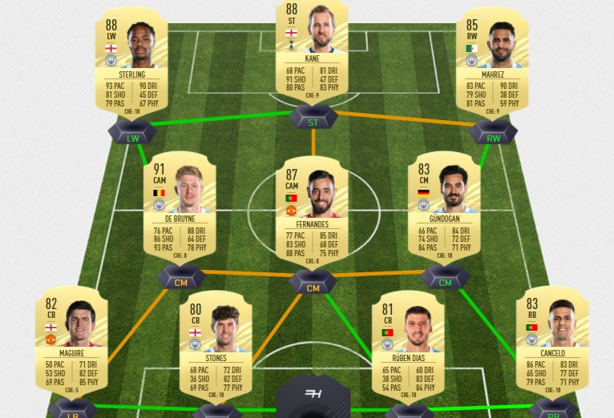
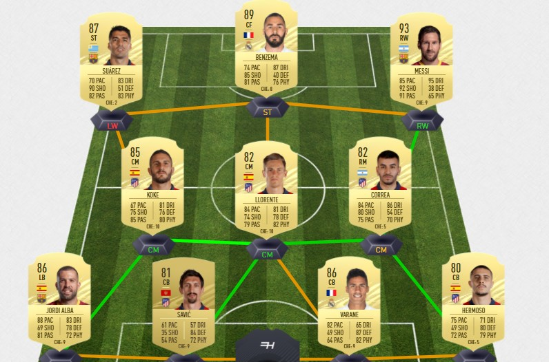
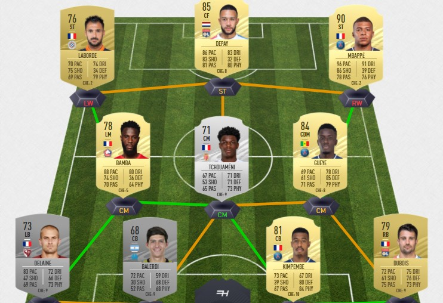
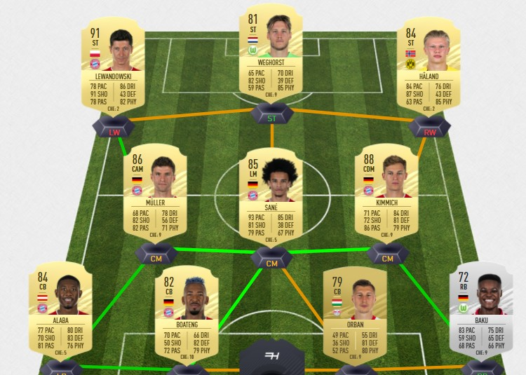
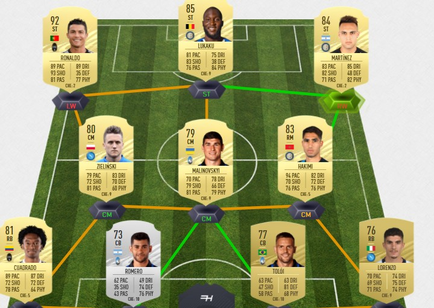

```{r setup, include=FALSE}
##knitr::opts_chunk$set(echo = TRUE)
```

```{r libraries, include=FALSE}
library(tidyverse)
library(tidymodels)
library(lubridate)
library(vip)
library(stacks)
library(DALEX)
library(DALEXtra)
library(themis)
```

```{r base models, include=FALSE}
fifa17_modeling <- readRDS("prem17mod")
fifa18_modeling <- readRDS("prem18mod")
fifa19_modeling <- readRDS("prem19mod")
fifa21_modeling <- readRDS("prem21mod")
fifa17_modeling_la_liga <- readRDS("laliga17mod")
fifa18_modeling_la_liga <- readRDS("laliga18mod")
fifa19_modeling_la_liga <- readRDS("laliga19mod")
fifa21_modeling_la_liga <- readRDS("laliga21mod")
ligue1_fifa17_modeling <- readRDS("ligue1_17mod")
ligue1_fifa18_modeling <- readRDS("ligue1_18mod")
ligue1_fifa19_modeling <- readRDS("ligue1_19mod")
fifa21_modeling_ligue1 <- readRDS("ligue1_21mod")
fifa17_modeling_serie_a <- readRDS("seriea17mod")
fifa18_modeling_serie_a <- readRDS("seriea18mod")
fifa19_modeling_serie_a <- readRDS("seriea19mod")
fifa21_modeling_serie_a <- readRDS("seriea21mod")
fifa17_modeling_bundesliga <- readRDS("bundesliga17mod")
fifa18_modeling_bundesliga <- readRDS("bundesliga18mod")
fifa19_modeling_bundesliga <- readRDS("bundesliga19mod")
fifa21_modeling_bundesliga <- readRDS("bundesliga21mod")
```


\
\


## Introduction

The video game FIFA, which is developed by Electronic Arts (EA) Sports, has become the most popular sports video game in the world in recent years, largely due to its game mode Ultimate Team. The objective of Ultimate Team is to build the best team possible through both buying and selling players, as well as buying packs of cards similarly to how people buy soccer trading cards in real life. Each player receives ratings in various categories based on their real life abilities, and each of these ratings factor into their overall rating. At the end of each season, EA Sports creates a Team of the Season (TOTS), where they select the best player at each position in each league from that season based on how they performed in real life. The players who receive TOTS cards also receive a boost to their overall rating to reflect their abilities in real life. Although most of their choices for TOTS are understandable, there are some choices that confuse and sometimes anger fans. Along with this, EA has never explained how they make their choices. Through the use of machine learning methods and predictive modeling, we aim to determine which variables are most important when choosing a player for TOTS, as well as predict the Team of the Season for Europe's top five leagues based on this season's statistics.


\
\


## Methods and Materials

**Materials**: We retrieved complete player datasets for FIFA 17, FIFA 18, and FIFA 19 from [here](https://www.kaggle.com/stefanoleone992/fifa-21-ultimate-team-players-and-prices-dataset). We retrieved real life statistics from the 2016-2017, 2017-2018, and 2018-2019 seasons from [fbref.com](https://fbref.com/en/). We did not use data from the 2019-2020 season because COVID-19 caused each season to prematurely end in March of 2020.
\


**Methods**: 
\
Using these data sets we went about predicting team of the season players using a Random Forest machine learning model. This makes many decision trees using the data to predict what players will be in the team of the season based upon the information that we feed into it. It then puts all of those trees together in order to make a decision on whether or not a player should be in the team of the season. We can then apply that model to data that it did not use in deciding how to decide whether or not a player is in the team of the season in order to check how good our model really is. 


\
\


## English Premier League

```{r premmod1, include=FALSE}
fifa19_modeling2 <- fifa19_modeling %>%
  mutate(Player = paste(Player, '19'))

fifa18_modeling2 <- fifa18_modeling %>%
  mutate(Player = paste(Player, '18'))

fifa17_modeling2 <- fifa17_modeling %>%
  mutate(Player = paste(Player, '17'))


prem_modeling <- fifa17_modeling2 %>% 
  bind_rows(fifa18_modeling2, fifa19_modeling2) %>% 
  mutate(revision = as.factor(revision), Nation = as.factor(Nation))
```

```{r premmod2, include=FALSE}
prem_modeling %>% 
  select(where(is.numeric)) %>% 
  pivot_longer(cols = everything(),
               names_to = "variable", 
               values_to = "value") %>% 
  ggplot(aes(x = value)) +
  geom_histogram(bins = 30) +
  facet_wrap(vars(variable), 
             scales = "free")
```

```{r}
theme_set(theme_cowplot())
prem_prop <- prem_modeling %>% 
  rename(Revision = revision) %>% 
  ggplot(aes(x = Revision, fill = Revision)) +
  geom_bar() +
  scale_fill_manual(values = c("TOTS" = "blue", "Normal" = "gold")) +
  # CHANGES
  labs(x = "Revision", y = "Count", title = "Proportion of Revisions Within Premier League Dataset Selected for TOTS") +
  theme(plot.title = element_text(hjust = .2, size = 13.5)) +
  geom_vline(xintercept = 0, linetype = "dotted") 
prem_prop_logo <- ggdraw() + draw_image("https://www.fifplay.com/img/public/premier-league-2-logo.png", x = .42, y = .23, scale = .25) + 
  draw_plot(prem_prop)

prem_prop_logo
```


```{r premplot2, echo=FALSE}
prem_modeling %>% 
  ggplot(aes(x = Gls, fill = revision)) +
  geom_density(alpha = 0.5) +
  scale_fill_manual(values = c("TOTS" = "blue", "Normal" = "gold")) +
  labs(x = "Goals", y = "Density", title = "Density Plot of Goals Scored in Premier League Season by Revision Status", subtitle = "TOTS players tend to score goals more prolifically than their non-selected counterparts") + 
theme(plot.subtitle = element_text(hjust = -.35, size = 11), plot.title = element_text(hjust = .1, size = 13.5))

prem_goals_logo <- ggdraw() + draw_image("https://www.fifplay.com/img/public/premier-league-2-logo.png", x = .42, y = .2, scale = .25) + 
  draw_plot(prem_goals_density)

prem_goals_logo
```


```{r premplot3, echo=FALSE}
prem_tablepos_density <- prem_modeling %>% 
  rename(Revision = revision) %>% 
  ggplot(aes(x = Rk, fill = Revision)) +
  geom_density(alpha = 0.5) +
  scale_fill_manual(values = c("TOTS" = "blue", "Normal" = "gold")) +
  labs(x = "Table Position", y = "Density", title = "Density Plot of Premier League Table Position by Revision Status", subtitle = "Players on winning teams (lower table position) make up a substantial proportion of the Premier League TOTS dataset") + 
theme(plot.subtitle = element_text(hjust = .4, size = 10), plot.title = element_text(hjust = .1, size = 13.5))

prem_tablepos_logo <- ggdraw() + draw_image("https://www.fifplay.com/img/public/premier-league-2-logo.png", x = .42, y = .2, scale = .25) + 
  draw_plot(prem_tablepos_density)

prem_tablepos_logo
```

```{r premplot4, echo=FALSE}
prem_mppn_density <- prem_modeling %>% 
  rename(Revision = revision) %>% 
  ggplot(aes(x = minutes_played_divided_by90, fill = Revision)) +
  geom_density(alpha = 0.5) +
  scale_fill_manual(values = c("TOTS" = "blue", "Normal" = "gold")) +
  labs(x = "Total Minutes Played Dived by 90 (Full Games Played)", y = "Density", title = "Density Plot of Premier League Minutes Played (Per 90 Minutes) by Revision Status", subtitle = "Players who accrue more minutes per contest") + 
theme(plot.subtitle = element_text(hjust = .45, size = 11), plot.title = element_text(hjust = .8, size = 13))

prem_mppn_logo <- ggdraw() + draw_image("https://www.fifplay.com/img/public/premier-league-2-logo.png", x = .42, y = .2, scale = .25) + 
  draw_plot(prem_mppn_density)

prem_mppn_logo
```

```{r premplot5, echo=FALSE}
prem_positions <- prem_modeling %>% 
  rename(Revision = revision) %>% 
  ggplot(aes(x = position, fill = Revision)) +
  geom_bar(position = "identity") +
  scale_fill_manual(values = c("TOTS" = "blue", "Normal" = "gold")) +
  labs(x = "Position", y = "Count", title = "Positional Breakdown Within Premier League Dataset")

prem_positions_logo <- ggdraw() + draw_image("https://www.fifplay.com/img/public/premier-league-2-logo.png", x = .42, y = .22, scale = .25) + 
  draw_plot(prem_positions)

prem_positions_logo
```


```{r premmod3, include=FALSE}
prem_modeling_outfield <- prem_modeling %>% 
  filter(position != "GK") %>% 
  filter(minutes_played_divided_by90 >= 19) %>% 
  mutate(position = ifelse(position == "RWB", "RB", ifelse(position == "LWB", "LB", position))) %>% 
  select(-Goals_allowed, -GA90, -SoTA, -Saves, -Save_percent, -W, -L, -D, -CS, -CS_percent, -Pkatt_against, -PKA, -PKsv, -Pk_Save_percent, -PKm)
```


```{r premmod4, include=FALSE}
set.seed(494)
prem_split <- initial_split(prem_modeling_outfield, prop = .75, strata = "revision")
prem_training <- training(prem_split)
prem_testing <- testing(prem_split)
```

```{r message = FALSE, warning = FALSE}
prem_train_metrics <- prem_training %>% 
  mutate(Type = "Training") %>% 
  rename(Revision = revision) %>% 
  group_by(Revision, Type) %>% 
  summarize(Goals = mean(Gls, na.rm = T), Assists = mean(Ast, na.rm = T), `Non PK Goals` = mean(Non_PK_G, na.rm = T), PK = mean(PK, na.rm = T), `Team Rank` = mean(Rk, na.rm = T), `Minutes Per 90` = mean(Min, na.rm = T)/90 , `Goals SD` = sd(Gls, na.rm = T), `Assists SD` = sd(Ast, na.rm = T), `Non PK Goals SD` = sd(Non_PK_G, na.rm = T),`Team Rank SD` = sd(Rk, na.rm = T), `Minutes Per 90 SD` = sd(Min, na.rm = T)/90)


prem_rebound_split <- rbind(prem_train_metrics, prem_test_metrics) %>% arrange(Revision)

prem_metrics_table <- formattable(prem_rebound_split[1:4,1:13])

kable(prem_metrics_table, align = c(rep('c', 1))) %>% 
  row_spec(0) %>% 
  kable_styling(full_width = F) %>% 
  add_header_above(c("Premier League Training and Testing Group Comparison for Suspected KPIs" = 13), background = "purple", color = "white")
```

```{r premranger1, include=FALSE}
prem_ranger_recipe <- recipe(revision ~., data = prem_training) %>% 
  step_rm(Player, Nation, Squad, G_per90, A_per90, minutes_played_divided_by90, Attendance, Born) %>% 
  step_upsample(revision, over_ratio = .33) %>% 
  step_mutate_at(all_numeric(), fn = ~as.numeric(.))

prem_ranger_recipe %>% 
  prep(prem_training) %>% 
  juice()
```


```{r premranger2, include=FALSE}
prem_ranger <- rand_forest(mtry = tune(), 
              min_n = tune(), 
              trees = 100) %>% 
  set_mode("classification") %>% 
  set_engine("ranger")

prem_ranger_wf <- 
  workflow() %>% 
  add_recipe(prem_ranger_recipe) %>% 
  add_model(prem_ranger) 

prem_ranger_wf
```


```{r premranger3, include=FALSE}
set.seed(494)
prem_cv <- vfold_cv(prem_training, v = 5)

prem_rf_grid <- grid_regular(min_n(), finalize(mtry(), prem_training %>% select(-revision)), levels = 3)

ctrl_res <- control_stack_grid()

prem_ranger_cv <- prem_ranger_wf %>% 
  tune_grid(resamples = prem_cv,
           grid = prem_rf_grid,
           control = ctrl_res)

collect_metrics(prem_ranger_cv)
```


```{r premranger4, include=FALSE}
prem_best1 <- prem_ranger_cv %>% 
  select_best(metric = "accuracy")

prem_ranger_final_wf<- prem_ranger_wf %>% 
  finalize_workflow(prem_best1)
```

```{r premranger5, include=FALSE}
set.seed(494)
prem_ranger_fit <- prem_ranger_final_wf %>% 
  fit(prem_training)


prem_rf_explain <- 
  explain_tidymodels(
    model = prem_ranger_fit,
    data = prem_training %>% select(-revision), 
    y = as.numeric(prem_training$revision == "TOTS"),
    label = "rf"
  )
```

```{r premvip1, echo=FALSE}
prem_rf_var_imp <- 
  model_parts(
    prem_rf_explain
    )

plot(prem_rf_var_imp)
```


```{r premranger6, include=FALSE}
prem_ranger_test <- prem_ranger_final_wf %>% 
  last_fit(prem_split)

prem_ranger_test %>% 
  collect_metrics()
```

```{r premconfuse1, echo=FALSE}
prem_preds1 <- prem_ranger_test %>% 
  collect_predictions()

prem_preds1 %>% 
  conf_mat(`revision`, .pred_class)
```


```{r premranger7, message= FALSE}
prem_ranger_test <- prem_testing %>% 
  bind_cols(predict(prem_ranger_fit, new_data = prem_testing, type = "prob")) %>% 
  bind_cols(predict(prem_ranger_fit, new_data = prem_testing)) 

prem_rf_preds <- prem_ranger_test %>% 
  conf_mat(revision, .pred_class)

prem_rf_ggconfusion <- autoplot(prem_rf_preds, type = "heatmap") + labs(title = "Confusion Matrix of Premier League Random Forest Model") + scale_fill_gradient(low = "blue", high = "red") + theme(plot.title = element_text(hjust = .5, size = 15))

prem_rf_ggconfusion
```

```{r premconfuse2, echo=FALSE}
prem_ranger_test %>% 
  conf_mat(revision, .pred_class)
```

```{r premwrong1, echo=FALSE}
prem_ranger_test %>% 
  filter(revision != .pred_class)
```


```{r 21prem, include=FALSE}
prem_modeling21 <- fifa21_modeling %>% 
  mutate(revision = as.factor(revision), Nation = as.factor(Nation), Age = as.integer(Age))
```

```{r 21premoutfield, include=FALSE}
prem_modeling_outfield21 <- prem_modeling21 %>% 
  filter(position != "GK") %>% 
  filter(minutes_played_divided_by90 >= 19) %>% 
  mutate(position = ifelse(position == "RWB", "RB", ifelse(position == "LWB", "LB", position)))
```


```{r 21premranger1, include=FALSE}
prem_ranger_test21 <- prem_modeling_outfield21 %>% 
  bind_cols(predict(prem_ranger_fit, new_data = prem_modeling_outfield21, type = "prob")) %>% 
  bind_cols(predict(prem_ranger_fit, new_data = prem_modeling_outfield21)) 
```

```{r, 21prempredictATT, echo=FALSE}
prem_ranger_test21 %>% 
  filter(position %in% c("ST", "RW", "CF", "LW")) %>% 
  arrange(desc(.pred_TOTS)) %>% 
  head(5)
```

```{r 21prempredictMID, echo=FALSE}
prem_ranger_test21 %>% 
  filter(position %in% c("CAM", "CM", "CDM", "LM", "RM")) %>% 
  arrange(desc(.pred_TOTS)) %>% 
  head(5)
```


```{r 21prempredictDEF, echo=FALSE}
prem_ranger_test21 %>% 
  filter(position %in% c("LB", "CB", "RB")) %>% 
  arrange(desc(.pred_TOTS)) %>% 
  head(5)
```




\
\


## La Liga (Spain)

```{r laligamod1, include=FALSE}
fifa19_modeling_la_liga2 <- fifa19_modeling_la_liga %>%
  mutate(Player = paste(Player, '19'))

fifa18_modeling_la_liga2 <- fifa18_modeling_la_liga %>%
  mutate(Player = paste(Player, '18'))

fifa17_modeling_la_liga2 <- fifa17_modeling_la_liga %>%
  mutate(Player = paste(Player, '17'))


la_liga_modeling <- fifa17_modeling_la_liga2%>% 
  bind_rows(fifa18_modeling_la_liga2, fifa19_modeling_la_liga2) %>% 
  select(-Starts) %>% 
  mutate(revision = as.factor(revision), Nation = as.factor(Nation))
```

```{r laligamod2, include=FALSE}
la_liga_modeling %>% 
  select(where(is.numeric)) %>% 
  pivot_longer(cols = everything(),
               names_to = "variable", 
               values_to = "value") %>% 
  ggplot(aes(x = value)) +
  geom_histogram(bins = 30) +
  facet_wrap(vars(variable), 
             scales = "free")
```

```{r laligaplot1, echo=FALSE}
theme_set(theme_cowplot())
la_liga_prop <- la_liga_modeling %>% 
# CHANGES:
  rename(Revision = revision) %>% 
  ggplot(aes(x = Revision, fill = Revision)) +
  geom_bar() +
  scale_fill_manual(values = c("TOTS" = "blue", "Normal" = "gold")) +
  # CHANGES
  labs(x = "Revision", y = "Count", title = "Proportion of Revisions Within La Liga Dataset Selected for TOTS") +
  theme(plot.title = element_text(hjust = .2, size = 13.5)) +
  geom_vline(xintercept = 0, linetype = "dotted") 
la_liga_prop_logo <- ggdraw() + draw_image("https://upload.wikimedia.org/wikipedia/commons/thumb/1/13/LaLiga.svg/1200px-LaLiga.svg.png", x = .42, y = .25, scale = .25) + 
  draw_plot(la_liga_prop)

la_liga_prop_logo
```


```{r laligaplot2, echo=FALSE}
la_liga_goals_density <- la_liga_modeling %>% 
  rename(Revision = revision) %>% 
  ggplot(aes(x = Gls, fill = Revision)) +
  geom_density(alpha = 0.5) +
  scale_fill_manual(values = c("TOTS" = "blue", "Normal" = "gold")) +
  labs(x = "Goals", y = "Density", title = "Density Plot of Goals Scored in La Liga Season by Revision Status", subtitle = "TOTS players tend to score goals more prolifically than their non-selected counterparts") + 
theme(plot.subtitle = element_text(hjust = -.35, size = 11), plot.title = element_text(hjust = .1, size = 13.5))

la_liga_goals_logo <- ggdraw() + draw_image("https://upload.wikimedia.org/wikipedia/commons/thumb/1/13/LaLiga.svg/1200px-LaLiga.svg.png", x = .42, y = .2, scale = .25) + 
  draw_plot(la_liga_goals_density)

la_liga_goals_logo
```

```{r laligaplot3, echo=FALSE}
la_liga_tablepos_density <- la_liga_modeling %>% 
  rename(Revision = revision) %>% 
  ggplot(aes(x = Rk, fill = Revision)) +
  geom_density(alpha = 0.5) +
  scale_fill_manual(values = c("TOTS" = "blue", "Normal" = "gold")) +
  labs(x = "Table Position", y = "Density", title = "Density Plot of La Liga Table Position by Revision Status", subtitle = "Players on winning teams (lower table position) make up a substantial proportion of the La Liga TOTS dataset") + 
theme(plot.subtitle = element_text(hjust = .4, size = 10), plot.title = element_text(hjust = .1, size = 13.5))

la_liga_tablepos_logo <- ggdraw() + draw_image("https://upload.wikimedia.org/wikipedia/commons/thumb/1/13/LaLiga.svg/1200px-LaLiga.svg.png", x = .42, y = .2, scale = .25) + 
  draw_plot(la_liga_tablepos_density)

la_liga_tablepos_logo
```

```{r lalligaplot4, echo=FALSE}
la_liga_mppn_density <- la_liga_modeling %>% 
  rename(Revision = revision) %>% 
  ggplot(aes(x = minutes_played_divided_by90, fill = Revision)) +
  geom_density(alpha = 0.5) +
  scale_fill_manual(values = c("TOTS" = "blue", "Normal" = "gold")) +
  labs(x = "Total Minutes Played Dived by 90 (Full Games Played)", y = "Density", title = "Density Plot of La Liga Minutes Played (Per 90 Minutes) by Revision Status", subtitle = "Players who accrue more minutes per contest") + 
theme(plot.subtitle = element_text(hjust = .3, size = 10), plot.title = element_text(hjust = .8, size = 13))

la_liga_mppn_logo <- ggdraw() + draw_image("https://upload.wikimedia.org/wikipedia/commons/thumb/1/13/LaLiga.svg/1200px-LaLiga.svg.png", x = .42, y = .22, scale = .25) + 
  draw_plot(la_liga_mppn_density)

la_liga_mppn_logo
```

```{r laligaplot5, echo=FALSE}
la_liga_positions <- la_liga_modeling %>% 
  rename(Revision = revision) %>% 
  ggplot(aes(x = position, fill = Revision)) +
  geom_bar(position = "identity") +
  scale_fill_manual(values = c("TOTS" = "blue", "Normal" = "gold")) +
  labs(x = "Position", y = "Count", title = "Positional Breakdown Within La Liga Dataset")

la_liga_positions_logo <- ggdraw() + draw_image("https://upload.wikimedia.org/wikipedia/commons/thumb/1/13/LaLiga.svg/1200px-LaLiga.svg.png", x = .425, y = .23, scale = .25) + 
  draw_plot(la_liga_positions)

la_liga_positions_logo
```


```{r laligamod3, include=FALSE}
la_liga_modeling_outfield <- la_liga_modeling %>% 
  filter(position != "GK") %>% 
  filter(minutes_played_divided_by90 >= 19) %>% 
  mutate(position = ifelse(position == "RWB", "RB", ifelse(position == "LWB", "LB", ifelse(position == "CF", "ST", position)))) %>% 
  select(-Goals_allowed, -GA90, -SoTA, -Saves, -Save_percent, -W, -L, -D, -CS, -CS_percent, -Pkatt_against, -PKA, -PKsv, -Pk_Save_percent, -PKm)
```


```{r laligamod4, include=FALSE}
set.seed(494)
la_liga_split <- initial_split(la_liga_modeling_outfield, prop = .75, strata = "revision")
la_liga_training <- training(la_liga_split)
la_liga_testing <- testing(la_liga_split)
```

```{r message = FALSE, warning = FALSE}
la_liga_train_metrics <- la_liga_training %>% 
  mutate(Type = "Training") %>% 
  rename(Revision = revision) %>% 
  group_by(Revision, Type) %>% 
  summarize(Goals = mean(Gls, na.rm = T), Assists = mean(Ast, na.rm = T), `Non PK Goals` = mean(Non_PK_G, na.rm = T), PK = mean(PK, na.rm = T), `Team Rank` = mean(Rk, na.rm = T), `Minutes Per 90` = mean(Min, na.rm = T)/90 , `Goals SD` = sd(Gls, na.rm = T), `Assists SD` = sd(Ast, na.rm = T), `Non PK Goals SD` = sd(Non_PK_G, na.rm = T),`Team Rank SD` = sd(Rk, na.rm = T), `Minutes Per 90 SD` = sd(Min, na.rm = T)/90)

la_liga_test_metrics <- la_liga_testing %>% 
  mutate(Type = "Testing") %>% 
  rename(Revision = revision) %>% 
  group_by(Revision, Type) %>% 
  summarize(Goals = mean(Gls, na.rm = T), Assists = mean(Ast, na.rm = T), `Non PK Goals` = mean(Non_PK_G, na.rm = T), PK = mean(PK, na.rm = T),`Team Rank` = mean(Rk, na.rm = T), `Minutes Per 90` = mean(Min, na.rm = T)/90, `Goals SD` = sd(Gls, na.rm = T), `Assists SD` = sd(Ast, na.rm = T), `Non PK Goals SD` = sd(Non_PK_G, na.rm = T),`Team Rank SD` = sd(Rk, na.rm = T), `Minutes Per 90 SD` = sd(Min, na.rm = T)/90)

la_liga_rebound_split <- rbind(la_liga_train_metrics, la_liga_test_metrics) %>% arrange(Revision)

la_liga_metrics_table <- formattable(la_liga_rebound_split[1:4,1:13])

kable(la_liga_metrics_table, align = c(rep('c', 1))) %>% 
  row_spec(0) %>% 
  kable_styling(full_width = F) %>% 
  add_header_above(c("La Liga Training and Testing Group Comparison for Suspected KPIs" = 13), background = "navy", color = "red")
```


```{r laligaranger1, include=FALSE}
la_liga_ranger_recipe <- recipe(revision ~., data = la_liga_training) %>% 
  step_rm(Player, Nation, Squad, Born, G_per90, A_per90, minutes_played_divided_by90, OG, Attendance) %>% 
  step_upsample(revision, over_ratio = .5) %>% 
  step_mutate_at(all_numeric(), fn = ~as.numeric(.))

la_liga_ranger_recipe %>% 
  prep(la_liga_training) %>% 
  juice()
```


```{r laligaranger2, include=FALSE}
la_liga_ranger <- rand_forest(mtry = tune(), 
              min_n = tune(), 
              trees = 100) %>% 
  set_mode("classification") %>% 
  set_engine("ranger")

la_liga_ranger_wf <- 
  workflow() %>% 
  add_recipe(la_liga_ranger_recipe) %>% 
  add_model(la_liga_ranger) 

la_liga_ranger_wf
```


```{r laligaranger3, include=FALSE}
set.seed(494)
la_liga_cv <- vfold_cv(la_liga_training, v = 5)

la_liga_rf_grid <- grid_regular(min_n(), finalize(mtry(), la_liga_training %>% select(-revision)), levels = 3)

ctrl_res <- control_stack_grid()

la_liga_ranger_cv <- la_liga_ranger_wf %>% 
  tune_grid(resamples = la_liga_cv,
           grid = la_liga_rf_grid,
           control = ctrl_res)

collect_metrics(la_liga_ranger_cv)
```


```{r laligaranger4, include=FALSE}
la_liga_best1 <- la_liga_ranger_cv %>% 
  select_best(metric = "accuracy")

la_liga_ranger_final_wf<- la_liga_ranger_wf %>% 
  finalize_workflow(la_liga_best1)
```

```{r laligaranger5, include=FALSE}
set.seed(494)
la_liga_ranger_fit <- la_liga_ranger_final_wf %>% 
  fit(la_liga_training)


la_liga_rf_explain <- 
  explain_tidymodels(
    model = la_liga_ranger_fit,
    data = la_liga_training %>% select(-revision), 
    y = as.numeric(la_liga_training$revision == "TOTS"),
    label = "rf"
  )
```

```{r laligavip1, echo=FALSE}
la_liga_rf_var_imp <- 
  model_parts(
    la_liga_rf_explain
    )

plot(la_liga_rf_var_imp)
```

```{r laligaranger6, include=FALSE}
la_liga_ranger_test <- la_liga_ranger_final_wf %>% 
  last_fit(la_liga_split)

la_liga_ranger_test %>% 
  collect_metrics()
```

```{r laligaconfuse1, echo=FALSE}
preds1 <- la_liga_ranger_test %>% 
  collect_predictions()

preds1 %>% 
  conf_mat(revision, .pred_class)
```

```{r laligaranger7, include=FALSE}
la_liga_ranger_test <- la_liga_testing %>% 
  bind_cols(predict(la_liga_ranger_fit, new_data = la_liga_testing, type = "prob")) %>% 
  bind_cols(predict(la_liga_ranger_fit, new_data = la_liga_testing)) 
```

```{r laligaconfuse2, echo=FALSE}
la_liga_ranger_test %>% 
  conf_mat(revision, .pred_class)
```
```{r message = FALSE}
la_liga_ranger_test <- la_liga_testing %>% 
  bind_cols(predict(la_liga_ranger_fit, new_data = la_liga_testing, type = "prob")) %>% 
  bind_cols(predict(la_liga_ranger_fit, new_data = la_liga_testing)) 

la_liga_rf_preds <- la_liga_ranger_test %>% 
  conf_mat(revision, .pred_class)

la_liga_rf_ggconfusion <- autoplot(la_liga_rf_preds, type = "heatmap") + labs(title = "Confusion Matrix of La Liga Random Forest Model") + scale_fill_gradient(low = "blue", high = "red") + theme(plot.title = element_text(hjust = .5, size = 15))

la_liga_rf_ggconfusion
```

```{r laligawrong1, echo=FALSE}
la_liga_ranger_test %>% 
  filter(revision != .pred_class)
```


```{r 21laligamod1, include=FALSE}
la_liga_modeling21 <- fifa21_modeling_la_liga %>% 
  mutate(revision = as.factor(revision), Nation = as.factor(Nation), Age = as.integer(Age))
```

```{r 21laligaoutfield, include=FALSE}
la_liga_modeling_outfield21 <- la_liga_modeling21 %>% 
  filter(position != "GK") %>% 
  filter(minutes_played_divided_by90 >= 14) %>% 
  mutate(position = ifelse(position == "RWB", "RB", ifelse(position == "LWB", "LB", ifelse(position == "CF", "ST", position))))
```


```{r 21laligaranger1, include=FALSE}
la_liga_ranger_test21 <- la_liga_modeling_outfield21 %>% 
  bind_cols(predict(la_liga_ranger_fit, new_data = la_liga_modeling_outfield21, type = "prob")) %>% 
  bind_cols(predict(la_liga_ranger_fit, new_data = la_liga_modeling_outfield21)) 
```


```{r 21laligapredictATT, echo=FALSE}
la_liga_ranger_test21 %>% 
  filter(position %in% c("ST", "RW", "CF", "LW")) %>% 
  arrange(desc(.pred_TOTS)) %>% 
  head(5)
```

```{r 21laligapredictMID, echo=FALSE}
la_liga_ranger_test21 %>% 
  filter(position %in% c("CAM", "CM", "CDM", "LM", "RM")) %>% 
  arrange(desc(.pred_TOTS)) %>% 
  head(5)
```


```{r 21laligapredictDEF, echo=FALSE}
la_liga_ranger_test21 %>% 
  filter(position %in% c("LB", "CB", "RB")) %>% 
  arrange(desc(.pred_TOTS)) %>% 
  head(5)
```





\
\


## French Ligue 1


```{r ligue1mod, include=FALSE}
ligue1_fifa19_modeling <- ligue1_fifa19_modeling %>%
  mutate(Player = paste(Player, '19'))

ligue1_fifa18_modeling <- ligue1_fifa18_modeling %>%
  mutate(Player = paste(Player, '18'))

ligue1_fifa17_modeling <- ligue1_fifa17_modeling %>%
  mutate(Player = paste(Player, '17'))

ligue1_modeling <- ligue1_fifa17_modeling %>% 
  bind_rows(ligue1_fifa18_modeling, ligue1_fifa19_modeling) %>% 
  mutate(revision = as.factor(revision), Nation = as.factor(Nation))
```


```{r ligue1plot1, echo=FALSE}
ligue1_modeling %>% 
  ggplot(aes(x = revision, fill = revision)) +
  geom_bar() +
  scale_fill_manual(values = c("TOTS" = "blue", "Normal" = "gold"))
```


```{r ligue1plot2, echo=FALSE}
ligue1_modeling %>% 
  ggplot(aes(x = Gls, fill = revision)) +
  geom_density(alpha = 0.5) +
  scale_fill_manual(values = c("TOTS" = "blue", "Normal" = "gold")) +
  xlab("Goals Scored")
```

```{r ligue1plot3, echo=FALSE}
ligue1_modeling %>% 
  ggplot(aes(x = Rk, fill = revision)) +
  geom_density(alpha = 0.5) +
  scale_fill_manual(values = c("TOTS" = "blue", "Normal" = "gold")) +
  xlab("Table Position")
```

```{r ligue1plot4, echo=FALSE}
ligue1_modeling %>% 
  ggplot(aes(x = minutes_played_divided_by90, fill = revision)) +
  geom_density(alpha = 0.5) +
  scale_fill_manual(values = c("TOTS" = "blue", "Normal" = "gold")) +
  xlab("Total Minutes Played Dived by 90 (Full Games Played)")
```

```{r ligue1plot5, echo=FALSE}
ligue1_modeling %>% 
  ggplot(aes(x = position, fill = revision)) +
  geom_bar(position = "dodge") +
  scale_fill_manual(values = c("TOTS" = "blue", "Normal" = "gold"))
```


```{r ligue1mod2, include=FALSE}
ligue1_modeling_outfield <- ligue1_modeling %>% 
  filter(position != "GK") %>% 
  filter(minutes_played_divided_by90 >= 19) %>% 
  mutate(position = ifelse(position == "RWB", "RB", ifelse(position == "LWB", "LB", position))) %>% 
  select(-Goals_allowed, -GA90, -SoTA, -Saves, -Save_percent, -W, -L, -D, -CS, -CS_percent, -Pkatt_against, -PKA, -PKsv, -Pk_Save_percent, -PKm)
```


```{r ligue1mod3, include=FALSE}
set.seed(494)
ligue1_split <- initial_split(ligue1_modeling_outfield, prop = .75, strata = "revision")
ligue1_training <- training(ligue1_split)
ligue1_testing <- testing(ligue1_split)
```

```{r ligue1ranger1, include=FALSE}
ligue1_ranger_recipe <- recipe(revision ~., data = ligue1_training) %>% 
  step_rm(Player, Nation, Squad, Born, minutes_played_divided_by90, G_per90, A_per90, Attendance) %>% 
  step_upsample(revision, over_ratio = .4) %>% 
  step_mutate_at(all_numeric(), fn = ~as.numeric(.))

ligue1_ranger_recipe %>% 
  prep(ligue1_training) %>% 
  juice()
```


```{r ligue1ranger2, include=FALSE}
ligue1_ranger <- rand_forest(mtry = tune(), 
              min_n = tune(), 
              trees = 100) %>% 
  set_mode("classification") %>% 
  set_engine("ranger")

ligue1_ranger_wf <- 
  workflow() %>% 
  add_recipe(ligue1_ranger_recipe) %>% 
  add_model(ligue1_ranger) 

ligue1_ranger_wf
```


```{r ligue1ranger3, include=FALSE}
set.seed(494)
ligue1_cv <- vfold_cv(ligue1_training, v = 5)

ligue1_rf_grid <- grid_regular(min_n(), finalize(mtry(), ligue1_training %>% select(-revision)), levels = 3)

ligue1_ctrl_res <- control_stack_grid()

ligue1_ranger_cv <- ligue1_ranger_wf %>% 
  tune_grid(resamples = ligue1_cv,
           grid = ligue1_rf_grid,
           control = ligue1_ctrl_res)

collect_metrics(ligue1_ranger_cv)
```


```{r ligue1ranger4, include=FALSE}
ligue1_best1 <- ligue1_ranger_cv %>% 
  select_best(metric = "accuracy")

ligue1_ranger_final_wf<- ligue1_ranger_wf %>% 
  finalize_workflow(ligue1_best1)
```

```{r ligue1ranger5, include=FALSE}
ligue1_ranger_fit <- ligue1_ranger_final_wf %>% 
  fit(ligue1_training)


ligue1_rf_explain <- 
  explain_tidymodels(
    model = ligue1_ranger_fit,
    data = ligue1_training %>% select(-revision), 
    y = as.numeric(ligue1_training$revision == "TOTS"),
    label = "rf"
  )
```

```{r ligue1vip, echo=FALSE}
ligue1_rf_var_imp <- 
  model_parts(
    ligue1_rf_explain
    )

plot(ligue1_rf_var_imp)
```


```{r ligue1ranger6, include=FALSE}
ligue1_ranger_test <- ligue1_ranger_final_wf %>% 
  last_fit(ligue1_split)

ligue1_ranger_test %>% 
  collect_metrics()
```

```{r ligue1confuse1, echo=FALSE}
ligue1_preds1 <- ligue1_ranger_test %>% 
  collect_predictions()

ligue1_preds1 %>% 
  conf_mat(revision, .pred_class)
```

```{r ligue1ranger7, include=FALSE}
ligue1_ranger_test <- ligue1_testing %>% 
  bind_cols(predict(ligue1_ranger_fit, new_data = ligue1_testing, type = "prob")) %>% 
  bind_cols(predict(ligue1_ranger_fit, new_data = ligue1_testing)) 
```

```{r ligue1confuse2, echo=FALSE}
ligue1_ranger_test %>% 
  conf_mat(revision, .pred_class)
```

```{r ligue1wrong, echo=FALSE}
ligue1_ranger_test %>% 
  filter(revision != .pred_class)
```


```{r 21ligue1mod1, include=FALSE}
ligue1_modeling21 <- fifa21_modeling_ligue1 %>% 
  mutate(revision = as.factor(revision), Nation = as.factor(Nation), Age = as.integer(Age))
```

```{r 21ligue1outfield, include=FALSE}
ligue1_modeling_outfield21 <- ligue1_modeling21 %>% 
  filter(position != "GK") %>% 
  filter(minutes_played_divided_by90 >= 14) %>% 
  mutate(position = ifelse(position == "RWB", "RB", ifelse(position == "LWB", "LB", position)))
```


```{r 21ligue1ranger, include=FALSE}
ligue1_ranger_test21 <- ligue1_modeling_outfield21 %>% 
  bind_cols(predict(ligue1_ranger_fit, new_data = ligue1_modeling_outfield21, type = "prob")) %>% 
  bind_cols(predict(ligue1_ranger_fit, new_data = ligue1_modeling_outfield21)) 
```


```{r 21ligue1predictATT, echo=FALSE}
ligue1_ranger_test21 %>% 
  filter(position %in% c("ST", "RW", "CF", "LW")) %>% 
  arrange(desc(.pred_TOTS)) %>% 
  head(5)
```

```{r 21ligue1predictMID, echo=FALSE}
ligue1_ranger_test21 %>% 
  filter(position %in% c("CAM", "CM", "CDM", "LM", "RM")) %>% 
  arrange(desc(.pred_TOTS)) %>% 
  head(5)
```

```{r 21ligue1predictDEF, echo=FALSE}
ligue1_ranger_test21 %>% 
  filter(position %in% c("LB", "CB", "RB")) %>% 
  arrange(desc(.pred_TOTS)) %>% 
  head(5)
```





\
\


## German Bundesliga

```{r bundesligamod1, include=FALSE}
fifa19_modeling_bundesliga2 <- fifa19_modeling_bundesliga %>%
  mutate(Player = paste(Player, '19'))

fifa18_modeling_bundesliga2 <- fifa18_modeling_bundesliga %>%
  mutate(Player = paste(Player, '18'))

fifa17_modeling_bundesliga2 <- fifa17_modeling_bundesliga %>%
  mutate(Player = paste(Player, '17'))


bundesliga_modeling <- fifa17_modeling_bundesliga2%>% 
  bind_rows(fifa18_modeling_bundesliga2, fifa19_modeling_bundesliga2) %>% 
  mutate(revision = as.factor(revision), Nation = as.factor(Nation))
```

```{r bundesligaplot1, include=FALSE}
bundesliga_modeling %>% 
  select(where(is.numeric)) %>% 
  pivot_longer(cols = everything(),
               names_to = "variable", 
               values_to = "value") %>% 
  ggplot(aes(x = value)) +
  geom_histogram(bins = 30) +
  facet_wrap(vars(variable), 
             scales = "free")
```

```{r bundesligaplot2, echo=FALSE}
bundesliga_modeling %>% 
  ggplot(aes(x = revision, fill = revision)) +
  geom_bar() +
  scale_fill_manual(values = c("TOTS" = "blue", "Normal" = "gold"))
```


```{r bundesligaplot3, echo=FALSE}
bundesliga_modeling %>% 
  ggplot(aes(x = Gls, fill = revision)) +
  geom_density(alpha = 0.5) +
  scale_fill_manual(values = c("TOTS" = "blue", "Normal" = "gold")) +
  xlab("Goals")
```

```{r bundesligaplot4, echo=FALSE}
bundesliga_modeling %>% 
  ggplot(aes(x = Rk, fill = revision)) +
  geom_density(alpha = 0.5) +
  scale_fill_manual(values = c("TOTS" = "blue", "Normal" = "gold")) +
  xlab("Table Position")
```

```{r bundesligaplot5, echo=FALSE}
bundesliga_modeling %>% 
  ggplot(aes(x = minutes_played_divided_by90, fill = revision)) +
  geom_density(alpha = 0.5) +
  scale_fill_manual(values = c("TOTS" = "blue", "Normal" = "gold")) +
  xlab("Total Minutes Played Dived by 90 (Full Games Played)")
```

```{r bundesligaplot6, echo=FALSE}
bundesliga_modeling %>% 
  ggplot(aes(x = position, fill = revision)) +
  geom_bar(position = "dodge") +
  scale_fill_manual(values = c("TOTS" = "blue", "Normal" = "gold"))
```


```{r bundesligamod2, include=FALSE}
bundesliga_modeling_outfield <- bundesliga_modeling %>% 
  filter(position != "GK") %>% 
  filter(minutes_played_divided_by90 >= 19) %>% 
  mutate(position = ifelse(position == "RWB", "RB", ifelse(position == "LWB", "LB", ifelse(position == "RW", "RM", ifelse(position == "LW", "LM", position))))) %>% 
  select(-Goals_allowed, -GA90, -SoTA, -Saves, -Save_percent, -W, -L, -D, -CS, -CS_percent, -Pkatt_against, -PKA, -PKsv, -Pk_Save_percent, -PKm)
```


```{r bundesligamod3, include=FALSE}
set.seed(494)
bundesliga_split <- initial_split(bundesliga_modeling_outfield, prop = .75, strata = "revision")
bundesliga_training <- training(bundesliga_split)
bundesliga_testing <- testing(bundesliga_split)
```

```{r bundesliaranger1, include=FALSE}
bundesliga_ranger_recipe <- recipe(revision ~., data = bundesliga_training) %>% 
  step_rm(Player, Nation, Squad, G_per90, A_per90, minutes_played_divided_by90, Attendance, Born) %>% 
  step_upsample(revision, over_ratio = .55) %>% 
  step_mutate_at(all_numeric(), fn = ~as.numeric(.))

bundesliga_ranger_recipe %>% 
  prep(bundesliga_training) %>% 
  juice()
```


```{r bundesligaranger2, include=FALSE}
bundesliga_ranger <- rand_forest(mtry = tune(), 
              min_n = tune(), 
              trees = 100) %>% 
  set_mode("classification") %>% 
  set_engine("ranger")

bundesliga_ranger_wf <- 
  workflow() %>% 
  add_recipe(bundesliga_ranger_recipe) %>% 
  add_model(bundesliga_ranger) 

bundesliga_ranger_wf
```


```{r bundesligaranger3, include=FALSE}
set.seed(494)
bundesliga_cv <- vfold_cv(bundesliga_training, v = 5)

bundesliga_rf_grid <- grid_regular(min_n(), finalize(mtry(), bundesliga_training %>% select(-revision)), levels = 3)

ctrl_res <- control_stack_grid()

bundesliga_ranger_cv <- bundesliga_ranger_wf %>% 
  tune_grid(resamples = bundesliga_cv,
           grid = bundesliga_rf_grid,
           control = ctrl_res)

collect_metrics(bundesliga_ranger_cv)
```


```{r bundesligaranger4, include=FALSE}
bundesliga_best1 <- bundesliga_ranger_cv %>% 
  select_best(metric = "accuracy")

bundesliga_ranger_final_wf<- bundesliga_ranger_wf %>% 
  finalize_workflow(bundesliga_best1)
```

```{r bundesligaranger5, include=FALSE}
set.seed(494)
bundesliga_ranger_fit <- bundesliga_ranger_final_wf %>% 
  fit(bundesliga_training)


bundesliga_rf_explain <- 
  explain_tidymodels(
    model = bundesliga_ranger_fit,
    data = bundesliga_training %>% select(-revision), 
    y = as.numeric(bundesliga_training$revision == "TOTS"),
    label = "rf"
  )
```

```{r bundesligavip, echo=FALSE}
bundesliga_rf_var_imp <- 
  model_parts(
    bundesliga_rf_explain
    )

plot(bundesliga_rf_var_imp)
```


```{r bundesligaranger6, include=FALSE}
bundesliga_ranger_test <- bundesliga_ranger_final_wf %>% 
  last_fit(bundesliga_split)

bundesliga_ranger_test %>% 
  collect_metrics()
```

```{r bundesligaconfuse1, echo=FALSE}
preds1 <- bundesliga_ranger_test %>% 
  collect_predictions()

preds1 %>% 
  conf_mat(revision, .pred_class)
```

```{r bundesligaranger7, include=FALSE}
bundesliga_ranger_test <- bundesliga_testing %>% 
  bind_cols(predict(bundesliga_ranger_fit, new_data = bundesliga_testing, type = "prob")) %>% 
  bind_cols(predict(bundesliga_ranger_fit, new_data = bundesliga_testing)) 
```

```{r bundesligaconfuse2, echo=FALSE}
bundesliga_ranger_test %>% 
  conf_mat(revision, .pred_class)
```

```{r bundesligawrong, echo=FALSE}
bundesliga_ranger_test %>% 
  filter(revision != .pred_class)
```

```{r 21bundesligamod, include=FALSE}
bundesliga_modeling21 <- fifa21_modeling_bundesliga %>% 
  mutate(revision = as.factor(revision), Nation = as.factor(Nation), Age = as.integer(Age))
```

```{r 21bundesligaoutfield, include=FALSE}
bundesliga_modeling_outfield21 <- bundesliga_modeling21 %>% 
  filter(position != "GK") %>% 
  filter(minutes_played_divided_by90 >= 18) %>% 
  mutate(position = ifelse(position == "RWB", "RB", ifelse(position == "LWB", "LB", ifelse(position == "RW", "RM", ifelse(position == "LW", "LM", position)))))
```


```{r 21bundesligaranger, include=FALSE}
bundesliga_ranger_test21 <- bundesliga_modeling_outfield21 %>% 
  bind_cols(predict(bundesliga_ranger_fit, new_data = bundesliga_modeling_outfield21, type = "prob")) %>% 
  bind_cols(predict(bundesliga_ranger_fit, new_data = bundesliga_modeling_outfield21)) 
```

```{r bundesligapredictATT, echo=FALSE}
bundesliga_ranger_test21 %>% 
  filter(position %in% c("ST", "RW", "CF", "LW")) %>% 
  arrange(desc(.pred_TOTS)) %>% 
  head(5)
```

```{r bundesligapredictMID, echo=FALSE}
bundesliga_ranger_test21 %>% 
  filter(position %in% c("CAM", "CM", "CDM", "LM", "RM")) %>% 
  arrange(desc(.pred_TOTS)) %>% 
  head(5)
```

```{r bundesligapredictDEF, echo=FALSE}
bundesliga_ranger_test21 %>% 
  filter(position %in% c("LB", "CB", "RB")) %>% 
  arrange(desc(.pred_TOTS)) %>% 
  head(5)
```





\
\


## Italian Serie A


```{r serieamod1, include=FALSE}
fifa19_modeling_serie_a2 <- fifa19_modeling_serie_a %>%
  mutate(Player = paste(Player, '19'))

fifa18_modeling_serie_a2 <- fifa18_modeling_serie_a %>%
  mutate(Player = paste(Player, '18'))

fifa17_modeling_serie_a2 <- fifa17_modeling_serie_a %>%
  mutate(Player = paste(Player, '17'))


serie_a_modeling <- fifa17_modeling_serie_a2%>% 
  bind_rows(fifa18_modeling_serie_a2, fifa19_modeling_serie_a2) %>% 
  mutate(revision = as.factor(revision), Nation = as.factor(Nation))
```

```{r serieaplot1, echo=FALSE}
serie_a_modeling %>% 
  select(where(is.numeric)) %>% 
  pivot_longer(cols = everything(),
               names_to = "variable", 
               values_to = "value") %>% 
  ggplot(aes(x = value)) +
  geom_histogram(bins = 30) +
  facet_wrap(vars(variable), 
             scales = "free")
```

```{r serieaplot2, echo=FALSE}
serie_a_modeling %>% 
  ggplot(aes(x = revision, fill = revision)) +
  geom_bar() +
  scale_fill_manual(values = c("TOTS" = "blue", "Normal" = "gold"))
```


```{r serieaplot3, echo=FALSE}
serie_a_modeling %>% 
  ggplot(aes(x = Gls, fill = revision)) +
  geom_density(alpha = 0.5) +
  scale_fill_manual(values = c("TOTS" = "blue", "Normal" = "gold")) +
  xlab("Goals")
```

```{r serieaplot4, echo=FALSE}
serie_a_modeling %>% 
  ggplot(aes(x = Rk, fill = revision)) +
  geom_density(alpha = 0.5) +
  scale_fill_manual(values = c("TOTS" = "blue", "Normal" = "gold")) +
  xlab("Table Position")
```

```{r serieaaplot5, echo=FALSE}
serie_a_modeling %>% 
  ggplot(aes(x = minutes_played_divided_by90, fill = revision)) +
  geom_density(alpha = 0.5) +
  scale_fill_manual(values = c("TOTS" = "blue", "Normal" = "gold")) +
  xlab("Total Minutes Played Dived by 90 (Full Games Played)")
```

```{r serieaplot6, echo=FALSE}
serie_a_modeling %>% 
  ggplot(aes(x = position, fill = revision)) +
  geom_bar(position = "dodge") +
  scale_fill_manual(values = c("TOTS" = "blue", "Normal" = "gold"))
```


```{r serieamod2, include=FALSE}
serie_a_modeling_outfield <- serie_a_modeling %>% 
  filter(position != "GK") %>% 
  #filter(position %in% c("ST", "LW", "RW", "CF", "CAM")) %>% 
  filter(minutes_played_divided_by90 >= 19) %>% 
  mutate(position = ifelse(position == "RWB", "RB", ifelse(position == "LWB", "LB", ifelse(position == "RW", "RM", ifelse(position == "LW", "LM", position))))) %>% 
  select(-Goals_allowed, -GA90, -SoTA, -Saves, -Save_percent, -W, -L, -D, -CS, -CS_percent, -Pkatt_against, -PKA, -PKsv, -Pk_Save_percent, -PKm)
```


```{r serieamod3, include=FALSE}
set.seed(494)
serie_a_split <- initial_split(serie_a_modeling_outfield, prop = .75, strata = "revision")
serie_a_training <- training(serie_a_split)
serie_a_testing <- testing(serie_a_split)
```

```{r seriearanger1, include=FALSE}
serie_a_ranger_recipe <- recipe(revision ~., data = serie_a_training) %>% 
  step_rm(Player, Nation, Squad, Born, G_per90, A_per90, minutes_played_divided_by90, Attendance) %>% 
  step_upsample(revision, over_ratio = .4) %>% 
  step_mutate_at(all_numeric(), fn = ~as.numeric(.))

serie_a_ranger_recipe %>% 
  prep(serie_a_training) %>% 
  juice()
```


```{r seriearanger2, include=FALSE}
serie_a_ranger <- rand_forest(mtry = tune(), 
              min_n = tune(), 
              trees = 100) %>% 
  set_mode("classification") %>% 
  set_engine("ranger")

serie_a_ranger_wf <- 
  workflow() %>% 
  add_recipe(serie_a_ranger_recipe) %>% 
  add_model(serie_a_ranger) 

serie_a_ranger_wf
```


```{r seriearanger3, include=FALSE}
set.seed(494)
serie_a_cv <- vfold_cv(serie_a_training, v = 5)

serie_a_rf_grid <- grid_regular(min_n(), finalize(mtry(), serie_a_training %>% select(-revision)), levels = 3)

ctrl_res <- control_stack_grid()

serie_a_ranger_cv <- serie_a_ranger_wf %>% 
  tune_grid(resamples = serie_a_cv,
           grid = serie_a_rf_grid,
           control = ctrl_res)

collect_metrics(serie_a_ranger_cv)
```


```{r seriearanger4, include=FALSE}
serie_a_best1 <- serie_a_ranger_cv %>% 
  select_best(metric = "accuracy")

serie_a_ranger_final_wf<- serie_a_ranger_wf %>% 
  finalize_workflow(serie_a_best1)
```

```{r seriearanger5, include=FALSE}
set.seed(494)
serie_a_ranger_fit <- serie_a_ranger_final_wf %>% 
  fit(serie_a_training)


serie_a_rf_explain <- 
  explain_tidymodels(
    model = serie_a_ranger_fit,
    data = serie_a_training %>% select(-revision), 
    y = as.numeric(serie_a_training$revision == "TOTS"),
    label = "rf"
  )
```

```{r serieavip, echo=FALSE}
serie_a_rf_var_imp <- 
  model_parts(
    serie_a_rf_explain
    )

plot(serie_a_rf_var_imp)
```


```{r seriearanger6, include=FALSE}
serie_a_ranger_test <- serie_a_ranger_final_wf %>% 
  last_fit(serie_a_split)

serie_a_ranger_test %>% 
  collect_metrics()
```

```{r serieaconfuse1, echo=FALSE}
preds1 <- serie_a_ranger_test %>% 
  collect_predictions()

preds1 %>% 
  conf_mat(revision, .pred_class)
```

```{r seriearanger7, include=FALSE}
serie_a_ranger_test <- serie_a_testing %>% 
  bind_cols(predict(serie_a_ranger_fit, new_data = serie_a_testing, type = "prob")) %>% 
  bind_cols(predict(serie_a_ranger_fit, new_data = serie_a_testing)) 
```

```{r serieaconfuse2, echo=FALSE}
serie_a_ranger_test %>% 
  conf_mat(revision, .pred_class)
```

```{r serieawrong, echo=FALSE}
serie_a_ranger_test %>% 
  filter(revision != .pred_class)
```


```{r 21serieamod1, include=FALSE}
serie_a_modeling21 <- fifa21_modeling_serie_a %>% 
  mutate(revision = as.factor(revision), Nation = as.factor(Nation), Age = as.integer(Age))
```

```{r 21serieaoutfield, include=FALSE}
serie_a_modeling_outfield21 <- serie_a_modeling21 %>% 
  filter(position != "GK") %>% 
  filter(minutes_played_divided_by90 >= 14) %>% 
  mutate(position = ifelse(position == "RWB", "RB", ifelse(position == "LWB", "LB", ifelse(position == "RW", "RM", ifelse(position == "LW", "LM", position)))))
```


```{r 21seriearanger, include=FALSE}
serie_a_ranger_test21 <- serie_a_modeling_outfield21 %>% 
  bind_cols(predict(serie_a_ranger_fit, new_data = serie_a_modeling_outfield21, type = "prob")) %>% 
  bind_cols(predict(serie_a_ranger_fit, new_data = serie_a_modeling_outfield21)) 
```

```{r serieapredictATT, echo=FALSE}
serie_a_ranger_test21 %>% 
  filter(position %in% c("ST", "RW", "CF", "LW")) %>% 
  arrange(desc(.pred_TOTS)) %>% 
  head(5)
```

```{r serieapredictMID, echo=FALSE}
serie_a_ranger_test21 %>% 
  filter(position %in% c("CAM", "CM", "CDM", "LM", "RM")) %>% 
  arrange(desc(.pred_TOTS)) %>% 
  head(5)
```

```{r serieapredictDEF, echo=FALSE}
serie_a_ranger_test21 %>% 
  filter(position %in% c("LB", "CB", "RB")) %>% 
  arrange(desc(.pred_TOTS)) %>% 
  head(5)
```





\
\


## All Leagues Combined (and why it does not work)


