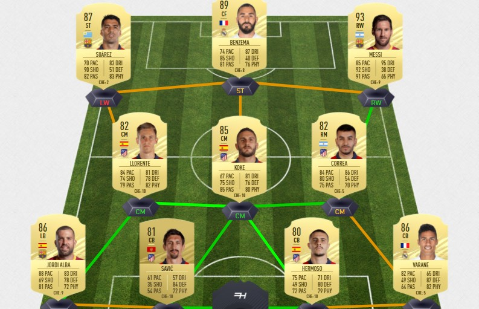

```{r setup, include = FALSE}
knitr::opts_chunk$set(include = TRUE, echo = FALSE)
```

```{r libraries, include = FALSE}
library(tidyverse)
library(tidymodels)
library(lubridate)
library(vip)
library(stacks)
library(DALEX)
library(DALEXtra)
library(themis)
library(formattable)
library(kableExtra)
library(cowplot)
library(formattable)
library(kableExtra)
library(cvms)
```

```{r prem data read}
fifa17 <- read_csv("fut_bin17_players.csv")
fifa18 <- read_csv("fut_bin18_players.csv")
fifa19 <- read_csv("fut_bin19_players.csv")
fifa21 <- read_csv("fut_bin21_players.csv")
premnames17 <- read.csv("16_17_premnames.csv")
premnames18 <- read.csv("17_18_premnames.csv")
premnames19 <- read.csv("18_19_premnames.csv")
standardprem17 <- read.csv("standardprem17.csv")
standardprem18 <- read.csv("standardprem18.csv")
standardprem19 <- read.csv("standardprem19.csv")
premtable17 <- read.csv("premtable17.csv")
premtable18 <- read.csv("premtable18.csv")
premtable19 <- read.csv("premtable19.csv")
premgoalkeeper17 <- read.csv('goalkeeper17.csv')
premgoalkeeper18 <- read.csv('goalkeeper18.csv')
premgoalkeeper19 <- read.csv('goalkeeper19.csv')
premnames21 <- read.csv("20_21_premnames.csv")
standardprem21 <- read.csv("standardprem21.csv")
premtable21 <- read.csv("premtable21.csv")
```

```{r fifa 17 clean}
fifa17_clean <- fifa17 %>% 
  filter(revision %in% c("Normal", "TOTS")) %>%
  arrange(desc(overall)) %>% 
  distinct(player_extended_name, .keep_all = TRUE)
```

```{r fifa 18 clean}
fifa18_clean <- fifa18 %>% 
  filter(revision %in% c("Normal", "TOTS")) %>%
  arrange(desc(overall)) %>% 
  distinct(player_extended_name, .keep_all = TRUE)
```

```{r fifa 19 clean}
fifa19_clean <- fifa19 %>% 
  filter(revision %in% c("Normal", "TOTS")) %>%
  arrange(desc(overall)) %>% 
  distinct(player_extended_name, .keep_all = TRUE)
```

```{r fifa 21 clean}
fifa21_clean <- fifa21 %>% 
  mutate(revision = ifelse(revision == "Rare", "Normal", ifelse(revision == "Non-Rare", "Normal", revision))) %>% 
  mutate(club = ifelse(player_name == "Rúben Dias", "Manchester City", ifelse(player_extended_name == "Wesley Fofana", "Leicester City", club))) %>% 
  mutate(league = ifelse(player_name == "Rúben Dias", "Premier League", ifelse(player_extended_name == "Wesley Fofana", "Premier League", league))) %>% 
  filter(revision %in% c("Normal", "TOTS")) %>%
  arrange(desc(overall)) %>% 
  distinct(player_extended_name, .keep_all = TRUE)
```

```{r fifa 17 names}
fifa17_names <- fifa17_clean %>% 
  mutate(player_extended_name = stringi::stri_trans_general(player_extended_name, "Latin-ASCII")) %>% 
   mutate(player_name = stringi::stri_trans_general(player_name, "Latin-ASCII"))
```

```{r fifa 18 names}
fifa18_names <- fifa18_clean %>% 
  mutate(player_extended_name = stringi::stri_trans_general(player_extended_name, "Latin-ASCII")) %>% 
   mutate(player_name = stringi::stri_trans_general(player_name, "Latin-ASCII"))
```

```{r fifa 19 names}
fifa19_names <- fifa19_clean %>% 
  mutate(player_extended_name = stringi::stri_trans_general(player_extended_name, "Latin-ASCII")) %>% 
   mutate(player_name = stringi::stri_trans_general(player_name, "Latin-ASCII"))
```

```{r fifa 21 names}
fifa21_names <- fifa21_clean %>% 
  mutate(player_extended_name = stringi::stri_trans_general(player_extended_name, "Latin-ASCII")) %>% 
   mutate(player_name = stringi::stri_trans_general(player_name, "Latin-ASCII"))
```

```{r}
premnames17 <-premnames17 %>% 
  mutate(Player1 = gsub(".*\\\\", "", Player)) %>% 
  mutate(Player = str_replace_all(Player1, "-", " "))
```

```{r}
prem17_names <- fifa17_names %>% 
  filter(league == "Premier League") %>% 
  select(player_name, player_extended_name, overall, revision, position)
```

```{r}
prem17 <- premnames17 %>%
  inner_join(prem17_names, by = c("Player" = "player_extended_name")) %>% 
  select(-Player1, -player_name)
```

```{r}
missing17 <- premnames17 %>%
  left_join(prem17_names, by = c("Player" = "player_extended_name")) %>% 
  filter(is.na(player_name) == TRUE)
```

```{r}
not_missing_17 <- missing17 %>% 
  select(-overall, -revision, -position) %>% 
  left_join(prem17_names, by = c("Player" = "player_name")) 
```

```{r}
last_names17 <- not_missing_17 %>% 
  filter(is.na(overall) == TRUE) %>% 
  mutate(Player_short =  gsub(".* ", "", Player)) %>% 
  mutate(Player_short = ifelse(Player_short == "Aanholt", "Van Aanholt", ifelse(Player_short == "Dijk", "Van Dijk", ifelse(Player_short == "min", "Son", ifelse(Player_short == "Prowse", "Ward-Prowse", ifelse(Player_short == "yueng", "Ki Sung Yueng", ifelse(Player_short == "yong", "Lee Chung Yong", ifelse(Player_short == "Cheek", "Loftus-Cheek", ifelse(Player_short == "Chamberlain", "Oxlade-Chamberlain", ifelse(Player_short == "Gea", "De Gea", ifelse(Player_short == "Traore", "Adama", ifelse(Player_short == "Bissaka", "Wan-Bissaka", Player_short)))))))))))) %>% 
  select(-player_name, -player_extended_name, -overall, -revision, - Player1, -position)

not_real_name17 <- not_missing_17 %>% 
  filter(is.na(overall) == FALSE) %>% 
  select(-Player1, -player_name, -player_extended_name)
```

```{r}
weird_names17 <- last_names17 %>% 
  inner_join(prem17_names, by = c("Player_short" = "player_name")) %>% 
  select(-Player_short, -player_extended_name)
```

```{r}
fifa17_prem_full <- prem17 %>%
  bind_rows(not_real_name17, weird_names17) %>% 
  distinct(Player, .keep_all = TRUE) %>% 
  select(Player, revision, position, Int, TklW, OG, PKcon)
```

```{r}
standardprem17 <- standardprem17 %>% 
  mutate(Player1 = gsub(".*\\\\", "", Player)) %>% 
  mutate(Player = str_replace_all(Player1, "-", " "))
```

```{r}
fifa17_prem_standard_stats <- fifa17_prem_full %>% 
  inner_join(standardprem17, by = "Player") %>% 
  select(-Player1, -Pos) %>% 
  distinct(Player, .keep_all = TRUE)
```

```{r}
fifa17_standard_plus_table <- fifa17_prem_standard_stats %>% 
  inner_join(premtable17, by = "Squad")
```

```{r}
premgoalkeeper17 <- premgoalkeeper17 %>% 
  mutate(Player1 = gsub(".*\\\\", "", Player)) %>% 
  mutate(Player = str_replace_all(Player1, "-", " ")) %>% 
  rename(Pkatt_against = PKatt) %>% 
  rename(Goals_allowed = GA)
```

```{r}
fifa17_modeling <- fifa17_standard_plus_table %>% 
  left_join(premgoalkeeper17, by = "Player") %>% 
  rename(minutes_played_divided_by90 = X90s, Non_PK_G = G.PK, G_plus_A_per90 = G.A, G_minus_Pk_per90 = G.PK.1, G_plus_A_minus_PK_per90 = G.A.PK, Save_percent = Save., CS_percent = CS., Pk_Save_percent = Save..1, G_per90 = Gls.1, A_per90 = Ast.1 ) %>% 
  select(-Matches.x, -Matches.y, -Player1, -Starts) %>% 
  mutate(Nation = sub('.* ', '', Nation))
```

```{r}
premnames18 <-premnames18 %>% 
  mutate(Player1 = gsub(".*\\\\", "", Player)) %>% 
  mutate(Player = str_replace_all(Player1, "-", " "))
```

```{r}
prem18_names <- fifa18_names %>% 
  filter(league == "Premier League") %>% 
  select(player_name, player_extended_name, overall, revision, position)
```

```{r}
prem18 <- premnames18 %>%
  inner_join(prem18_names, by = c("Player" = "player_extended_name")) %>% 
  select(-Player1, -player_name)
```

```{r}
missing18 <- premnames18 %>%
  left_join(prem18_names, by = c("Player" = "player_extended_name")) %>% 
  filter(is.na(player_name) == TRUE)
```

```{r}
not_missing_18 <- missing18 %>% 
  select(-overall, -revision, -position) %>% 
  left_join(prem18_names, by = c("Player" = "player_name")) 
```

```{r}
last_names18 <- not_missing_18 %>% 
  filter(is.na(overall) == TRUE) %>% 
  mutate(Player_short =  gsub(".* ", "", Player)) %>% 
  mutate(Player_short = ifelse(Player_short == "Aanholt", "Van Aanholt", ifelse(Player_short == "Dijk", "Van Dijk", ifelse(Player_short == "min", "Son", ifelse(Player_short == "Prowse", "Ward-Prowse", ifelse(Player_short == "yueng", "Ki Sung Yueng", ifelse(Player_short == "yong", "Lee Chung Yong", ifelse(Player_short == "Cheek", "Loftus-Cheek", ifelse(Player_short == "Chamberlain", "Oxlade-Chamberlain", ifelse(Player_short == "Gea", "De Gea", ifelse(Player_short == "Ginkel", "Van Ginkel", ifelse(Player_short == "Traore", "Adama", ifelse(Player_short == "Bissaka", "Wan-Bissaka", Player_short))))))))))))) %>% 
  select(-player_name, -player_extended_name, -overall, -revision, - Player1, -position)

not_real_name18 <- not_missing_18 %>% 
  filter(is.na(overall) == FALSE) %>% 
  select(-Player1, -player_name, -player_extended_name)
```

```{r}
weird_names18 <- last_names18 %>% 
  inner_join(prem18_names, by = c("Player_short" = "player_name")) %>% 
  select(-Player_short, -player_extended_name)
```

```{r}
fifa18_prem_full <- prem18 %>%
  bind_rows(not_real_name18, weird_names18) %>% 
  distinct(Player, .keep_all = TRUE) %>% 
  select(Player, revision, position, Int, TklW, OG, PKcon)
```

```{r}
standardprem18 <- standardprem18 %>% 
  mutate(Player1 = gsub(".*\\\\", "", Player)) %>% 
  mutate(Player = str_replace_all(Player1, "-", " "))
```

```{r}
fifa18_prem_standard_stats <- fifa18_prem_full %>% 
  inner_join(standardprem18, by = "Player") %>% 
  select(-Player1, -Pos) %>% 
  distinct(Player, .keep_all = TRUE)
```

```{r}
fifa18_standard_plus_table <- fifa18_prem_standard_stats %>% 
  inner_join(premtable18, by = "Squad")
```

```{r}
premgoalkeeper18 <- premgoalkeeper18 %>% 
  mutate(Player1 = gsub(".*\\\\", "", Player)) %>% 
  mutate(Player = str_replace_all(Player1, "-", " ")) %>% 
  rename(Pkatt_against = PKatt) %>% 
  rename(Goals_allowed = GA) %>% 
  select(-X90s, -Pos, -Nation, -Squad, -MP, -Starts, -Min, -Age, -Born)
```

```{r}
fifa18_modeling <- fifa18_standard_plus_table %>% 
  left_join(premgoalkeeper18, by = "Player") %>% 
  rename(minutes_played_divided_by90 = X90s, Non_PK_G = G.PK, G_plus_A_per90 = G.A, G_minus_Pk_per90 = G.PK.1, G_plus_A_minus_PK_per90 = G.A.PK, Save_percent = Save., CS_percent = CS., Pk_Save_percent = Save..1, G_per90 = Gls.1, A_per90 = Ast.1 ) %>% 
  select(-Matches.x, -Matches.y, -Player1, -xG, -npxG, -xA, -npxG.1, -npxG.xA, -npxG.xA.1, -xG.1, -xA.1, -xG.xA, -Starts) %>% 
  mutate(Nation = sub('.* ', '', Nation))
```

```{r}
premnames19 <-premnames19 %>% 
  mutate(Player1 = gsub(".*\\\\", "", Player)) %>% 
  mutate(Player = str_replace_all(Player1, "-", " "))
```


```{r}
prem19_names <- fifa19_names %>% 
  filter(league == "Premier League") %>% 
  select(player_name, player_extended_name, overall, revision, position)
```

```{r}
prem19 <- premnames19 %>%
  inner_join(prem19_names, by = c("Player" = "player_extended_name")) %>% 
  select(-Player1, -player_name)
```

```{r}
missing19 <- premnames19 %>%
  left_join(prem19_names, by = c("Player" = "player_extended_name")) %>% 
  filter(is.na(player_name) == TRUE)
```

```{r}
not_missing_19 <- missing19 %>% 
  select(-overall, -revision, -position) %>% 
  left_join(prem19_names, by = c("Player" = "player_name")) 
```

```{r}
last_names19 <- not_missing_19 %>% 
  filter(is.na(overall) == TRUE) %>% 
  mutate(Player_short =  gsub(".* ", "", Player)) %>% 
  mutate(Player_short = ifelse(Player_short == "Aanholt", "Van Aanholt", ifelse(Player_short == "Dijk", "Van Dijk", ifelse(Player_short == "min", "Son", ifelse(Player_short == "Prowse", "Ward-Prowse", ifelse(Player_short == "yueng", "Ki Sung Yueng", ifelse(Player_short == "yong", "Lee Chung Yong", ifelse(Player_short == "Cheek", "Loftus-Cheek", ifelse(Player_short == "Chamberlain", "Oxlade-Chamberlain", ifelse(Player_short == "Gea", "De Gea", ifelse(Player_short == "Ginkel", "Van Ginkel", ifelse(Player_short == "Traore", "Adama",ifelse(Player_short == "Bissaka", "Wan-Bissaka", Player_short))))))))))))) %>% 
  select(-player_name, -player_extended_name, -overall, -revision, - Player1, -position)

not_real_name19 <- not_missing_19 %>% 
  filter(is.na(overall) == FALSE) %>% 
  select(-Player1, -player_name, -player_extended_name)
```

```{r}
weird_names19 <- last_names19 %>% 
  inner_join(prem19_names, by = c("Player_short" = "player_name")) %>% 
  select(-Player_short, -player_extended_name)
```

```{r}
fifa19_prem_full <- prem19 %>%
  bind_rows(not_real_name19, weird_names19) %>% 
  distinct(Player, .keep_all = TRUE) %>% 
  select(Player, revision, position, Int, TklW, OG, PKcon)
```

```{r}
standardprem19 <- standardprem19 %>% 
  mutate(Player1 = gsub(".*\\\\", "", Player)) %>% 
  mutate(Player = str_replace_all(Player1, "-", " "))
```

```{r}
fifa19_prem_standard_stats <- fifa19_prem_full %>% 
  inner_join(standardprem19, by = "Player") %>% 
  select(-Player1, -Pos) %>% 
  distinct(Player, .keep_all = TRUE)
```

```{r}
fifa19_standard_plus_table <- fifa19_prem_standard_stats %>% 
  inner_join(premtable19, by = "Squad")
```

```{r}
premgoalkeeper19 <- premgoalkeeper19 %>% 
  mutate(Player1 = gsub(".*\\\\", "", Player)) %>% 
  mutate(Player = str_replace_all(Player1, "-", " ")) %>% 
  rename(Pkatt_against = PKatt) %>% 
  rename(Goals_allowed = GA) %>% 
  select(-X90s, -Pos, -Nation, -Squad, -MP, -Starts, -Min, -Age, -Born)
```

```{r}
fifa19_modeling <- fifa19_standard_plus_table %>% 
  left_join(premgoalkeeper19, by = "Player") %>% 
  rename(minutes_played_divided_by90 = X90s, Non_PK_G = G.PK, G_plus_A_per90 = G.A, G_minus_Pk_per90 = G.PK.1, G_plus_A_minus_PK_per90 = G.A.PK, Save_percent = Save., CS_percent = CS., Pk_Save_percent = Save..1, G_per90 = Gls.1, A_per90 = Ast.1) %>% 
  select(-Matches.x, -Matches.y, -Player1, -Starts) %>% 
  mutate(Nation = sub('.* ', '', Nation)) 
```

```{r}
premnames21 <-premnames21 %>% 
  mutate(Player1 = gsub(".*\\\\", "", Player)) %>% 
  mutate(Player = str_replace_all(Player1, "-", " ")) 
```

```{r}
prem21_names <- fifa21_names %>% 
  filter(league == "Premier League") %>% 
  select(player_name, player_extended_name, overall, revision, position)
```

```{r}
prem21 <- premnames21 %>%
  inner_join(prem21_names, by = c("Player" = "player_extended_name")) %>% 
  select(-Player1, -player_name)
```

```{r}
missing21 <- premnames21 %>%
  left_join(prem21_names, by = c("Player" = "player_extended_name")) %>% 
  filter(is.na(player_name) == TRUE)
```

```{r}
not_missing_21 <- missing21 %>% 
  select(-overall, -revision, -position) %>% 
  left_join(prem21_names, by = c("Player" = "player_name")) 
```

```{r}
last_names21 <- not_missing_21 %>% 
  filter(is.na(overall) == TRUE) %>% 
  mutate(Player_short =  gsub(".* ", "", Player)) %>% 
  mutate(Player_short = ifelse(Player_short == "Aanholt", "Van Aanholt", ifelse(Player_short == "Dijk", "Van Dijk", ifelse(Player_short == "min", "Son", ifelse(Player_short == "Prowse", "Ward-Prowse", ifelse(Player_short == "yueng", "Ki Sung Yueng", ifelse(Player_short == "yong", "Lee Chung Yong", ifelse(Player_short == "Cheek", "Loftus-Cheek", ifelse(Player_short == "Chamberlain", "Oxlade-Chamberlain", ifelse(Player_short == "Gea", "De Gea", ifelse(Player_short == "Ginkel", "Van Ginkel", ifelse(Player_short == "Traore", "Adama",ifelse(Player_short == "Bissaka", "Wan-Bissaka", ifelse(Player_short == "Dias", "Ruben Dias", Player_short)))))))))))))) %>% 
  select(-player_name, -player_extended_name, -overall, -revision, - Player1, -position)

not_real_name21 <- not_missing_21 %>% 
  filter(is.na(overall) == FALSE) %>% 
  select(-Player1, -player_name, -player_extended_name)
```

```{r}
weird_names21 <- last_names21 %>% 
  inner_join(prem21_names, by = c("Player_short" = "player_name")) %>% 
  select(-Player_short, -player_extended_name)
```

```{r}
fifa21_prem_full <- prem21 %>%
  bind_rows(not_real_name21, weird_names21) %>% 
  distinct(Player, .keep_all = TRUE) %>% 
  select(Player, revision, position, Int, TklW, OG, PKcon)
```

```{r}
standardprem21 <- standardprem21 %>% 
  mutate(Player1 = gsub(".*\\\\", "", Player)) %>% 
  mutate(Player = str_replace_all(Player1, "-", " ")) %>% 
  mutate(Age = gsub("-.*", "", Age))
```

```{r}
fifa21_prem_standard_stats <- fifa21_prem_full %>% 
  inner_join(standardprem21, by = "Player") %>% 
  select(-Player1, -Pos) %>% 
  distinct(Player, .keep_all = TRUE)
```

```{r}
fifa21_standard_plus_table <- fifa21_prem_standard_stats %>% 
  inner_join(premtable21, by = "Squad")
```

```{r}
fifa21_modeling <- fifa21_standard_plus_table %>% 
   rename(minutes_played_divided_by90 = X90s, Non_PK_G = G.PK, G_plus_A_per90 = G.A, G_minus_Pk_per90 = G.PK.1, G_plus_A_minus_PK_per90 = G.A.PK, G_per90 = Gls.1, A_per90 = Ast.1) %>% 
  mutate(Nation = sub('.* ', '', Nation)) 
```

```{r la liga data read}
la_liganames17 <- read.csv("16_17_la_liganames.csv")
la_liganames18 <- read.csv("17_18_la_liganames.csv")
la_liganames19 <- read.csv("18_19_la_liganames.csv")
standardla_liga17 <- read.csv("standardla_liga17.csv")
standardla_liga18 <- read.csv("standardla_liga18.csv")
standardla_liga19 <- read.csv("standardla_liga19.csv")
la_ligatable17 <- read.csv("la_ligatable17.csv")
la_ligatable18 <- read.csv("la_ligatable18.csv")
la_ligatable19 <- read.csv("la_ligatable19.csv")
goalkeeper_la_liga17 <- read.csv('goalkeeper_la_liga17.csv')
goalkeeper_la_liga18 <- read.csv('goalkeeper_la_liga18.csv')
goalkeeper_la_liga19 <- read.csv('goalkeeper_la_liga19.csv')
la_liganames21 <- read.csv("20_21_la_liganames.csv")
standardla_liga21 <- read.csv("standardla_liga21.csv")
la_ligatable21 <- read.csv("la_ligatable21.csv")
```

```{r }
la_liganames17 <-la_liganames17 %>% 
  mutate(Player1 = gsub(".*\\\\", "", Player)) %>% 
  mutate(Player = str_replace_all(Player1, "-", " "))
```

```{r }
la_liga17_names <- fifa17_names %>% 
  filter(league == "LaLiga Santander") %>% 
  select(player_name, player_extended_name, overall, revision, position)
```

```{r }
la_liga17 <- la_liganames17 %>%
  inner_join(la_liga17_names, by = c("Player" = "player_extended_name")) %>% 
  select(-Player1, -player_name)
```

```{r }
missing_la_liga17 <- la_liganames17 %>%
  left_join(la_liga17_names, by = c("Player" = "player_extended_name")) %>% 
  filter(is.na(player_name) == TRUE)
```

```{r }
not_missing_la_liga_17 <- missing_la_liga17 %>% 
  select(-overall, -revision, -position) %>% 
  left_join(la_liga17_names, by = c("Player" = "player_name")) 
```

```{r }
last_names_la_liga17 <- not_missing_la_liga_17 %>% 
 filter(is.na(overall) == TRUE) %>% 
  mutate(Player_short =  gsub(".* ", "", Player)) %>% 
  mutate(Player_short = ifelse(Player_short == "Stegen", "Ter Stegen", ifelse(Player_short == "Sanjurjo", "Oier", ifelse(Player_short == "Berchiche", "Yuri", ifelse(Player_short == "Nzonzi", "N'Zonzi", ifelse(Player_short == "Soriano" , "Bruno", ifelse(Player_short == "Niguez", "Saul", ifelse(Player_short == "Etxebarria", "Benat", ifelse(Player_short == "Nacho", "Nacho Fernandez", ifelse(Player_short == "Ramirez", "Sandro", ifelse(Player == "Yeray Alvarez", "Yeray", ifelse(Player == "Jonny Castro", "Jonny", ifelse(Player_short == "Marcos", "De Marcos", ifelse(Player_short == "Michel", "Michel Maicedo", ifelse(Player_short == "Alexander", "Szymanowski", ifelse(Player == "Alvaro Gonzalez", "Alvaro", ifelse(Player_short == "Cuevas", "De Las Cuevas", ifelse(Player_short == "Carcela", "Carcela-Gonzalez", ifelse(Player_short == "Dehli", "Krohn-Dehli", ifelse(Player_short == "Tomas", "De Tomas", Player_short)))))))))))))))))))) %>% 
  select(-player_name, -player_extended_name, -overall, -revision, - Player1, -position)

not_real_name_la_liga17 <- not_missing_la_liga_17 %>% 
  filter(is.na(overall) == FALSE) %>% 
  select(-Player1, -player_name, -player_extended_name)
```

```{r }
weird_names_la_liga17 <- last_names_la_liga17 %>% 
  inner_join(la_liga17_names, by = c("Player_short" = "player_name")) %>% 
  select(-Player_short, -player_extended_name)
```

```{r }
fifa17_la_liga_full <- la_liga17 %>%
  bind_rows(not_real_name_la_liga17, weird_names_la_liga17) %>% 
  distinct(Player, .keep_all = TRUE) %>% 
  select(Player, revision, position, Int, TklW, OG, PKcon)
```

```{r }
standardla_liga17 <- standardla_liga17 %>% 
  mutate(Player1 = gsub(".*\\\\", "", Player)) %>% 
  mutate(Player = str_replace_all(Player1, "-", " "))
```

```{r }
fifa17_la_liga_standard_stats <- fifa17_la_liga_full %>% 
  inner_join(standardla_liga17, by = "Player") %>% 
  select(-Player1, -Pos) %>% 
  distinct(Player, .keep_all = TRUE)
```

```{r }
fifa17_standard_plus_table_la_liga <- fifa17_la_liga_standard_stats %>% 
  inner_join(la_ligatable17, by = "Squad")
```

```{r }
goalkeeper_la_liga17 <- goalkeeper_la_liga17 %>% 
  mutate(Player1 = gsub(".*\\\\", "", Player)) %>% 
  mutate(Player = str_replace_all(Player1, "-", " ")) %>% 
  rename(Pkatt_against = PKatt) %>% 
  rename(Goals_allowed = GA) %>%
  select(-X90s, -Pos, -Nation, -Squad, -MP, -Starts, -Min, -Age, -Born)
```

```{r }
fifa17_modeling_la_liga <- fifa17_standard_plus_table_la_liga %>% 
  left_join(goalkeeper_la_liga17, by = "Player") %>% 
  rename(minutes_played_divided_by90 = X90s, Non_PK_G = G.PK, G_plus_A_per90 = G.A, G_minus_Pk_per90 = G.PK.1, G_plus_A_minus_PK_per90 = G.A.PK, Save_percent = Save., CS_percent = CS., Pk_Save_percent = Save..1, G_per90 = Gls.1, A_per90 = Ast.1 ) %>% 
  select(-Matches.x, -Matches.y, -Player1) %>% 
  mutate(Nation = sub('.* ', '', Nation)) 
```

```{r }
la_liganames18 <-la_liganames18 %>% 
  mutate(Player1 = gsub(".*\\\\", "", Player)) %>% 
  mutate(Player = str_replace_all(Player1, "-", " "))
```

```{r }
la_liga18_names <- fifa18_names %>% 
  filter(league == "LaLiga Santander") %>% 
  select(player_name, player_extended_name, overall, revision, position)
```

```{r }
la_liga18 <- la_liganames18 %>%
  inner_join(la_liga18_names, by = c("Player" = "player_extended_name")) %>% 
  select(-Player1, -player_name)
```

```{r }
missing_la_liga18 <- la_liganames18 %>%
  left_join(la_liga18_names, by = c("Player" = "player_extended_name")) %>% 
  filter(is.na(player_name) == TRUE)
```

```{r }
not_missing_la_liga_18 <- missing_la_liga18 %>% 
  select(-overall, -revision, -position) %>% 
  left_join(la_liga18_names, by = c("Player" = "player_name")) 
```

```{r }
last_names_la_liga18 <- not_missing_la_liga_18 %>% 
 filter(is.na(overall) == TRUE) %>% 
  mutate(Player_short =  gsub(".* ", "", Player)) %>% 
  mutate(Player_short = ifelse(Player_short == "Stegen", "Ter Stegen", ifelse(Player_short == "Sanjurjo", "Oier", ifelse(Player_short == "Berchiche", "Yuri", ifelse(Player_short == "Nzonzi", "N'Zonzi", ifelse(Player_short == "Soriano" , "Bruno", ifelse(Player_short == "Niguez", "Saul", ifelse(Player_short == "Etxebarria", "Benat", ifelse(Player_short == "Nacho", "Nacho Fernandez", ifelse(Player_short == "Ramirez", "Sandro", ifelse(Player == "Yeray Alvarez", "Yeray", ifelse(Player == "Jonny Castro", "Jonny", ifelse(Player_short == "Marcos", "De Marcos", ifelse(Player_short == "Michel", "Michel Maicedo", ifelse(Player_short == "Alexander", "Szymanowski", ifelse(Player == "Alvaro Gonzalez", "Alvaro", ifelse(Player_short == "Cuevas", "De Las Cuevas", ifelse(Player_short == "Carcela", "Carcela-Gonzalez", ifelse(Player_short == "Dehli", "Krohn-Dehli", ifelse(Player_short == "Tomas", "De Tomas", ifelse(Player_short == "Torres", "Pau Torres", Player_short))))))))))))))))))))) %>% 
  select(-player_name, -player_extended_name, -overall, -revision, - Player1, -position)

not_real_name_la_liga18 <- not_missing_la_liga_18 %>% 
  filter(is.na(overall) == FALSE) %>% 
  select(-Player1, -player_name, -player_extended_name)
```

```{r }
weird_names_la_liga18 <- last_names_la_liga18 %>% 
  inner_join(la_liga18_names, by = c("Player_short" = "player_name")) %>% 
  select(-Player_short, -player_extended_name)
```

```{r }
fifa18_la_liga_full <- la_liga18 %>%
  bind_rows(not_real_name_la_liga18, weird_names_la_liga18) %>% 
  distinct(Player, .keep_all = TRUE) %>% 
  select(Player, revision, position, Int, TklW, OG, PKcon)
```

```{r }
standardla_liga18 <- standardla_liga18 %>% 
  mutate(Player1 = gsub(".*\\\\", "", Player)) %>% 
  mutate(Player = str_replace_all(Player1, "-", " "))
```

```{r }
fifa18_la_liga_standard_stats <- fifa18_la_liga_full %>% 
  inner_join(standardla_liga18, by = "Player") %>% 
  select(-Player1, -Pos) %>% 
  distinct(Player, .keep_all = TRUE)
```

```{r }
fifa18_standard_plus_table_la_liga <- fifa18_la_liga_standard_stats %>% 
  inner_join(la_ligatable18, by = "Squad")
```

```{r }
goalkeeper_la_liga18 <- goalkeeper_la_liga18 %>% 
  mutate(Player1 = gsub(".*\\\\", "", Player)) %>% 
  mutate(Player = str_replace_all(Player1, "-", " ")) %>% 
  rename(Pkatt_against = PKatt) %>% 
  rename(Goals_allowed = GA) %>%
  select(-X90s, -Pos, -Nation, -Squad, -MP, -Starts, -Min, -Age, -Born)
```

```{r }
fifa18_modeling_la_liga <- fifa18_standard_plus_table_la_liga %>% 
  left_join(goalkeeper_la_liga18, by = "Player") %>% 
  rename(minutes_played_divided_by90 = X90s, Non_PK_G = G.PK, G_plus_A_per90 = G.A, G_minus_Pk_per90 = G.PK.1, G_plus_A_minus_PK_per90 = G.A.PK, Save_percent = Save., CS_percent = CS., Pk_Save_percent = Save..1, G_per90 = Gls.1, A_per90 = Ast.1 ) %>% 
  select(-Matches.x, -Matches.y, -Player1, -xG, -npxG, -xA, -npxG.1, -npxG.xA, -npxG.xA.1, -xG.1, -xA.1, -xG.xA) %>% 
  mutate(Nation = sub('.* ', '', Nation)) %>% 
  filter(Player != "Luis Hernandez")
```

```{r }
la_liganames19 <-la_liganames19 %>% 
  mutate(Player1 = gsub(".*\\\\", "", Player)) %>% 
  mutate(Player = str_replace_all(Player1, "-", " "))
```

```{r }
la_liga19_names <- fifa19_names %>% 
  filter(league == "LaLiga Santander") %>% 
  select(player_name, player_extended_name, overall, revision, position)
```

```{r }
la_liga19 <- la_liganames19 %>%
  inner_join(la_liga19_names, by = c("Player" = "player_extended_name")) %>% 
  select(-Player1, -player_name)
```

```{r }
missing_la_liga19 <- la_liganames19 %>%
  left_join(la_liga19_names, by = c("Player" = "player_extended_name")) %>% 
  filter(is.na(player_name) == TRUE)
```

```{r }
not_missing_la_liga_19 <- missing_la_liga19 %>% 
  select(-overall, -revision, -position) %>% 
  left_join(la_liga19_names, by = c("Player" = "player_name")) 
```

```{r }
last_names_la_liga19 <- not_missing_la_liga_19 %>% 
  filter(is.na(overall) == TRUE) %>% 
  mutate(Player_short =  gsub(".* ", "", Player)) %>% 
  mutate(Player_short = ifelse(Player_short == "Stegen", "Ter Stegen", ifelse(Player_short == "Sanjurjo", "Oier", ifelse(Player_short == "Berchiche", "Yuri", ifelse(Player_short == "Nzonzi", "N'Zonzi", ifelse(Player_short == "Soriano" , "Bruno", ifelse(Player_short == "Niguez", "Saul", ifelse(Player_short == "Etxebarria", "Benat", ifelse(Player_short == "Nacho", "Nacho Fernandez", ifelse(Player_short == "Ramirez", "Sandro", ifelse(Player == "Yeray Alvarez", "Yeray", ifelse(Player == "Jonny Castro", "Jonny", ifelse(Player_short == "Marcos", "De Marcos", ifelse(Player_short == "Michel", "Michel Maicedo", ifelse(Player_short == "Alexander", "Szymanowski", ifelse(Player == "Alvaro Gonzalez", "Alvaro", ifelse(Player_short == "Cuevas", "De Las Cuevas", ifelse(Player_short == "Carcela", "Carcela-Gonzalez", ifelse(Player_short == "Dehli", "Krohn-Dehli", ifelse(Player_short == "Tomas", "De Tomas", Player_short)))))))))))))))))))) %>%
  select(-player_name, -player_extended_name, -overall, -revision, - Player1, -position)

not_real_name_la_liga19 <- not_missing_la_liga_19 %>% 
  filter(is.na(overall) == FALSE) %>% 
  select(-Player1, -player_name, -player_extended_name)
```

```{r }
weird_names_la_liga19 <- last_names_la_liga19 %>% 
  inner_join(la_liga19_names, by = c("Player_short" = "player_name")) %>% 
  select(-Player_short, -player_extended_name)
```

```{r }
fifa19_la_liga_full <- la_liga19 %>%
  bind_rows(not_real_name_la_liga19, weird_names_la_liga19) %>% 
  distinct(Player, .keep_all = TRUE) %>% 
  select(Player, revision, position, Int, TklW, OG, PKcon)
```

```{r }
standardla_liga19 <- standardla_liga19 %>% 
  mutate(Player1 = gsub(".*\\\\", "", Player)) %>% 
  mutate(Player = str_replace_all(Player1, "-", " "))
```

```{r }
fifa19_la_liga_standard_stats <- fifa19_la_liga_full %>% 
  inner_join(standardla_liga19, by = "Player") %>% 
  select(-Player1, -Pos) %>% 
  distinct(Player, .keep_all = TRUE)
```

```{r }
fifa19_standard_plus_table_la_liga <- fifa19_la_liga_standard_stats %>% 
  inner_join(la_ligatable19, by = "Squad")
```

```{r }
goalkeeper_la_liga19 <- goalkeeper_la_liga19 %>% 
  mutate(Player1 = gsub(".*\\\\", "", Player)) %>% 
  mutate(Player = str_replace_all(Player1, "-", " ")) %>% 
  rename(Pkatt_against = PKatt) %>% 
  rename(Goals_allowed = GA) %>%
  select(-X90s, -Pos, -Nation, -Squad, -MP, -Starts, -Min, -Age, -Born)
```

```{r }
fifa19_modeling_la_liga <- fifa19_standard_plus_table_la_liga %>% 
  left_join(goalkeeper_la_liga19, by = "Player") %>% 
  rename(minutes_played_divided_by90 = X90s, Non_PK_G = G.PK, G_plus_A_per90 = G.A, G_minus_Pk_per90 = G.PK.1, G_plus_A_minus_PK_per90 = G.A.PK, Save_percent = Save., CS_percent = CS., Pk_Save_percent = Save..1, G_per90 = Gls.1, A_per90 = Ast.1) %>% 
  select(-Matches.x, -Matches.y, -Player1) %>% 
  mutate(Nation = sub('.* ', '', Nation)) %>% 
  filter(Player != "Luis Hernandez") %>% 
  filter(Player != "Mario Suarez")
```

```{r }
la_liganames21 <-la_liganames21 %>% 
  mutate(Player1 = gsub(".*\\\\", "", Player)) %>% 
  mutate(Player = str_replace_all(Player1, "-", " ")) 
```

```{r }
la_liga21_names <- fifa21_names %>% 
  filter(league == "LaLiga Santander") %>% 
  select(player_name, player_extended_name, overall, revision, position)
```

```{r }
la_liga21 <- la_liganames21 %>%
  inner_join(la_liga21_names, by = c("Player" = "player_extended_name")) %>% 
  select(-Player1, -player_name)
```

```{r }
missing21 <- la_liganames21 %>%
  left_join(la_liga21_names, by = c("Player" = "player_extended_name")) %>% 
  filter(is.na(player_name) == TRUE)
```

```{r }
not_missing_21 <- missing21 %>% 
  select(-overall, -revision, -position) %>% 
  left_join(la_liga21_names, by = c("Player" = "player_name")) 
```

```{r }
last_names21 <- not_missing_21 %>% 
  filter(is.na(overall) == TRUE) %>% 
  mutate(Player_short =  gsub(".* ", "", Player)) %>% 
 mutate(Player_short = ifelse(Player_short == "Stegen", "Ter Stegen", ifelse(Player_short == "Sanjurjo", "Oier", ifelse(Player_short == "Berchiche", "Yuri", ifelse(Player_short == "Nzonzi", "N'Zonzi", ifelse(Player_short == "Soriano" , "Bruno", ifelse(Player_short == "Niguez", "Saul", ifelse(Player_short == "Etxebarria", "Benat", ifelse(Player_short == "Nacho", "Nacho Fernandez", ifelse(Player_short == "Ramirez", "Sandro", ifelse(Player == "Yeray Alvarez", "Yeray", ifelse(Player == "Jonny Castro", "Jonny", ifelse(Player_short == "Marcos", "De Marcos", ifelse(Player_short == "Michel", "Michel Maicedo", ifelse(Player_short == "Alexander", "Szymanowski", ifelse(Player == "Alvaro Gonzalez", "Alvaro", ifelse(Player_short == "Cuevas", "De Las Cuevas", ifelse(Player_short == "Carcela", "Carcela-Gonzalez", ifelse(Player_short == "Dehli", "Krohn-Dehli", ifelse(Player_short == "Tomas", "De Tomas", ifelse(Player_short == "Torres", "Pau Torres", Player_short))))))))))))))))))))) %>%
  select(-player_name, -player_extended_name, -overall, -revision, - Player1, -position)

not_real_name21 <- not_missing_21 %>% 
  filter(is.na(overall) == FALSE) %>% 
  select(-Player1, -player_name, -player_extended_name)
```

```{r }
weird_names21 <- last_names21 %>% 
  inner_join(la_liga21_names, by = c("Player_short" = "player_name")) %>% 
  select(-Player_short, -player_extended_name)
```

```{r }
fifa21_la_liga_full <- la_liga21 %>%
  bind_rows(not_real_name21, weird_names21) %>% 
  distinct(Player, .keep_all = TRUE) %>% 
  select(Player, revision, position, Int, TklW, OG, PKcon)
```

```{r }
standardla_liga21 <- standardla_liga21 %>% 
  mutate(Player1 = gsub(".*\\\\", "", Player)) %>% 
  mutate(Player = str_replace_all(Player1, "-", " ")) %>% 
  mutate(Age = gsub("-.*", "", Age))
```

```{r }
fifa21_la_liga_standard_stats <- fifa21_la_liga_full %>% 
  inner_join(standardla_liga21, by = "Player") %>% 
  select(-Player1, -Pos) %>% 
  distinct(Player, .keep_all = TRUE)
```

```{r }
fifa21_standard_plus_table_la_liga <- fifa21_la_liga_standard_stats %>% 
  inner_join(la_ligatable21, by = "Squad")
```

```{r }
fifa21_modeling_la_liga <- fifa21_standard_plus_table_la_liga %>% 
   rename(minutes_played_divided_by90 = X90s, Non_PK_G = G.PK, G_plus_A_per90 = G.A, G_minus_Pk_per90 = G.PK.1, G_plus_A_minus_PK_per90 = G.A.PK, G_per90 = Gls.1, A_per90 = Ast.1) %>% 
  mutate(Nation = sub('.* ', '', Nation)) 
```

```{r ligue 1 data read}
ligue1_names17 <- read.csv("16_17_ligue1names.csv")
ligue1_names18 <- read.csv("17_18_ligue1names.csv")
ligue1_names19 <- read.csv("18_19_ligue1names.csv")
standard_ligue1_17 <- read.csv("standardligue1_17.csv")
standard_ligue1_18 <- read.csv("standardligue1_18.csv")
standard_ligue1_19 <- read.csv("standardligue1_19.csv")
ligue1table17 <- read.csv("ligue1table17.csv")
ligue1table18 <- read.csv("ligue1table18.csv")
ligue1table19 <- read.csv("ligue1table19.csv")
ligue1goalkeeper17 <- read.csv("ligue1goalkeeper17.csv")
ligue1goalkeeper18 <- read.csv("ligue1goalkeeper18.csv")
ligue1goalkeeper19 <- read.csv("ligue1goalkeeper19.csv")
ligue1names21 <- read.csv("20_21_ligue1names.csv")
standardligue121 <- read.csv("standardligue121.csv")
ligue1table21 <- read.csv("ligue1table21.csv")
```

```{r }
ligue1_names17 <-ligue1_names17 %>% 
  mutate(Player1 = gsub(".*\\\\", "", Player)) %>% 
  mutate(Player = str_replace_all(Player1, "-", " "))
```

```{r }
ligue1_17_names <- fifa17_names %>% 
  filter(league == "Ligue 1") %>% 
  select(player_name, player_extended_name, overall, revision, position)
```

```{r }
ligue1_17 <- ligue1_names17 %>%
  inner_join(ligue1_17_names, by = c("Player" = "player_extended_name")) %>% 
  select(-Player1, -player_name)
```

```{r }
missing_ligue1_17 <- ligue1_names17 %>%
  left_join(ligue1_17_names, by = c("Player" = "player_extended_name")) %>% 
  filter(is.na(player_name) == TRUE)
```

```{r }
not_missing_ligue1_17 <- missing_ligue1_17 %>% 
  select(-overall, -revision, -position) %>% 
  left_join(ligue1_17_names, by = c("Player" = "player_name")) 
```

```{r }
last_names_ligue1_17 <- not_missing_ligue1_17 %>%  
  filter(is.na(overall) == TRUE) %>% 
  mutate(Player_short =  gsub(".* ", "", Player)) %>% 
  mutate(Player_short = ifelse(Player_short == "NDoye", "N'Doye", ifelse(Player_short == "Henrique", "Dalbert", ifelse(Player_short == "Catherine", "Theophile-Catherine", ifelse(Player_short == "Diop", "Issa", ifelse(Player_short == "Maximin", "Saint-Maximin", ifelse(Player_short == "Melou", "Lees-Melou", ifelse(Player_short == "Ekambi", "Toko-Ekambi", ifelse(Player_short == "Moura", "Lucas", ifelse(Player_short == "Paquet", "Monnet-Paquet", ifelse(Player_short == "Nguette", "N'Guette", ifelse(Player_short == "Mbiwa", "Yanga-M'Biwa", ifelse(Player_short == "Preville", "De Preville", ifelse(Player_short == "Assembe", "Ndy Assembe", ifelse(Player_short == "Anguissa", "Zambo Anguissa", ifelse(Player_short == "Lang", "Adam", ifelse(Player_short == "Mbappe", "Mbappe Lottin", ifelse(Player_short == "Ekotto", "Assou-Ekotto", ifelse(Player_short == "Mbengue", "M'Bengue", ifelse(Player_short == "NJie", "N'Jie", ifelse(Player_short == "Ghazi", "El Ghazi", ifelse(Player_short == "Ruf", "Saint-Ruf", ifelse(Player_short == "Bamba", "Abdoulaye", ifelse(Player_short == "Aliadiere", "Jeremie", ifelse(Player_short == "Dolly", "Keagan", ifelse(Player_short == "NDoram", "N'Doram", ifelse(Player_short == "King", "Musavu-King", ifelse(Player_short == "hoon", "Chang-Hoon", Player_short)))))))))))))))))))))))))))) %>% 
  select(-player_name, -player_extended_name, -overall, -revision, - Player1, -position)

not_real_name_ligue1_17 <- not_missing_ligue1_17 %>% 
  filter(is.na(overall) == FALSE) %>% 
  select(-Player1, -player_name, -player_extended_name)
```

```{r }
weird_names_ligue1_17 <- last_names_ligue1_17 %>% 
  inner_join(ligue1_17_names, by = c("Player_short" = "player_name")) %>% 
  select(-Player_short, -player_extended_name)
```

```{r }
fifa17_ligue1_full <- ligue1_17 %>%
  bind_rows(not_real_name_ligue1_17, weird_names_ligue1_17) %>% 
  distinct(Player, .keep_all = TRUE) %>% 
  select(Player, revision, position, Int, TklW, OG, PKcon)
```

```{r }
standard_ligue1_17 <- standard_ligue1_17 %>% 
  mutate(Player1 = gsub(".*\\\\", "", Player)) %>% 
  mutate(Player = str_replace_all(Player1, "-", " "))
```

```{r }
fifa17_ligue1_standard_stats <- fifa17_ligue1_full %>% 
  inner_join(standard_ligue1_17, by = "Player") %>% 
  select(-Player1, -Pos) %>% 
  distinct(Player, .keep_all = TRUE)
```

```{r }
ligue1table17 <- ligue1table17 %>% 
  select(-MP, -W, -L, -D, -Notes, -Top.Team.Scorer, -Goalkeeper)
```

```{r }
ligue1_fifa17_standard_plus_table <- fifa17_ligue1_standard_stats %>% 
  inner_join(ligue1table17, by = "Squad")
```

```{r }
ligue1goalkeeper17 <- ligue1goalkeeper17 %>% 
  mutate(Player1 = gsub(".*\\\\", "", Player)) %>% 
  mutate(Player = str_replace_all(Player1, "-", " ")) %>% 
  rename(Pkatt_against = PKatt) %>% 
  rename(Goals_allowed = GA) %>% 
  select(-X90s, -Pos, -Nation, -Squad, -MP, -Starts, -Min, -Age, -Born, -Rk)
```

```{r }
ligue1_fifa17_modeling <- ligue1_fifa17_standard_plus_table %>% 
  left_join(ligue1goalkeeper17, by = "Player") %>% 
  rename(minutes_played_divided_by90 = X90s, Non_PK_G = G.PK, G_plus_A_per90 = G.A, G_minus_Pk_per90 = G.PK.1, G_plus_A_minus_PK_per90 = G.A.PK, Save_percent = Save., CS_percent = CS., Pk_Save_percent = Save..1, G_per90 = Gls.1, A_per90 = Ast.1 ) %>% 
  select(-Matches.x, -Matches.y, -Player1) %>% 
  mutate(Nation = sub('.* ', '', Nation))
```

```{r }
ligue1_names18 <-ligue1_names18 %>% 
  mutate(Player1 = gsub(".*\\\\", "", Player)) %>% 
  mutate(Player = str_replace_all(Player1, "-", " "))
```

```{r }
ligue1_18_names <- fifa18_names %>% 
  filter(league == "Ligue 1 Conforama") %>% 
  select(player_name, player_extended_name, overall, revision, position)
```

```{r }
ligue1_18 <- ligue1_names18 %>%
  inner_join(ligue1_18_names, by = c("Player" = "player_extended_name")) %>% 
  select(-Player1, -player_name)
```

```{r }
missing_ligue1_18 <- ligue1_names18 %>%
  left_join(ligue1_18_names, by = c("Player" = "player_extended_name")) %>% 
  filter(is.na(player_name) == TRUE)
```

```{r }
not_missing_ligue1_18 <- missing_ligue1_18 %>% 
  select(-overall, -revision, -position) %>% 
  left_join(ligue1_18_names, by = c("Player" = "player_name")) 
```

```{r }
last_names_ligue1_18 <- not_missing_ligue1_18 %>% 
  filter(is.na(overall) == TRUE) %>% 
  mutate(Player_short =  gsub(".* ", "", Player)) %>% 
  mutate(Player_short = ifelse(Player_short == "Catherine", "Theophile-Catherine", ifelse(Player_short == "Maximin", "Saint-Maximin", ifelse(Player_short == "Melou", "Lees-Melou", ifelse(Player_short == "Ekambi", "Toko-Ekambi", ifelse(Player_short == "Moura", "Lucas", ifelse(Player_short == "Paquet", "Monnet-Paquet", ifelse(Player_short == "Preville", "De Preville", ifelse(Player_short == "Anguissa", "Zambo Anguissa", ifelse(Player_short == "Ekotto", "Assou-Ekotto", ifelse(Player_short == "Mbengue", "M'Bengue", ifelse(Player_short == "NJie", "N'Jie", ifelse(Player_short == "NDoram", "N'Doram", ifelse(Player_short == "hoon", "Chang-Hoon", ifelse(Player_short == "Amian", "Amian Adou", ifelse(Player_short == "Marlon", "Santos", ifelse(Player_short == "Costa", "Da Costa", ifelse(Player_short == "Berchiche", "Yuri", ifelse(Player_short == "MVila", "M'Vila", ifelse(Player_short == "Balde", "Balde Diao", ifelse(Player_short == "jun", "Suk Hyun Jun", ifelse(Player_short == "Gabriel", "Pierre-Gabriel", ifelse(Player_short == "Ngosso", "N'Gosso", ifelse(Player_short == "Adelaide", "Reine-Adelaide", ifelse(Player_short == "Tahrat", "Jean Tahrat", ifelse(Player_short == "Brandon", "Thomas", Player_short)))))))))))))))))))))))))) %>% 
  select(-player_name, -player_extended_name, -overall, -revision, - Player1, -position)

not_real_name_ligue1_18 <- not_missing_ligue1_18 %>% 
  filter(is.na(overall) == FALSE) %>% 
  select(-Player1, -player_name, -player_extended_name)
```

```{r }
weird_names_ligue1_18 <- last_names_ligue1_18 %>% 
  inner_join(ligue1_18_names, by = c("Player_short" = "player_name")) %>% 
  select(-Player_short, -player_extended_name)
```

```{r }
fifa18_ligue1_full <- ligue1_18 %>%
  bind_rows(not_real_name_ligue1_18, weird_names_ligue1_18) %>% 
  distinct(Player, .keep_all = TRUE) %>% 
  select(Player, revision, position, Int, TklW, OG, PKcon)
```

```{r }
standard_ligue1_18 <- standard_ligue1_18 %>% 
  mutate(Player1 = gsub(".*\\\\", "", Player)) %>% 
  mutate(Player = str_replace_all(Player1, "-", " "))
```

```{r }
fifa18_ligue1_standard_stats <- fifa18_ligue1_full %>% 
  inner_join(standard_ligue1_18, by = "Player") %>% 
  select(-Player1, -Pos, -Rk) %>% 
  distinct(Player, .keep_all = TRUE)
```

```{r }
ligue1table18 <- ligue1table18 %>% 
  select(-MP, -W, -L, -D, -Notes, -Top.Team.Scorer, -Goalkeeper)
```

```{r }
ligue1_fifa18_standard_plus_table <- fifa18_ligue1_standard_stats %>% 
  inner_join(ligue1table18, by = "Squad")
```

```{r }
ligue1goalkeeper18 <- ligue1goalkeeper18 %>% 
  mutate(Player1 = gsub(".*\\\\", "", Player)) %>% 
  mutate(Player = str_replace_all(Player1, "-", " ")) %>% 
  rename(Pkatt_against = PKatt) %>% 
  rename(Goals_allowed = GA) %>% 
  select(-X90s, -Pos, -Nation, -Squad, -MP, -Starts, -Min, -Age, -Born, -Rk)
```

```{r }
ligue1_fifa18_modeling <- ligue1_fifa18_standard_plus_table %>%
  left_join(ligue1goalkeeper18, by = "Player") %>% 
  rename(minutes_played_divided_by90 = X90s, Non_PK_G = G.PK, G_plus_A_per90 = G.A, G_minus_Pk_per90 = G.PK.1, G_plus_A_minus_PK_per90 = G.A.PK, Save_percent = Save., CS_percent = CS., Pk_Save_percent = Save..1, G_per90 = Gls.1, A_per90 = Ast.1 ) %>% 
  select(-Matches.x, -Matches.y, -Player1, -xG, -npxG, -xA, -npxG.1, -npxG.xA, -npxG.xA.1, -xG.1, -xA.1, -xG.xA, -Starts) %>% 
  mutate(Nation = sub('.* ', '', Nation))
```

```{r }
ligue1_names19 <- ligue1_names19 %>% 
  mutate(Player1 = gsub(".*\\\\", "", Player)) %>% 
  mutate(Player = str_replace_all(Player1, "-", " ")) 
```

```{r }
ligue1_19_names <- fifa19_names %>% 
  filter(league == "Ligue 1 Conforama") %>% 
  select(player_name, player_extended_name, overall, revision, position)
```

```{r }
ligue1_19 <- ligue1_names19 %>%
  inner_join(ligue1_19_names, by = c("Player" = "player_extended_name")) %>% 
  select(-Player1, -player_name)
```

```{r }
missing_ligue1_19 <- ligue1_names19 %>%
  left_join(ligue1_19_names, by = c("Player" = "player_extended_name")) %>% 
  filter(is.na(player_name) == TRUE)
```

```{r }
not_missing_ligue1_19 <- missing_ligue1_19 %>% 
  select(-overall, -revision, -position) %>% 
  left_join(ligue1_19_names, by = c("Player" = "player_name")) 
```

```{r }
last_names_ligue1_19 <- not_missing_ligue1_19 %>% 
  filter(is.na(overall) == TRUE) %>% 
  mutate(Player_short =  gsub(".* ", "", Player)) %>% 
  mutate(Player_short = ifelse(Player_short == "Maximin", "Saint-Maximin", ifelse(Player_short == "Melou", "Lees-Melou", ifelse(Player_short == "Paquet", "Monnet-Paquet", ifelse(Player_short == "Preville", "De Preville", ifelse(Player_short == "NJie", "N'Jie", ifelse(Player_short == "NDoram", "N'Doram", ifelse(Player_short == "hoon", "Chang-Hoon", ifelse(Player_short == "Amian", "Amian Adou", ifelse(Player_short == "Costa", "Da Costa", ifelse(Player_short == "MVila", "M'Vila", ifelse(Player_short == "jun", "Suk Hyun Jun", ifelse(Player_short == "Gabriel", "Pierre-Gabriel", ifelse(Player_short == "Adelaide", "Reine-Adelaide", ifelse(Player_short == "NDoye", "N'Doye", ifelse(Player_short == "Barbosa", "Danilo", ifelse(Player_short == "Car", "Caleta-Car", ifelse(Player_short == "Neymar", "Neymar Jr", ifelse(Player_short == "Martins", "Gelson Martins", ifelse(Player_short == "Fabregas", "Cesc Fabregas", ifelse(Player_short == "Moting", "Choupo-Moting", ifelse(Player_short == "Mbia", "M'Bia", ifelse(Player_short == "Attal", "Atal", Player_short))))))))))))))))))))))) %>%  
  select(-player_name, -player_extended_name, -overall, -revision, - Player1, -position)

not_real_name_ligue1_19 <- not_missing_ligue1_19 %>% 
  filter(is.na(overall) == FALSE) %>% 
  select(-Player1, -player_name, -player_extended_name)
```

```{r }
weird_names_ligue1_19 <- last_names_ligue1_19 %>% 
  inner_join(ligue1_19_names, by = c("Player_short" = "player_name")) %>% 
  select(-Player_short, -player_extended_name)
```

```{r }
fifa19_ligue1_full <- ligue1_19 %>%
  bind_rows(not_real_name_ligue1_19, weird_names_ligue1_19) %>% 
  distinct(Player, .keep_all = TRUE) %>% 
  select(Player, revision, position, Int, TklW, OG, PKcon)
```

```{r }
standard_ligue1_19 <- standard_ligue1_19 %>% 
  mutate(Player1 = gsub(".*\\\\", "", Player)) %>% 
  mutate(Player = str_replace_all(Player1, "-", " "))
```

```{r }
fifa19_ligue1_standard_stats <- fifa19_ligue1_full %>% 
  inner_join(standard_ligue1_19, by = "Player") %>% 
  select(-Player1, -Pos, -Rk) %>% 
  distinct(Player, .keep_all = TRUE)
```

```{r }
ligue1_fifa19_standard_plus_table <- fifa19_ligue1_standard_stats %>% 
  inner_join(ligue1table19, by = "Squad") 
```

```{r }
ligue1goalkeeper19 <- ligue1goalkeeper19 %>% 
  mutate(Player1 = gsub(".*\\\\", "", Player)) %>% 
  mutate(Player = str_replace_all(Player1, "-", " ")) %>% 
  rename(Pkatt_against = PKatt) %>% 
  rename(Goals_allowed = GA) %>% 
  select(-X90s, -Pos, -Nation, -Squad, -MP, -Starts, -Min, -Age, -Born, -Rk)
```

```{r }
ligue1_fifa19_modeling <- ligue1_fifa19_standard_plus_table %>% 
  left_join(ligue1goalkeeper19, by = "Player") %>% 
 rename(minutes_played_divided_by90 = X90s, Non_PK_G = G.PK, G_plus_A_per90 = G.A, G_minus_Pk_per90 = G.PK.1, G_plus_A_minus_PK_per90 = G.A.PK, Save_percent = Save., CS_percent = CS., Pk_Save_percent = Save..1, G_per90 = Gls.1, A_per90 = Ast.1 ) %>% 
  select(-Matches.x, -Matches.y, -Player1, -xG, -npxG, -xA, -npxG.1, -npxG.xA, -npxG.xA.1, -xG.1, -xA.1, -xG.xA, -Starts) %>% 
  mutate(Nation = sub('.* ', '', Nation))
```

```{r }
ligue1names21 <-ligue1names21 %>% 
  mutate(Player1 = gsub(".*\\\\", "", Player)) %>% 
  mutate(Player = str_replace_all(Player1, "-", " ")) 
```

```{r }
ligue121_names <- fifa21_names %>% 
  filter(league == "Ligue 1 Conforama") %>% 
  select(player_name, player_extended_name, overall, revision, position)
```

```{r }
ligue121 <- ligue1names21 %>%
  inner_join(ligue121_names, by = c("Player" = "player_extended_name")) %>% 
  select(-Player1, -player_name)
```

```{r }
missing21 <- ligue1names21 %>%
  left_join(ligue121_names, by = c("Player" = "player_extended_name")) %>% 
  filter(is.na(player_name) == TRUE)
```

```{r }
not_missing_21 <- missing21 %>% 
  select(-overall, -revision, -position) %>% 
  left_join(ligue121_names, by = c("Player" = "player_name")) 
```

```{r }
last_names21 <- not_missing_21 %>% 
  filter(is.na(overall) == TRUE) %>% 
  mutate(Player_short =  gsub(".* ", "", Player)) %>% 
 mutate(Player_short = ifelse(Player_short == "Maximin", "Saint-Maximin", ifelse(Player_short == "Melou", "Lees-Melou", ifelse(Player_short == "Paquet", "Monnet-Paquet", ifelse(Player_short == "Preville", "De Preville", ifelse(Player_short == "NJie", "N'Jie", ifelse(Player_short == "NDoram", "N'Doram", ifelse(Player_short == "hoon", "Chang-Hoon", ifelse(Player_short == "Amian", "Amian Adou", ifelse(Player_short == "Costa", "Da Costa", ifelse(Player_short == "MVila", "M'Vila", ifelse(Player_short == "jun", "Suk Hyun Jun", ifelse(Player_short == "Gabriel", "Pierre-Gabriel", ifelse(Player_short == "Adelaide", "Reine-Adelaide", ifelse(Player_short == "NDoye", "N'Doye", ifelse(Player_short == "Barbosa", "Danilo", ifelse(Player_short == "Car", "Caleta-Car", ifelse(Player_short == "Neymar", "Neymar Jr", ifelse(Player_short == "Martins", "Gelson Martins", ifelse(Player_short == "Fabregas", "Cesc Fabregas", ifelse(Player_short == "Moting", "Choupo-Moting", ifelse(Player_short == "Mbia", "M'Bia", ifelse(Player_short == "Attal", "Atal", Player_short))))))))))))))))))))))) %>%
  select(-player_name, -player_extended_name, -overall, -revision, - Player1, -position)

not_real_name21 <- not_missing_21 %>% 
  filter(is.na(overall) == FALSE) %>% 
  select(-Player1, -player_name, -player_extended_name)
```

```{r }
weird_names21 <- last_names21 %>% 
  inner_join(ligue121_names, by = c("Player_short" = "player_name")) %>% 
  select(-Player_short, -player_extended_name)
```

```{r }
fifa21_ligue1_full <- ligue121 %>%
  bind_rows(not_real_name21, weird_names21) %>% 
  distinct(Player, .keep_all = TRUE) %>% 
  select(Player, revision, position, Int, TklW, OG, PKcon)
```

```{r }
standardligue121 <- standardligue121 %>% 
  mutate(Player1 = gsub(".*\\\\", "", Player)) %>% 
  mutate(Player = str_replace_all(Player1, "-", " ")) %>% 
  mutate(Age = gsub("-.*", "", Age))
```

```{r }
fifa21_ligue1_standard_stats <- fifa21_ligue1_full %>% 
  inner_join(standardligue121, by = "Player") %>% 
  select(-Player1, -Pos) %>% 
  distinct(Player, .keep_all = TRUE)
```

```{r }
fifa21_standard_plus_table_ligue1 <- fifa21_ligue1_standard_stats %>% 
  inner_join(ligue1table21, by = "Squad")
```

```{r }
fifa21_modeling_ligue1 <- fifa21_standard_plus_table_ligue1 %>% 
   rename(minutes_played_divided_by90 = X90s, Non_PK_G = G.PK, G_plus_A_per90 = G.A, G_minus_Pk_per90 = G.PK.1, G_plus_A_minus_PK_per90 = G.A.PK, G_per90 = Gls.1, A_per90 = Ast.1) %>% 
  mutate(Nation = sub('.* ', '', Nation)) 
```

```{r serie a data read}
serie_anames17 <- read.csv("16_17_serie_anames.csv")
serie_anames18 <- read.csv("17_18_serie_anames.csv")
serie_anames19 <- read.csv("18_19_serie_anames.csv")
standardserie_a17 <- read.csv("standardserie_a17.csv")
standardserie_a18 <- read.csv("standardserie_a18.csv")
standardserie_a19 <- read.csv("standardserie_a19.csv")
serie_atable17 <- read.csv("serie_atable17.csv")
serie_atable18 <- read.csv("serie_atable18.csv")
serie_atable19 <- read.csv("serie_atable19.csv")
goalkeeper_serie_a17 <- read.csv('goalkeeper_serie_a17.csv')
goalkeeper_serie_a18 <- read.csv('goalkeeper_serie_a18.csv')
goalkeeper_serie_a19 <- read.csv('goalkeeper_serie_a19.csv')
serie_anames21 <- read.csv("20_21_serie_anames.csv")
standardserie_a21 <- read.csv("standardserie_a21.csv")
serie_atable21 <- read.csv("serie_atable21.csv")
```

```{r}
serie_anames17 <-serie_anames17 %>% 
  mutate(Player1 = gsub(".*\\\\", "", Player)) %>% 
  mutate(Player = str_replace_all(Player1, "-", " "))
```

```{r}
serie_a17_names <- fifa17_names %>% 
  filter(league == "Calcio A") %>% 
  select(player_name, player_extended_name, overall, revision, position)
```

```{r}
serie_a17 <- serie_anames17 %>%
  inner_join(serie_a17_names, by = c("Player" = "player_extended_name")) %>% 
  select(-Player1, -player_name)
```

```{r}
missing_serie_a17 <- serie_anames17 %>%
  left_join(serie_a17_names, by = c("Player" = "player_extended_name")) %>% 
  filter(is.na(player_name) == TRUE)
```

```{r}
not_missing_serie_a_17 <- missing_serie_a17 %>% 
  select(-overall, -revision, -position) %>% 
  left_join(serie_a17_names, by = c("Player" = "player_name")) 
```

```{r}
last_names_serie_a17 <- not_missing_serie_a_17 %>% 
 filter(is.na(overall) == TRUE) %>% 
 filter(is.na(overall) == TRUE) %>% 
  mutate(Player_short =  gsub(".* ", "", Player)) %>% 
  mutate(Player_short = ifelse(Player_short == "Kadhim", "Adnan", ifelse(Player_short == "Balde", "Balde Diao", ifelse(Player_short == "Barbosa", "Gabriel", ifelse(Player_short == "Cabral", "Rafael", ifelse(Player_short == "Chiesa", "Federico", ifelse(Player_short == "Junior", "Da Costa", ifelse(Player_short == "DAlessandro", "D'Alessandro", ifelse(Player_short == "DAmbrosio", "D'Ambrosio", ifelse(Player_short == "Maio", "De Maio", ifelse(Player_short == "DellOrco", "Dell'Orco", ifelse(Player_short == "Roberto", "Di Roberto", ifelse(Player_short == "Guzman", "De Guzman", ifelse(Player_short == "Higuain", "Higuai­n", ifelse(Player_short == "Lirola", "Pol Mikel", ifelse(Player_short == "Locatelli", "Manuel", ifelse(Player_short == "Savic", "Milinkovic-Savic", ifelse(Player_short == "Reina", "Jose Reina", ifelse(Player_short == "Andrade", "Nicolas", ifelse(Player_short == "Bello", "Felipe", ifelse(Player_short == "Santos", "Samir", ifelse(Player_short == "Nwankwo", "Simy", Player_short)))))))))))))))))))))) %>% 
  select(-player_name, -player_extended_name, -overall, -revision, - Player1, -position)

not_real_name_serie_a17 <- not_missing_serie_a_17 %>% 
  filter(is.na(overall) == FALSE) %>% 
  select(-Player1, -player_name, -player_extended_name)
```

```{r}
weird_names_serie_a17 <- last_names_serie_a17 %>% 
  inner_join(serie_a17_names, by = c("Player_short" = "player_name")) %>% 
  select(-Player_short, -player_extended_name)
```

```{r}
fifa17_serie_a_full <- serie_a17 %>%
  bind_rows(not_real_name_serie_a17, weird_names_serie_a17) %>% 
  distinct(Player, .keep_all = TRUE) %>% 
  select(Player, revision, position, Int, TklW, OG, PKcon)
```

```{r}
standardserie_a17 <- standardserie_a17 %>% 
  mutate(Player1 = gsub(".*\\\\", "", Player)) %>% 
  mutate(Player = str_replace_all(Player1, "-", " "))
```

```{r}
fifa17_serie_a_standard_stats <- fifa17_serie_a_full %>% 
  inner_join(standardserie_a17, by = "Player") %>% 
  select(-Player1, -Pos) %>% 
  distinct(Player, .keep_all = TRUE)
```

```{r}
fifa17_standard_plus_table_serie_a <- fifa17_serie_a_standard_stats %>% 
  inner_join(serie_atable17, by = "Squad")
```

```{r}
goalkeeper_serie_a17 <- goalkeeper_serie_a17 %>% 
  mutate(Player1 = gsub(".*\\\\", "", Player)) %>% 
  mutate(Player = str_replace_all(Player1, "-", " ")) %>% 
  rename(Pkatt_against = PKatt) %>% 
  rename(Goals_allowed = GA) %>%
  select(-X90s, -Pos, -Nation, -Squad, -MP, -Starts, -Min, -Age, -Born)
```

```{r}
fifa17_modeling_serie_a <- fifa17_standard_plus_table_serie_a %>% 
  left_join(goalkeeper_serie_a17, by = "Player") %>% 
  rename(minutes_played_divided_by90 = X90s, Non_PK_G = G.PK, G_plus_A_per90 = G.A, G_minus_Pk_per90 = G.PK.1, G_plus_A_minus_PK_per90 = G.A.PK, Save_percent = Save., CS_percent = CS., Pk_Save_percent = Save..1, G_per90 = Gls.1, A_per90 = Ast.1 ) %>% 
  select(-Matches.x, -Matches.y, -Player1, -Starts) %>% 
  mutate(Nation = sub('.* ', '', Nation)) 
```

```{r}
serie_anames18 <-serie_anames18 %>% 
  mutate(Player1 = gsub(".*\\\\", "", Player)) %>% 
  mutate(Player = str_replace_all(Player1, "-", " "))
```

```{r}
serie_a18_names <- fifa18_names %>% 
  filter(league == "Calcio A") %>% 
  select(player_name, player_extended_name, overall, revision, position)
```

```{r}
serie_a18 <- serie_anames18 %>%
  inner_join(serie_a18_names, by = c("Player" = "player_extended_name")) %>% 
  select(-Player1, -player_name)
```

```{r}
missing_serie_a18 <- serie_anames18 %>%
  left_join(serie_a18_names, by = c("Player" = "player_extended_name")) %>% 
  filter(is.na(player_name) == TRUE)
```

```{r}
not_missing_serie_a_18 <- missing_serie_a18 %>% 
  select(-overall, -revision, -position) %>% 
  left_join(serie_a18_names, by = c("Player" = "player_name")) 
```

```{r}
last_names_serie_a18 <- not_missing_serie_a_18 %>% 
  filter(is.na(overall) == TRUE) %>% 
  mutate(Player_short =  gsub(".* ", "", Player)) %>% 
  mutate(Player_short = ifelse(Player_short == "Kadhim", "Adnan", ifelse(Player_short == "Balde", "Balde Diao", ifelse(Player_short == "Barbosa", "Gabriel", ifelse(Player_short == "Cabral", "Rafael", ifelse(Player_short == "Chiesa", "Federico", ifelse(Player_short == "Junior", "Da Costa", ifelse(Player_short == "DAlessandro", "D'Alessandro", ifelse(Player_short == "DAmbrosio", "D'Ambrosio", ifelse(Player_short == "Maio", "De Maio", ifelse(Player_short == "DellOrco", "Dell'Orco", ifelse(Player_short == "Roberto", "Di Roberto", ifelse(Player_short == "Guzman", "De Guzman", ifelse(Player_short == "Higuain", "Higuai­n", ifelse(Player_short == "Lirola", "Pol Mikel", ifelse(Player_short == "Locatelli", "Manuel", ifelse(Player_short == "Savic", "Milinkovic-Savic", ifelse(Player_short == "Reina", "Jose Reina", ifelse(Player_short == "Andrade", "Nicolas", ifelse(Player_short == "Bello", "Felipe", ifelse(Player_short == "Santos", "Samir", ifelse(Player_short == "Nwankwo", "Simy", Player_short)))))))))))))))))))))) %>% 
  select(-player_name, -player_extended_name, -overall, -revision, - Player1, -position)

not_real_name_serie_a18 <- not_missing_serie_a_18 %>% 
  filter(is.na(overall) == FALSE) %>% 
  select(-Player1, -player_name, -player_extended_name)
```

```{r}
weird_names_serie_a18 <- last_names_serie_a18 %>% 
  inner_join(serie_a18_names, by = c("Player_short" = "player_name")) %>% 
  select(-Player_short, -player_extended_name)
```

```{r}
fifa18_serie_a_full <- serie_a18 %>%
  bind_rows(not_real_name_serie_a18, weird_names_serie_a18) %>% 
  distinct(Player, .keep_all = TRUE) %>% 
  select(Player, revision, position, Int, TklW, OG, PKcon)
```

```{r}
standardserie_a18 <- standardserie_a18 %>% 
  mutate(Player1 = gsub(".*\\\\", "", Player)) %>% 
  mutate(Player = str_replace_all(Player1, "-", " "))
```

```{r}
fifa18_serie_a_standard_stats <- fifa18_serie_a_full %>% 
  inner_join(standardserie_a18, by = "Player") %>% 
  select(-Player1, -Pos) %>% 
  distinct(Player, .keep_all = TRUE)
```

```{r}
fifa18_standard_plus_table_serie_a <- fifa18_serie_a_standard_stats %>% 
  inner_join(serie_atable18, by = "Squad")
```

```{r}
goalkeeper_serie_a18 <- goalkeeper_serie_a18 %>% 
  mutate(Player1 = gsub(".*\\\\", "", Player)) %>% 
  mutate(Player = str_replace_all(Player1, "-", " ")) %>% 
  rename(Pkatt_against = PKatt) %>% 
  rename(Goals_allowed = GA) %>%
  select(-X90s, -Pos, -Nation, -Squad, -MP, -Starts, -Min, -Age, -Born)
```

```{r}
fifa18_modeling_serie_a <- fifa18_standard_plus_table_serie_a %>% 
  left_join(goalkeeper_serie_a18, by = "Player") %>% 
  rename(minutes_played_divided_by90 = X90s, Non_PK_G = G.PK, G_plus_A_per90 = G.A, G_minus_Pk_per90 = G.PK.1, G_plus_A_minus_PK_per90 = G.A.PK, Save_percent = Save., CS_percent = CS., Pk_Save_percent = Save..1, G_per90 = Gls.1, A_per90 = Ast.1 ) %>% 
  select(-Matches.x, -Matches.y, -Player1, -xG, -npxG, -xA, -npxG.1, -npxG.xA, -npxG.xA.1, -xG.1, -xA.1, -xG.xA, -Starts) %>% 
  mutate(Nation = sub('.* ', '', Nation)) %>% 
  filter(Player != "Vanja Milinkovic Savic")
```

```{r}
serie_anames19 <-serie_anames19 %>% 
  mutate(Player1 = gsub(".*\\\\", "", Player)) %>% 
  mutate(Player = str_replace_all(Player1, "-", " "))
```

```{r}
serie_a19_names <- fifa19_names %>% 
  filter(league == "Serie A TIM") %>% 
  select(player_name, player_extended_name, overall, revision, position)
```

```{r}
serie_a19 <- serie_anames19 %>%
  inner_join(serie_a19_names, by = c("Player" = "player_extended_name")) %>% 
  select(-Player1, -player_name)
```

```{r}
missing_serie_a19 <- serie_anames19 %>%
  left_join(serie_a19_names, by = c("Player" = "player_extended_name")) %>% 
  filter(is.na(player_name) == TRUE)
```

```{r}
not_missing_serie_a_19 <- missing_serie_a19 %>% 
  select(-overall, -revision, -position) %>% 
  left_join(serie_a19_names, by = c("Player" = "player_name")) 
```

```{r}
last_names_serie_a19 <- not_missing_serie_a_19 %>% 
  filter(is.na(overall) == TRUE) %>% 
  mutate(Player_short =  gsub(".* ", "", Player)) %>% 
  mutate(Player_short = ifelse(Player_short == "Kadhim", "Adnan", ifelse(Player_short == "Balde", "Balde Diao", ifelse(Player_short == "Barbosa", "Gabriel", ifelse(Player_short == "Cabral", "Rafael", ifelse(Player_short == "Chiesa", "Federico", ifelse(Player_short == "Junior", "Da Costa", ifelse(Player_short == "DAlessandro", "D'Alessandro", ifelse(Player_short == "DAmbrosio", "D'Ambrosio", ifelse(Player_short == "Maio", "De Maio", ifelse(Player_short == "DellOrco", "Dell'Orco", ifelse(Player_short == "Roberto", "Di Roberto", ifelse(Player_short == "Guzman", "De Guzman", ifelse(Player_short == "Higuain", "Higuai­n", ifelse(Player_short == "Lirola", "Pol Mikel", ifelse(Player_short == "Locatelli", "Manuel", ifelse(Player_short == "Savic", "Milinkovic-Savic", ifelse(Player_short == "Reina", "Jose Reina", ifelse(Player_short == "Andrade", "Nicolas", ifelse(Player_short == "Bello", "Felipe", ifelse(Player_short == "Santos", "Samir", ifelse(Player_short == "Nwankwo", "Simy", ifelse(Player_short == "Ekong", "Troots-Ekong", ifelse(Player_short == "Nzonzi", "N'Zonzi", ifelse(Player_short == "Marlon", "Marlon Santos", ifelse(Player_short == "Henrique", "Dalbert", Player_short)))))))))))))))))))))))))) %>% 
  select(-player_name, -player_extended_name, -overall, -revision, - Player1, -position)

not_real_name_serie_a19 <- not_missing_serie_a_19 %>% 
  filter(is.na(overall) == FALSE) %>% 
  select(-Player1, -player_name, -player_extended_name)
```

```{r}
weird_names_serie_a19 <- last_names_serie_a19 %>% 
  inner_join(serie_a19_names, by = c("Player_short" = "player_name")) %>% 
  select(-Player_short, -player_extended_name)
```

```{r}
fifa19_serie_a_full <- serie_a19 %>%
  bind_rows(not_real_name_serie_a19, weird_names_serie_a19) %>% 
  distinct(Player, .keep_all = TRUE) %>% 
  select(Player, revision, position, Int, TklW, OG, PKcon)
```

```{r}
standardserie_a19 <- standardserie_a19 %>% 
  mutate(Player1 = gsub(".*\\\\", "", Player)) %>% 
  mutate(Player = str_replace_all(Player1, "-", " "))
```

```{r}
fifa19_serie_a_standard_stats <- fifa19_serie_a_full %>% 
  inner_join(standardserie_a19, by = "Player") %>% 
  select(-Player1, -Pos) %>% 
  distinct(Player, .keep_all = TRUE)
```

```{r}
fifa19_standard_plus_table_serie_a <- fifa19_serie_a_standard_stats %>% 
  inner_join(serie_atable19, by = "Squad")
```

```{r}
goalkeeper_serie_a19 <- goalkeeper_serie_a19 %>% 
  mutate(Player1 = gsub(".*\\\\", "", Player)) %>% 
  mutate(Player = str_replace_all(Player1, "-", " ")) %>% 
  rename(Pkatt_against = PKatt) %>% 
  rename(Goals_allowed = GA) %>%
  select(-X90s, -Pos, -Nation, -Squad, -MP, -Starts, -Min, -Age, -Born)
```

```{r}
fifa19_modeling_serie_a <- fifa19_standard_plus_table_serie_a %>% 
  left_join(goalkeeper_serie_a19, by = "Player") %>% 
  rename(minutes_played_divided_by90 = X90s, Non_PK_G = G.PK, G_plus_A_per90 = G.A, G_minus_Pk_per90 = G.PK.1, G_plus_A_minus_PK_per90 = G.A.PK, Save_percent = Save., CS_percent = CS., Pk_Save_percent = Save..1, G_per90 = Gls.1, A_per90 = Ast.1) %>% 
  select(-Matches.x, -Matches.y, -Player1, -Starts) %>% 
  mutate(Nation = sub('.* ', '', Nation)) %>% 
  filter(Player != "Vanja Milinkovic Savic")
```

```{r}
serie_anames21 <-serie_anames21 %>% 
  mutate(Player1 = gsub(".*\\\\", "", Player)) %>% 
  mutate(Player = str_replace_all(Player1, "-", " ")) 
```

```{r}
serie_a21_names <- fifa21_names %>% 
  filter(league == "Serie A TIM") %>% 
  select(player_name, player_extended_name, overall, revision, position)
```

```{r}
serie_a21 <- serie_anames21 %>%
  inner_join(serie_a21_names, by = c("Player" = "player_extended_name")) %>% 
  select(-Player1, -player_name)
```

```{r}
missing21 <- serie_anames21 %>%
  left_join(serie_a21_names, by = c("Player" = "player_extended_name")) %>% 
  filter(is.na(player_name) == TRUE)
```

```{r}
not_missing_21 <- missing21 %>% 
  select(-overall, -revision, -position) %>% 
  left_join(serie_a21_names, by = c("Player" = "player_name")) 
```

```{r}
last_names21 <- not_missing_21 %>% 
  filter(is.na(overall) == TRUE) %>% 
  mutate(Player_short =  gsub(".* ", "", Player)) %>% 
 mutate(Player_short = ifelse(Player_short == "Kadhim", "Adnan", ifelse(Player_short == "Balde", "Balde Diao", ifelse(Player_short == "Barbosa", "Gabriel", ifelse(Player_short == "Cabral", "Rafael", ifelse(Player_short == "Chiesa", "Federico", ifelse(Player_short == "Junior", "Da Costa", ifelse(Player_short == "DAlessandro", "D'Alessandro", ifelse(Player_short == "DAmbrosio", "D'Ambrosio", ifelse(Player_short == "Maio", "De Maio", ifelse(Player_short == "DellOrco", "Dell'Orco", ifelse(Player_short == "Roberto", "Di Roberto", ifelse(Player_short == "Guzman", "De Guzman", ifelse(Player_short == "Higuain", "Higuai­n", ifelse(Player_short == "Lirola", "Pol Mikel", ifelse(Player_short == "Locatelli", "Manuel", ifelse(Player_short == "Savic", "Milinkovic-Savic", ifelse(Player_short == "Reina", "Jose Reina", ifelse(Player_short == "Andrade", "Nicolas", ifelse(Player_short == "Bello", "Felipe", ifelse(Player_short == "Santos", "Samir", ifelse(Player_short == "Nwankwo", "Simy", ifelse(Player_short == "Ekong", "Troots-Ekong", ifelse(Player_short == "Nzonzi", "N'Zonzi", ifelse(Player_short == "Marlon", "Marlon Santos", ifelse(Player_short == "Henrique", "Dalbert", Player_short)))))))))))))))))))))))))) %>%
  select(-player_name, -player_extended_name, -overall, -revision, - Player1, -position)

not_real_name21 <- not_missing_21 %>% 
  filter(is.na(overall) == FALSE) %>% 
  select(-Player1, -player_name, -player_extended_name)
```

```{r}
weird_names21 <- last_names21 %>% 
  inner_join(serie_a21_names, by = c("Player_short" = "player_name")) %>% 
  select(-Player_short, -player_extended_name)
```

```{r}
fifa21_serie_a_full <- serie_a21 %>%
  bind_rows(not_real_name21, weird_names21) %>% 
  distinct(Player, .keep_all = TRUE) %>% 
  select(Player, revision, position, Int, TklW, OG, PKcon)
```

```{r}
standardserie_a21 <- standardserie_a21 %>% 
  mutate(Player1 = gsub(".*\\\\", "", Player)) %>% 
  mutate(Player = str_replace_all(Player1, "-", " ")) %>% 
  mutate(Age = gsub("-.*", "", Age))
```

```{r}
fifa21_serie_a_standard_stats <- fifa21_serie_a_full %>% 
  inner_join(standardserie_a21, by = "Player") %>% 
  select(-Player1, -Pos) %>% 
  distinct(Player, .keep_all = TRUE)
```

```{r}
fifa21_standard_plus_table_serie_a <- fifa21_serie_a_standard_stats %>% 
  inner_join(serie_atable21, by = "Squad")
```

```{r}
fifa21_modeling_serie_a <- fifa21_standard_plus_table_serie_a %>% 
   rename(minutes_played_divided_by90 = X90s, Non_PK_G = G.PK, G_plus_A_per90 = G.A, G_minus_Pk_per90 = G.PK.1, G_plus_A_minus_PK_per90 = G.A.PK, G_per90 = Gls.1, A_per90 = Ast.1) %>% 
  mutate(Nation = sub('.* ', '', Nation)) 
```

```{r bundesliga data reading}
bundesliganames17 <- read.csv("16_17_bundesliganames.csv")
bundesliganames18 <- read.csv("17_18_bundesliganames.csv")
bundesliganames19 <- read.csv("18_19_bundesliganames.csv")
standardbundesliga17 <- read.csv("standardbundesliga17.csv")
standardbundesliga18 <- read.csv("standardbundesliga18.csv")
standardbundesliga19 <- read.csv("standardbundesliga19.csv")
bundesligatable17 <- read.csv("bundesligatable17.csv")
bundesligatable18 <- read.csv("bundesligatable18.csv")
bundesligatable19 <- read.csv("bundesligatable19.csv")
goalkeeper_bundesliga17 <- read.csv('goalkeeper_bundesliga17.csv')
goalkeeper_bundesliga18 <- read.csv('goalkeeper_bundesliga18.csv')
goalkeeper_bundesliga19 <- read.csv('goalkeeper_bundesliga19.csv')
bundesliganames21 <- read.csv("20_21_bundesliganames.csv")
standardbundesliga21 <- read.csv("standardbundesliga21.csv")
bundesligatable21 <- read.csv("bundesligatable21.csv")

```

```{r }
bundesliganames17 <-bundesliganames17 %>% 
  mutate(Player1 = gsub(".*\\\\", "", Player)) %>% 
  mutate(Player = str_replace_all(Player1, "-", " "))
```

```{r }
bundesliga17_names <- fifa17_names %>% 
  filter(league == "Bundesliga") %>% 
  select(player_name, player_extended_name, overall, revision, position)
```

```{r }
bundesliga17 <- bundesliganames17 %>%
  inner_join(bundesliga17_names, by = c("Player" = "player_extended_name")) %>% 
  select(-Player1, -player_name)
```

```{r }
missing_bundesliga17 <- bundesliganames17 %>%
  left_join(bundesliga17_names, by = c("Player" = "player_extended_name")) %>% 
  filter(is.na(player_name) == TRUE)
```

```{r }
not_missing_bundesliga_17 <- missing_bundesliga17 %>% 
  select(-overall, -revision, -position) %>% 
  left_join(bundesliga17_names, by = c("Player" = "player_name")) 
```

```{r }
last_names_bundesliga17 <- not_missing_bundesliga_17 %>% 
 filter(is.na(overall) == TRUE) %>% 
  mutate(Player_short =  gsub(".* ", "", Player)) %>% 
  mutate(Player_short = ifelse(Player_short == "Alcantara", "Thiago", ifelse(Player_short == "Barkok", "Aymen", ifelse(Player_short == "Harita", "Ben-Harita", ifelse(Player_short == "Blasis", "De Blasis", ifelse(Player_short == "Bracker", "Callsen-Bracker", ifelse(Player_short == "Cleber", "Cleber Reis", ifelse(Player_short =="won", "Ji Dong Won", ifelse(Player_short == "cheol", "Koo Ja Cheol", ifelse(Player_short == "ho", "Park Joo Ho", ifelse(Player_short == "Moting", "Choupo-Moting", ifelse(Player_short == "Engel", "Stroh-Engel", ifelse(Player_short == "Martinez", "Palacios Martinez", ifelse(Player_short == "Guzman", "De Guzman", ifelse(Player_short == "Jong", "De Jong", Player_short))))))))))))))) %>% 
  select(-player_name, -player_extended_name, -overall, -revision, - Player1, -position)

not_real_name_bundesliga17 <- not_missing_bundesliga_17 %>% 
  filter(is.na(overall) == FALSE) %>% 
  select(-Player1, -player_name, -player_extended_name)
```

```{r }
weird_names_bundesliga17 <- last_names_bundesliga17 %>% 
  inner_join(bundesliga17_names, by = c("Player_short" = "player_name")) %>% 
  select(-Player_short, -player_extended_name)
```

```{r }
fifa17_bundesliga_full <- bundesliga17 %>%
  bind_rows(not_real_name_bundesliga17, weird_names_bundesliga17) %>% 
  distinct(Player, .keep_all = TRUE) %>% 
  select(Player, revision, position, Int, TklW, OG, PKcon)
```

```{r }
standardbundesliga17 <- standardbundesliga17 %>% 
  mutate(Player1 = gsub(".*\\\\", "", Player)) %>% 
  mutate(Player = str_replace_all(Player1, "-", " "))
```

```{r }
fifa17_bundesliga_standard_stats <- fifa17_bundesliga_full %>% 
  inner_join(standardbundesliga17, by = "Player") %>% 
  select(-Player1, -Pos) %>% 
  distinct(Player, .keep_all = TRUE)
```

```{r }
fifa17_standard_plus_table_bundesliga <- fifa17_bundesliga_standard_stats %>% 
  inner_join(bundesligatable17, by = "Squad")
```

```{r }
goalkeeper_bundesliga17 <- goalkeeper_bundesliga17 %>% 
  mutate(Player1 = gsub(".*\\\\", "", Player)) %>% 
  mutate(Player = str_replace_all(Player1, "-", " ")) %>% 
  rename(Pkatt_against = PKatt) %>% 
  rename(Goals_allowed = GA) %>%
  select(-X90s, -Pos, -Nation, -Squad, -MP, -Starts, -Min, -Age, -Born)
```

```{r }
fifa17_modeling_bundesliga <- fifa17_standard_plus_table_bundesliga %>% 
  left_join(goalkeeper_bundesliga17, by = "Player") %>% 
  rename(minutes_played_divided_by90 = X90s, Non_PK_G = G.PK, G_plus_A_per90 = G.A, G_minus_Pk_per90 = G.PK.1, G_plus_A_minus_PK_per90 = G.A.PK, Save_percent = Save., CS_percent = CS., Pk_Save_percent = Save..1, G_per90 = Gls.1, A_per90 = Ast.1 ) %>% 
  select(-Matches.x, -Matches.y, -Player1, -Starts) %>% 
  mutate(Nation = sub('.* ', '', Nation)) 
```

```{r }
bundesliganames18 <-bundesliganames18 %>% 
  mutate(Player1 = gsub(".*\\\\", "", Player)) %>% 
  mutate(Player = str_replace_all(Player1, "-", " "))
```

```{r }
bundesliga18_names <- fifa18_names %>% 
  filter(league == "Bundesliga") %>% 
  select(player_name, player_extended_name, overall, revision, position)
```

```{r }
bundesliga18 <- bundesliganames18 %>%
  inner_join(bundesliga18_names, by = c("Player" = "player_extended_name")) %>% 
  select(-Player1, -player_name)
```

```{r }
missing_bundesliga18 <- bundesliganames18 %>%
  left_join(bundesliga18_names, by = c("Player" = "player_extended_name")) %>% 
  filter(is.na(player_name) == TRUE)
```

```{r }
not_missing_bundesliga_18 <- missing_bundesliga18 %>% 
  select(-overall, -revision, -position) %>% 
  left_join(bundesliga18_names, by = c("Player" = "player_name")) 
```

```{r }
last_names_bundesliga18 <- not_missing_bundesliga_18 %>% 
   filter(is.na(overall) == TRUE) %>% 
  mutate(Player_short =  gsub(".* ", "", Player)) %>% 
  mutate(Player_short = ifelse(Player_short == "Alcantara", "Thiago", ifelse(Player_short == "Barkok", "Aymen", ifelse(Player_short == "Harita", "Ben-Harita", ifelse(Player_short == "Blasis", "De Blasis", ifelse(Player_short == "Bracker", "Callsen-Bracker", ifelse(Player_short == "Cleber", "Cleber Reis", ifelse(Player_short =="won", "Ji Dong Won", ifelse(Player_short == "cheol", "Koo Ja Cheol", ifelse(Player_short == "ho", "Park Joo Ho", ifelse(Player_short == "Moting", "Choupo-Moting", ifelse(Player_short == "Engel", "Stroh-Engel", ifelse(Player_short == "Martinez", "Palacios Martinez", ifelse(Player_short == "Guzman", "De Guzman", ifelse(Player_short == "Jong", "De Jong", Player_short))))))))))))))) %>% 
  select(-player_name, -player_extended_name, -overall, -revision, - Player1, -position)

not_real_name_bundesliga18 <- not_missing_bundesliga_18 %>% 
  filter(is.na(overall) == FALSE) %>% 
  select(-Player1, -player_name, -player_extended_name)
```

```{r }
weird_names_bundesliga18 <- last_names_bundesliga18 %>% 
  inner_join(bundesliga18_names, by = c("Player_short" = "player_name")) %>% 
  select(-Player_short, -player_extended_name)
```

```{r }
fifa18_bundesliga_full <- bundesliga18 %>%
  bind_rows(not_real_name_bundesliga18, weird_names_bundesliga18) %>% 
  distinct(Player, .keep_all = TRUE) %>% 
  select(Player, revision, position, Int, TklW, OG, PKcon)
```

```{r }
standardbundesliga18 <- standardbundesliga18 %>% 
  mutate(Player1 = gsub(".*\\\\", "", Player)) %>% 
  mutate(Player = str_replace_all(Player1, "-", " "))
```

```{r }
fifa18_bundesliga_standard_stats <- fifa18_bundesliga_full %>% 
  inner_join(standardbundesliga18, by = "Player") %>% 
  select(-Player1, -Pos) %>% 
  distinct(Player, .keep_all = TRUE)
```

```{r }
fifa18_standard_plus_table_bundesliga <- fifa18_bundesliga_standard_stats %>% 
  inner_join(bundesligatable18, by = "Squad")
```

```{r }
goalkeeper_bundesliga18 <- goalkeeper_bundesliga18 %>% 
  mutate(Player1 = gsub(".*\\\\", "", Player)) %>% 
  mutate(Player = str_replace_all(Player1, "-", " ")) %>% 
  rename(Pkatt_against = PKatt) %>% 
  rename(Goals_allowed = GA) %>%
  select(-X90s, -Pos, -Nation, -Squad, -MP, -Starts, -Min, -Age, -Born)
```

```{r }
fifa18_modeling_bundesliga <- fifa18_standard_plus_table_bundesliga %>% 
  left_join(goalkeeper_bundesliga18, by = "Player") %>% 
  rename(minutes_played_divided_by90 = X90s, Non_PK_G = G.PK, G_plus_A_per90 = G.A, G_minus_Pk_per90 = G.PK.1, G_plus_A_minus_PK_per90 = G.A.PK, Save_percent = Save., CS_percent = CS., Pk_Save_percent = Save..1, G_per90 = Gls.1, A_per90 = Ast.1 ) %>% 
  select(-Matches.x, -Matches.y, -Player1, -xG, -npxG, -xA, -npxG.1, -npxG.xA, -npxG.xA.1, -xG.1, -xA.1, -xG.xA, -Starts) %>% 
  mutate(Nation = sub('.* ', '', Nation))
```

```{r }
bundesliganames19 <-bundesliganames19 %>% 
  mutate(Player1 = gsub(".*\\\\", "", Player)) %>% 
  mutate(Player = str_replace_all(Player1, "-", " "))
```

```{r }
bundesliga19_names <- fifa19_names %>% 
  filter(league == "Bundesliga") %>% 
  select(player_name, player_extended_name, overall, revision, position)
```

```{r }
bundesliga19 <- bundesliganames19 %>%
  inner_join(bundesliga19_names, by = c("Player" = "player_extended_name")) %>% 
  select(-Player1, -player_name)
```

```{r }
missing_bundesliga19 <- bundesliganames19 %>%
  left_join(bundesliga19_names, by = c("Player" = "player_extended_name")) %>% 
  filter(is.na(player_name) == TRUE)
```

```{r }
not_missing_bundesliga_19 <- missing_bundesliga19 %>% 
  select(-overall, -revision, -position) %>% 
  left_join(bundesliga19_names, by = c("Player" = "player_name")) 
```

```{r }
last_names_bundesliga19 <- not_missing_bundesliga_19 %>% 
  filter(is.na(overall) == TRUE) %>% 
  mutate(Player_short =  gsub(".* ", "", Player)) %>% 
  mutate(Player_short = ifelse(Player_short == "Alcantara", "Thiago", ifelse(Player_short == "Barkok", "Aymen", ifelse(Player_short == "Harita", "Ben-Harita", ifelse(Player_short == "Blasis", "De Blasis", ifelse(Player_short == "Bracker", "Callsen-Bracker", ifelse(Player_short == "Cleber", "Cleber Reis", ifelse(Player_short =="won", "Ji Dong Won", ifelse(Player_short == "cheol", "Koo Ja Cheol", ifelse(Player_short == "ho", "Park Joo Ho", ifelse(Player_short == "Moting", "Choupo-Moting", ifelse(Player_short == "Engel", "Stroh-Engel", ifelse(Player_short == "Martinez", "Palacios Martinez", ifelse(Player_short == "Guzman", "De Guzman", ifelse(Player_short == "Jong", "De Jong", ifelse(Player_short == "NDicka", "Ndicka", Player_short)))))))))))))))) %>% 
  select(-player_name, -player_extended_name, -overall, -revision, - Player1, -position)

not_real_name_bundesliga19 <- not_missing_bundesliga_19 %>% 
  filter(is.na(overall) == FALSE) %>% 
  select(-Player1, -player_name, -player_extended_name)
```

```{r }
weird_names_bundesliga19 <- last_names_bundesliga19 %>% 
  inner_join(bundesliga19_names, by = c("Player_short" = "player_name")) %>% 
  select(-Player_short, -player_extended_name)
```

```{r }
fifa19_bundesliga_full <- bundesliga19 %>%
  bind_rows(not_real_name_bundesliga19, weird_names_bundesliga19) %>% 
  distinct(Player, .keep_all = TRUE) %>% 
  select(Player, revision, position, Int, TklW, OG, PKcon)
```

```{r }
standardbundesliga19 <- standardbundesliga19 %>% 
  mutate(Player1 = gsub(".*\\\\", "", Player)) %>% 
  mutate(Player = str_replace_all(Player1, "-", " "))
```

```{r }
fifa19_bundesliga_standard_stats <- fifa19_bundesliga_full %>% 
  inner_join(standardbundesliga19, by = "Player") %>% 
  select(-Player1, -Pos) %>% 
  distinct(Player, .keep_all = TRUE)
```

```{r }
fifa19_standard_plus_table_bundesliga <- fifa19_bundesliga_standard_stats %>% 
  inner_join(bundesligatable19, by = "Squad")
```

```{r }
goalkeeper_bundesliga19 <- goalkeeper_bundesliga19 %>% 
  mutate(Player1 = gsub(".*\\\\", "", Player)) %>% 
  mutate(Player = str_replace_all(Player1, "-", " ")) %>% 
  rename(Pkatt_against = PKatt) %>% 
  rename(Goals_allowed = GA) %>%
  select(-X90s, -Pos, -Nation, -Squad, -MP, -Starts, -Min, -Age, -Born)
```

```{r }
fifa19_modeling_bundesliga <- fifa19_standard_plus_table_bundesliga %>% 
  left_join(goalkeeper_bundesliga19, by = "Player") %>% 
  rename(minutes_played_divided_by90 = X90s, Non_PK_G = G.PK, G_plus_A_per90 = G.A, G_minus_Pk_per90 = G.PK.1, G_plus_A_minus_PK_per90 = G.A.PK, Save_percent = Save., CS_percent = CS., Pk_Save_percent = Save..1, G_per90 = Gls.1, A_per90 = Ast.1) %>% 
  select(-Matches.x, -Matches.y, -Player1, -Starts) %>% 
  mutate(Nation = sub('.* ', '', Nation))
```

```{r}
bundesliganames21 <-bundesliganames21 %>% 
  mutate(Player1 = gsub(".*\\\\", "", Player)) %>% 
  mutate(Player = str_replace_all(Player1, "-", " ")) 
```

```{r}
bundesliga21_names <- fifa21_names %>% 
  filter(league == "Bundesliga") %>% 
  select(player_name, player_extended_name, overall, revision, position)
```

```{r}
bundesliga21 <- bundesliganames21 %>%
  inner_join(bundesliga21_names, by = c("Player" = "player_extended_name")) %>% 
  select(-Player1, -player_name)
```

```{r}
missing21 <- bundesliganames21 %>%
  left_join(bundesliga21_names, by = c("Player" = "player_extended_name")) %>% 
  filter(is.na(player_name) == TRUE)
```

```{r}
not_missing_21 <- missing21 %>% 
  select(-overall, -revision, -position) %>% 
  left_join(bundesliga21_names, by = c("Player" = "player_name")) 
```

```{r}
last_names21 <- not_missing_21 %>% 
  filter(is.na(overall) == TRUE) %>% 
  mutate(Player_short =  gsub(".* ", "", Player)) %>% 
   mutate(Player_short = ifelse(Player_short == "Alcantara", "Thiago", ifelse(Player_short == "Barkok", "Aymen", ifelse(Player_short == "Harita", "Ben-Harita", ifelse(Player_short == "Blasis", "De Blasis", ifelse(Player_short == "Bracker", "Callsen-Bracker", ifelse(Player_short == "Cleber", "Cleber Reis", ifelse(Player_short =="won", "Ji Dong Won", ifelse(Player_short == "cheol", "Koo Ja Cheol", ifelse(Player_short == "ho", "Park Joo Ho", ifelse(Player_short == "Moting", "Choupo-Moting", ifelse(Player_short == "Engel", "Stroh-Engel", ifelse(Player_short == "Martinez", "Palacios Martinez", ifelse(Player_short == "Guzman", "De Guzman", ifelse(Player_short == "Jong", "De Jong", ifelse(Player_short == "NDicka", "Ndicka", ifelse(Player_short == "Haaland", "Haland", ifelse(Player_short == "Silva", "Andre Silva", Player_short)))))))))))))))))) %>% 
  select(-player_name, -player_extended_name, -overall, -revision, - Player1, -position)

not_real_name21 <- not_missing_21 %>% 
  filter(is.na(overall) == FALSE) %>% 
  select(-Player1, -player_name, -player_extended_name)
```


```{r}
weird_names21 <- last_names21 %>% 
  inner_join(bundesliga21_names, by = c("Player_short" = "player_name")) %>% 
  select(-Player_short, -player_extended_name)
```

```{r}
fifa21_bundesliga_full <- bundesliga21 %>%
  bind_rows(not_real_name21, weird_names21) %>% 
  distinct(Player, .keep_all = TRUE) %>% 
  select(Player, revision, position, Int, TklW, OG, PKcon)
```

```{r}
standardbundesliga21 <- standardbundesliga21 %>% 
  mutate(Player1 = gsub(".*\\\\", "", Player)) %>% 
  mutate(Player = str_replace_all(Player1, "-", " ")) %>% 
  mutate(Age = gsub("-.*", "", Age))
```

```{r}
fifa21_bundesliga_standard_stats <- fifa21_bundesliga_full %>% 
  inner_join(standardbundesliga21, by = "Player") %>% 
  select(-Player1, -Pos) %>% 
  distinct(Player, .keep_all = TRUE)
```

```{r}
fifa21_standard_plus_table_bundesliga <- fifa21_bundesliga_standard_stats %>% 
  inner_join(bundesligatable21, by = "Squad")
```

```{r}
fifa21_modeling_bundesliga <- fifa21_standard_plus_table_bundesliga %>% 
   rename(minutes_played_divided_by90 = X90s, Non_PK_G = G.PK, G_plus_A_per90 = G.A, G_minus_Pk_per90 = G.PK.1, G_plus_A_minus_PK_per90 = G.A.PK, G_per90 = Gls.1, A_per90 = Ast.1) %>% 
  mutate(Nation = sub('.* ', '', Nation)) 
```


\
\


## Introduction

The video game FIFA, which is developed by Electronic Arts (EA) Sports, has become the most popular sports video game in the world in recent years, largely due to its game mode Ultimate Team. The objective of Ultimate Team is to build the best team possible through both buying and selling players, as well as buying packs of cards similarly to how people buy soccer trading cards in real life. Each player receives ratings in various categories based on their real life abilities, and each of these ratings factor into their overall rating. At the end of each season, EA Sports creates a Team of the Season (TOTS), where they select the best player at each position in each league from that season based on how they performed in real life. The players who receive TOTS cards also receive a boost to their overall rating to reflect their abilities in real life. Although most of their choices for TOTS are understandable, there are some choices that confuse and sometimes anger fans. Along with this, EA has never explained how they make their choices. Through the use of machine learning methods and predictive modeling, we aim to determine which variables are most important when choosing a player for TOTS, as well as predict the Team of the Season for Europe's top five leagues based on this season's statistics.


\
\


## Methods and Materials

**Materials**: We retrieved complete player datasets for FIFA 17, FIFA 18, and FIFA 19 from [here](https://www.kaggle.com/stefanoleone992/fifa-21-ultimate-team-players-and-prices-dataset). We retrieved real life statistics from the 2016-2017, 2017-2018, and 2018-2019 seasons from [fbref.com](https://fbref.com/en/). We did not use data from the 2019-2020 season because COVID-19 caused each season to prematurely end in March of 2020.
\


**Methods**: 
\
Using these data sets we went about predicting team of the season players using a Random Forest machine learning model. OTher models were tested, but we found that this method was the best. This makes many decision trees using the data to predict what players will be in the team of the season based upon the information that we feed into it. It then puts all of those trees together in order to make a decision on whether or not a player should be in the team of the season. We can then apply that model to data that it did not use in deciding how to decide whether or not a player is in the team of the season in order to check how good our model really is. 


\
\

## Variable Legend

Revision: Whether the card is "Normal" or "Team of the Season (TOTS)"
\
Int : Interceptions
\
TklW : Tackles Won
\
OG : Own Goals
\
Pkcon : Penalties Conceded
\
MP: Matches Played
\
Min : Minutes
\
Gls : Goals
\
Ast: Assists
\
Non_Pk_G : Non Penalty Goals (Goals from Open Play or Free Kicks)
\
Pk: Penalty Kicks
\
Pkatt: Penalty Attempts
\
CrdY : Yellow Cards
\
CrdR : Red Cards
\
G_per90 : Goals per 90 minutes 
\
A_per90 : Assists per 90 minutes
\
G_plus_A_per90 : Goals plus Assists per 90 minutes
\
G_minus_pk_per90 : Non Penalty Goals per 90 minutes
\
Rk : Table Position
\
GF : Goals For (Goals your team has scored)
\
GA : Goals Against (Goals your team has conceded)
\
GD : Goal Difference (GF-GA)
\
Pts : Team Points for the Season (3 for a win, 1 for a draw, 0 for a loss)


\
\
\

```{r earlyjoiningfortablebelow, echo = FALSE}
fifa19_modeling2 <- fifa19_modeling %>%
  mutate(Player = paste(Player, '19'))

fifa18_modeling2 <- fifa18_modeling %>%
  mutate(Player = paste(Player, '18'))

fifa17_modeling2 <- fifa17_modeling %>%
  mutate(Player = paste(Player, '17'))


prem_modeling <- fifa17_modeling2 %>% 
  bind_rows(fifa18_modeling2, fifa19_modeling2) %>% 
  mutate(revision = as.factor(revision), Nation = as.factor(Nation))

fifa19_modeling_la_liga2 <- fifa19_modeling_la_liga %>%
  mutate(Player = paste(Player, '19'))

fifa18_modeling_la_liga2 <- fifa18_modeling_la_liga %>%
  mutate(Player = paste(Player, '18'))

fifa17_modeling_la_liga2 <- fifa17_modeling_la_liga %>%
  mutate(Player = paste(Player, '17'))


la_liga_modeling <- fifa17_modeling_la_liga2%>% 
  bind_rows(fifa18_modeling_la_liga2, fifa19_modeling_la_liga2) %>% 
  select(-Starts) %>% 
  mutate(revision = as.factor(revision), Nation = as.factor(Nation))

ligue1_fifa19_modeling <- ligue1_fifa19_modeling %>%
  mutate(Player = paste(Player, '19'))

ligue1_fifa18_modeling <- ligue1_fifa18_modeling %>%
  mutate(Player = paste(Player, '18'))

ligue1_fifa17_modeling <- ligue1_fifa17_modeling %>%
  mutate(Player = paste(Player, '17'))

ligue1_modeling <- ligue1_fifa17_modeling %>% 
  bind_rows(ligue1_fifa18_modeling, ligue1_fifa19_modeling) %>% 
  mutate(revision = as.factor(revision), Nation = as.factor(Nation))

fifa19_modeling_bundesliga2 <- fifa19_modeling_bundesliga %>%
  mutate(Player = paste(Player, '19'))

fifa18_modeling_bundesliga2 <- fifa18_modeling_bundesliga %>%
  mutate(Player = paste(Player, '18'))

fifa17_modeling_bundesliga2 <- fifa17_modeling_bundesliga %>%
  mutate(Player = paste(Player, '17'))


bundesliga_modeling <- fifa17_modeling_bundesliga2%>% 
  bind_rows(fifa18_modeling_bundesliga2, fifa19_modeling_bundesliga2) %>% 
  mutate(revision = as.factor(revision), Nation = as.factor(Nation))

fifa19_modeling_serie_a2 <- fifa19_modeling_serie_a %>%
  mutate(Player = paste(Player, '19'))

fifa18_modeling_serie_a2 <- fifa18_modeling_serie_a %>%
  mutate(Player = paste(Player, '18'))

fifa17_modeling_serie_a2 <- fifa17_modeling_serie_a %>%
  mutate(Player = paste(Player, '17'))


serie_a_modeling <- fifa17_modeling_serie_a2%>% 
  bind_rows(fifa18_modeling_serie_a2, fifa19_modeling_serie_a2) %>% 
  mutate(revision = as.factor(revision), Nation = as.factor(Nation))
```


```{r echo = FALSE}
prem_summarized <- prem_modeling %>% 
  summarize(Goals = round(mean(Gls, na.rm = T),2), Assists = round(mean(Ast, na.rm = T),2), `Non PK Goals` = round(mean(Non_PK_G, na.rm = T),2), PK = round(mean(PK, na.rm = T),2), `Team Rank` = round(mean(Rk, na.rm = T),2), `Minutes Per 90` = round(mean(Min, na.rm = T)/90,2) , `Goals SD` = round(sd(Gls, na.rm = T),2), `Assists SD` = round(sd(Ast, na.rm = T),2), `Non PK Goals SD` = round(sd(Non_PK_G, na.rm = T),2),`Team Rank SD` = round(sd(Rk, na.rm = T),2), `Minutes Per 90 SD` = round(sd(Min, na.rm = T)/90,2)) %>% 
  mutate(League = "Premier League") %>% 
  select(League, everything())

la_liga_summarized <- la_liga_modeling %>% 
    summarize(Goals = round(mean(Gls, na.rm = T),2), Assists = round(mean(Ast, na.rm = T),2), `Non PK Goals` = round(mean(Non_PK_G, na.rm = T),2), PK = round(mean(PK, na.rm = T),2), `Team Rank` = round(mean(Rk, na.rm = T),2), `Minutes Per 90` = round(mean(Min, na.rm = T)/90,2) , `Goals SD` = round(sd(Gls, na.rm = T),2), `Assists SD` = round(sd(Ast, na.rm = T),2), `Non PK Goals SD` = round(sd(Non_PK_G, na.rm = T),2),`Team Rank SD` = round(sd(Rk, na.rm = T),2), `Minutes Per 90 SD` = round(sd(Min, na.rm = T)/90,2)) %>% 
  mutate(League = "La Liga") %>% 
  select(League, everything())

ligue1_summarized <- ligue1_modeling %>% 
  summarize(Goals = round(mean(Gls, na.rm = T),2), Assists = round(mean(Ast, na.rm = T),2), `Non PK Goals` = round(mean(Non_PK_G, na.rm = T),2), PK = round(mean(PK, na.rm = T),2), `Team Rank` = round(mean(Rk, na.rm = T),2), `Minutes Per 90` = round(mean(Min, na.rm = T)/90,2) , `Goals SD` = round(sd(Gls, na.rm = T),2), `Assists SD` = round(sd(Ast, na.rm = T),2), `Non PK Goals SD` = round(sd(Non_PK_G, na.rm = T),2),`Team Rank SD` = round(sd(Rk, na.rm = T),2), `Minutes Per 90 SD` = round(sd(Min, na.rm = T)/90,2)) %>% 
  mutate(League = "Ligue 1") %>% 
  select(League, everything())

bundesliga_summarized <- bundesliga_modeling %>% 
  summarize(Goals = round(mean(Gls, na.rm = T),2), Assists = round(mean(Ast, na.rm = T),2), `Non PK Goals` = round(mean(Non_PK_G, na.rm = T),2), PK = round(mean(PK, na.rm = T),2), `Team Rank` = round(mean(Rk, na.rm = T),2), `Minutes Per 90` = round(mean(Min, na.rm = T)/90,2) , `Goals SD` = round(sd(Gls, na.rm = T),2), `Assists SD` = round(sd(Ast, na.rm = T),2), `Non PK Goals SD` = round(sd(Non_PK_G, na.rm = T),2),`Team Rank SD` = round(sd(Rk, na.rm = T),2), `Minutes Per 90 SD` = round(sd(Min, na.rm = T)/90,2)) %>% 
  mutate(League = "Bundesliga") %>%  
  select(League, everything())

serie_a_summarized <- serie_a_modeling %>% 
    summarize(Goals = round(mean(Gls, na.rm = T),2), Assists = round(mean(Ast, na.rm = T),2), `Non PK Goals` = round(mean(Non_PK_G, na.rm = T),2), PK = round(mean(PK, na.rm = T),2), `Team Rank` = round(mean(Rk, na.rm = T),2), `Minutes Per 90` = round(mean(Min, na.rm = T)/90,2) , `Goals SD` = round(sd(Gls, na.rm = T),2), `Assists SD` = round(sd(Ast, na.rm = T),2), `Non PK Goals SD` = round(sd(Non_PK_G, na.rm = T),2),`Team Rank SD` = round(sd(Rk, na.rm = T),2), `Minutes Per 90 SD` = round(sd(Min, na.rm = T)/90,2)) %>% 
  mutate(League = "Serie A") %>%  
  select(League, everything())

league_comparison <- rbind(prem_summarized, la_liga_summarized, ligue1_summarized, bundesliga_summarized, serie_a_summarized)

leagues_formatted <- formattable(league_comparison[1:5,1:12])

kable(leagues_formatted, align = c(rep("c", 12))) %>% 
  row_spec(0) %>% 
  kable_styling(full_width = F) %>% 
  add_header_above(c("Comparison of 5 Largest Global Soccer Leagues for Suspected KPIs (2017-2019)" = 12), background = "black", color = "white")
```


## English Premier League
\
The Premier League is widely considered the best league in the world. A league full of tradition and history that has seen many dominant teams and outstanding players. In recent history the league has been generally dominated by Manchester City and Liverpool, both of which won league titles by large margins. With the influx of foreign money in the league the talent gap between the top and the bottom of the league has seen steady growth, but those at the bottom continue to make it competitive. 

```{r premmod1, echo = FALSE}
fifa19_modeling2 <- fifa19_modeling %>%
  mutate(Player = paste(Player, '19'))

fifa18_modeling2 <- fifa18_modeling %>%
  mutate(Player = paste(Player, '18'))

fifa17_modeling2 <- fifa17_modeling %>%
  mutate(Player = paste(Player, '17'))


prem_modeling <- fifa17_modeling2 %>% 
  bind_rows(fifa18_modeling2, fifa19_modeling2) %>% 
  mutate(revision = as.factor(revision), Nation = as.factor(Nation))
```

```{r premmod2, include = FALSE}
prem_modeling %>% 
  select(where(is.numeric)) %>% 
  pivot_longer(cols = everything(),
               names_to = "variable", 
               values_to = "value") %>% 
  ggplot(aes(x = value)) +
  geom_histogram(bins = 30) +
  facet_wrap(vars(variable), 
             scales = "free")
```

Before diving into modeling, we first must explore the data to observe basic trends. First, we looked at the proportion of Premier League cards that are given the TOTS designation. Below, we see that a select few cards are given the TOTS designation.

```{r echo = FALSE}
theme_set(theme_cowplot())

prem_prop <- prem_modeling %>% 
  rename(Revision = revision) %>% 
  ggplot(aes(x = Revision, fill = Revision)) +
  geom_bar() +
  scale_fill_manual(values = c("TOTS" = "blue", "Normal" = "gold")) +
  labs(x = "Revision", y = "Count", title = "Proportion of Revisions Within Premier League Dataset Selected for TOTS") +
  theme(plot.title = element_text(hjust = .25, size = 13.5)) +
  geom_vline(xintercept = 0, linetype = "dotted") 

prem_prop_logo <- ggdraw() + draw_image("https://www.fifplay.com/img/public/premier-league-2-logo.png", x = .42, y = .23, scale = .25) + 
  draw_plot(prem_prop)

prem_prop_logo
```

We also wanted to look at goals scored by TOTS players versus normal players. In this density plot, we are able to see that TOTS players score significantly more goals than regular players.

```{r premplot2, echo = FALSE}
prem_goals_density <- prem_modeling %>% 
  rename(Revision = revision) %>% 
  ggplot(aes(x = Gls, fill = Revision)) +
  geom_density(alpha = 0.5) +
  scale_fill_manual(values = c("TOTS" = "blue", "Normal" = "gold")) +
  labs(x = "Goals", y = "Density", title = "Density Plot of Goals Scored in Premier League Season by Revision Status", subtitle = "TOTS players tend to score goals more prolifically than their non-selected counterparts") + 
theme(plot.subtitle = element_text(hjust = -.35, size = 11), plot.title = element_text(hjust = .3, size = 13.5))

prem_goals_logo <- ggdraw() + draw_image("https://www.fifplay.com/img/public/premier-league-2-logo.png", x = .42, y = .2, scale = .25) + 
  draw_plot(prem_goals_density)

prem_goals_logo
```

We also found that final table position and player card status were highly correlated, specifically that players with TOTS cards generally played for teams that finished highly in the table. In the past three years, each team of the season has generally been filled with many of the top teams' players, and the density plot below reflects this.

```{r premplot3, echo = FALSE}
prem_tablepos_density <- prem_modeling %>% 
  rename(Revision = revision) %>% 
  ggplot(aes(x = Rk, fill = Revision)) +
  geom_density(alpha = 0.5) +
  scale_fill_manual(values = c("TOTS" = "blue", "Normal" = "gold")) +
  labs(x = "Table Position", y = "Density", title = "Density Plot of Premier League Table Position by Revision Status", subtitle = "Players on winning teams (lower table position) make up a substantial proportion of the Premier League TOTS dataset") + 
theme(plot.subtitle = element_text(hjust = .4, size = 8), plot.title = element_text(hjust = .1, size = 13.5))

prem_tablepos_logo <- ggdraw() + draw_image("https://www.fifplay.com/img/public/premier-league-2-logo.png", x = .42, y = .2, scale = .25) + 
  draw_plot(prem_tablepos_density)

prem_tablepos_logo
```

Players who receive TOTS cards are usually the most important players to their teams, and because of this, play more minutes per contest. The density plot below is evidence of this fact.

```{r premplot4, echo = FALSE}
prem_mppn_density <- prem_modeling %>% 
  rename(Revision = revision) %>% 
  ggplot(aes(x = minutes_played_divided_by90, fill = Revision)) +
  geom_density(alpha = 0.5) +
  scale_fill_manual(values = c("TOTS" = "blue", "Normal" = "gold")) +
  labs(x = "Total Minutes Played Dived by 90 (Full Games Played)", y = "Density", title = "Density Plot of Premier League Minutes Played (Per 90 Minutes) by Revision Status", subtitle = "Players who accrue more minutes per contest are more likely to be picked for Premier League TOTS") + 
theme(plot.subtitle = element_text(hjust = .45, size = 8), plot.title = element_text(hjust = .5, size = 11))

prem_mppn_logo <- ggdraw() + draw_image("https://www.fifplay.com/img/public/premier-league-2-logo.png", x = .42, y = .2, scale = .25) + 
  draw_plot(prem_mppn_density)

prem_mppn_logo
```

Finally, TOTS distribution is expected to be vary from league to league, so it is important to look at the distribution specific to the Premier League. In the Premier League, the position with the highest number of TOTS cards is striker.

```{r premplot5, echo = FALSE}
prem_positions <- prem_modeling %>% 
  rename(Revision = revision) %>% 
  ggplot(aes(x = position, fill = Revision)) +
  geom_bar(position = "identity") +
  scale_fill_manual(values = c("TOTS" = "blue", "Normal" = "gold")) +
  labs(x = "Position", y = "Count", title = "Positional Breakdown Within Premier League Dataset")

prem_positions_logo <- ggdraw() + draw_image("https://www.fifplay.com/img/public/premier-league-2-logo.png", x = .42, y = .22, scale = .25) + 
  draw_plot(prem_positions)

prem_positions_logo
```


```{r premmod3, echo = FALSE}
prem_modeling_outfield <- prem_modeling %>% 
  filter(position != "GK") %>% 
  filter(minutes_played_divided_by90 >= 19) %>% 
  mutate(position = ifelse(position == "RWB", "RB", ifelse(position == "LWB", "LB", position))) %>% 
  select(-Goals_allowed, -GA90, -SoTA, -Saves, -Save_percent, -W, -L, -D, -CS, -CS_percent, -Pkatt_against, -PKA, -PKsv, -Pk_Save_percent, -PKm)
```


```{r premmod4, echo = FALSE}
set.seed(494)
prem_split <- initial_split(prem_modeling_outfield, prop = .75, strata = "revision")
prem_training <- training(prem_split)
prem_testing <- testing(prem_split)
```

Before modeling the data, we must split the data into training and testing sets. The training data is the data that we give to the model to learn from, while the testing data is what we use to test our model. It is important that the Key Performance Indicators (KPIs) are similar in each dataset, as this indicates that the model that has learned from the training data is correctly being applied to the testing data.

```{r message = FALSE, warning = FALSE, echo = FALSE}
prem_train_metrics <- prem_training %>% 
  mutate(Type = "Training") %>% 
  rename(Revision = revision) %>% 
  group_by(Revision, Type) %>% 
  summarize(Goals = mean(Gls, na.rm = T), Assists = mean(Ast, na.rm = T), `Non PK Goals` = mean(Non_PK_G, na.rm = T), PK = mean(PK, na.rm = T), `Team Rank` = mean(Rk, na.rm = T), `Minutes Per 90` = mean(Min, na.rm = T)/90 , `Goals SD` = sd(Gls, na.rm = T), `Assists SD` = sd(Ast, na.rm = T), `Non PK Goals SD` = sd(Non_PK_G, na.rm = T),`Team Rank SD` = sd(Rk, na.rm = T), `Minutes Per 90 SD` = sd(Min, na.rm = T)/90)

prem_test_metrics <- prem_testing %>% 
  mutate(Type = "Testing") %>% 
  rename(Revision = revision) %>% 
  group_by(Revision, Type) %>% 
  summarize(Goals = mean(Gls, na.rm = T), Assists = mean(Ast, na.rm = T), `Non PK Goals` = mean(Non_PK_G, na.rm = T), PK = mean(PK, na.rm = T), `Team Rank` = mean(Rk, na.rm = T), `Minutes Per 90` = mean(Min, na.rm = T)/90 , `Goals SD` = sd(Gls, na.rm = T), `Assists SD` = sd(Ast, na.rm = T), `Non PK Goals SD` = sd(Non_PK_G, na.rm = T),`Team Rank SD` = sd(Rk, na.rm = T), `Minutes Per 90 SD` = sd(Min, na.rm = T)/90)


prem_rebound_split <- rbind(prem_train_metrics, prem_test_metrics) %>% arrange(Revision)

prem_metrics_table <- formattable(prem_rebound_split[1:4,1:13])

kable(prem_metrics_table, align = c(rep('c', 1))) %>% 
  row_spec(0) %>% 
  kable_styling(full_width = F) %>% 
  add_header_above(c("Premier League Training and Testing Group Comparison for Suspected KPIs" = 13), background = "purple", color = "white")
```

```{r premranger1, include = FALSE}
prem_ranger_recipe <- recipe(revision ~., data = prem_training) %>% 
  step_rm(Player, Nation, Squad, G_per90, A_per90, minutes_played_divided_by90, Attendance, Born) %>% 
  step_upsample(revision, over_ratio = .33) %>% 
  step_mutate_at(all_numeric(), fn = ~as.numeric(.))

prem_ranger_recipe %>% 
  prep(prem_training) %>% 
  juice()
```


```{r premranger2, include = FALSE}
prem_ranger <- rand_forest(mtry = tune(), 
              min_n = tune(), 
              trees = 100) %>% 
  set_mode("classification") %>% 
  set_engine("ranger")

prem_ranger_wf <- 
  workflow() %>% 
  add_recipe(prem_ranger_recipe) %>% 
  add_model(prem_ranger) 

prem_ranger_wf
```

After seeing that our training and testing sets performed similarly, we created a random forest model to predict whether a player would be classified as TOTS or not. Our random forest model was made up of 100 decision trees. Each of these trees are uncorrelated, which helps provide stability and accuracy to the model. We also created a LASSO model, which filters out explanatory variables based on their importance to the outcome, for the training and testing data, however we found that the random forest was more accurate.


```{r premranger3, include = FALSE}
set.seed(494)
prem_cv <- vfold_cv(prem_training, v = 5)

prem_rf_grid <- grid_regular(min_n(), finalize(mtry(), prem_training %>% select(-revision)), levels = 3)

ctrl_res <- control_stack_grid()

prem_ranger_cv <- prem_ranger_wf %>% 
  tune_grid(resamples = prem_cv,
           grid = prem_rf_grid,
           control = ctrl_res)

collect_metrics(prem_ranger_cv)
```


```{r premranger4, echo = FALSE}
prem_best1 <- prem_ranger_cv %>% 
  select_best(metric = "accuracy")

prem_ranger_final_wf<- prem_ranger_wf %>% 
  finalize_workflow(prem_best1)
```

```{r premranger5, include = FALSE}
set.seed(494)
prem_ranger_fit <- prem_ranger_final_wf %>% 
  fit(prem_training)


prem_rf_explain <- 
  explain_tidymodels(
    model = prem_ranger_fit,
    data = prem_training %>% select(-revision), 
    y = as.numeric(prem_training$revision == "TOTS"),
    label = "rf"
  )
```

Using our random forest model, we were able to observe which variables were most important to our model. It appears that goals against each player's team, minutes played, and matches played. 

```{r premvip1, echo = FALSE}
prem_rf_var_imp <- 
  model_parts(
    prem_rf_explain
    )

plot(prem_rf_var_imp)
```


```{r premranger6, include = FALSE}
prem_ranger_test <- prem_ranger_final_wf %>% 
  last_fit(prem_split)

prem_ranger_test %>% 
  collect_metrics()
```

```{r premconfuse1, include = FALSE}
prem_preds1 <- prem_ranger_test %>% 
  collect_predictions()

prem_preds1 %>% 
  conf_mat(`revision`, .pred_class)
```

The confusion matrix below shows that 17 players were classified as TOTS. 10 of these players were correctly classified, while the model felt that 7 players who were not given TOTS cards should have been given one. It also felt that 7 players who were given TOTS cards should not have been given one.

```{r premranger7, message = FALSE, echo = FALSE}
prem_ranger_test <- prem_testing %>% 
  bind_cols(predict(prem_ranger_fit, new_data = prem_testing, type = "prob")) %>% 
  bind_cols(predict(prem_ranger_fit, new_data = prem_testing)) 

prem_rf_preds <- prem_ranger_test %>% 
  conf_mat(revision, .pred_class)

prem_rf_ggconfusion <- autoplot(prem_rf_preds, type = "heatmap") + labs(title = "Confusion Matrix of Premier League Random Forest Model") + scale_fill_gradient(low = "blue", high = "red") + theme(plot.title = element_text(hjust = .5, size = 15))


prem_rf_final_confusion <- ggdraw() + draw_image("https://www.fifplay.com/img/public/premier-league-2-logo.png", x = -.43, y = .4, scale = .18) + 
  draw_plot(prem_rf_ggconfusion)

prem_rf_final_confusion 
```

```{r premconfuse2, echo = FALSE}
prem_ranger_test %>% 
  conf_mat(revision, .pred_class)
```

Below are the players that our testing model incorrectly classified. Many of these players were either undervalued or overvalued based on the performance of their team. It is clear that the choices for TOTS are someone subjective.

```{r premwrong1, echo = FALSE}
prem_ranger_test %>% 
  filter(revision != .pred_class)
```


```{r 21prem, echo = FALSE}
prem_modeling21 <- fifa21_modeling %>% 
  mutate(revision = as.factor(revision), Nation = as.factor(Nation), Age = as.integer(Age))
```

```{r 21premoutfield, echo = FALSE}
prem_modeling_outfield21 <- prem_modeling21 %>% 
  filter(position != "GK") %>% 
  filter(minutes_played_divided_by90 >= 19) %>% 
  mutate(position = ifelse(position == "RWB", "RB", ifelse(position == "LWB", "LB", position)))
```


```{r 21premranger1_1, echo = FALSE}
prem_ranger_test21 <- prem_modeling_outfield21 %>% 
  bind_cols(predict(prem_ranger_fit, new_data = prem_modeling_outfield21, type = "prob")) %>% 
  bind_cols(predict(prem_ranger_fit, new_data = prem_modeling_outfield21)) 
```

```{r, 21prempredictATT, echo = FALSE}
prem_ranger_test_att <- prem_ranger_test21 %>% 
  filter(position %in% c("ST", "RW", "CF", "LW")) %>% 
  arrange(desc(.pred_TOTS)) %>% 
  head(5) %>% 
  mutate(Role = ifelse(rank(.pred_TOTS, ties.method = c("first")) >= 3, "Starter", "Bench"), Position = 1)
```

```{r 21prempredictMID, echo = FALSE}
prem_ranger_test_mid <- prem_ranger_test21 %>% 
  filter(position %in% c("CAM", "CM", "CDM", "LM", "RM")) %>% 
  arrange(desc(.pred_TOTS)) %>% 
  head(5) %>% 
  mutate(Role = ifelse(rank(.pred_TOTS, ties.method = c("first")) >= 3, "Starter", "Bench"), Position = 2)
```


```{r 21prempredictDEF, echo = FALSE}
prem_ranger_test_def <- prem_ranger_test21 %>% 
  filter(position %in% c("LB", "CB", "RB")) %>% 
  arrange(desc(.pred_TOTS)) %>% 
  head(5)  %>% 
    mutate(Role = ifelse(rank(.pred_TOTS, ties.method = c("first")) >= 2, "Starter", "Bench"), Position = 3)
```


Finally, we applied our model to the Premier League stats from the 2020-2021 season. The players who were chosen for TOTS are shown below.

```{r 21prempredictALL}
prem_tots_21 <- rbind(prem_ranger_test_att, prem_ranger_test_mid, prem_ranger_test_def) %>% 
  arrange(desc(Role), Position) %>% 
  distinct(Player, Role, position, Squad, Gls, Ast, Pts, Rk, MP, Starts, Min, .pred_TOTS) %>% 
  rename(Position = position, Goals = Gls, Assists = Ast, Points = Pts, `Team Rank` = Rk, `Minutes Played` = MP, `Predicted TOTS Probability` = .pred_TOTS, `Projected Role` = Role)

prem_tots_formatted <- formattable(prem_tots_21[1:15,1:12])

kable(prem_tots_formatted, align = c(rep('c',12)))  %>% 
  row_spec(0) %>% 
  kable_styling(full_width = F) %>% 
  add_header_above(c("Premier League 2021 Predicted TOTS" = 12), background = "purple", color = "white") %>% 
  row_spec(1:10, background = "green", color = "white") %>% 
  row_spec(11:15, background = "red", color = "white") 
```


\
\


## La Liga (Spain)
\
La Liga has been dominated for many years by Barcelona and Real Madrid, two of the most storied clubs in the world. For the past decade it has been the story of Messi vs Ronaldo, best vs best. These two clubs have won the most Champions League trophies in the last decade and it is rare that one of them does not win the league. Outside of those two clubs the league somewhat struggles for talent, especially defensively, but the gap has seen some closing in the last few years.
\


```{r laligamod1, echo = FALSE}
fifa19_modeling_la_liga2 <- fifa19_modeling_la_liga %>%
  mutate(Player = paste(Player, '19'))

fifa18_modeling_la_liga2 <- fifa18_modeling_la_liga %>%
  mutate(Player = paste(Player, '18'))

fifa17_modeling_la_liga2 <- fifa17_modeling_la_liga %>%
  mutate(Player = paste(Player, '17'))


la_liga_modeling <- fifa17_modeling_la_liga2%>% 
  bind_rows(fifa18_modeling_la_liga2, fifa19_modeling_la_liga2) %>% 
  select(-Starts) %>% 
  mutate(revision = as.factor(revision), Nation = as.factor(Nation))
```

```{r laligamod2, echo = FALSE}
la_liga_modeling %>% 
  select(where(is.numeric)) %>% 
  pivot_longer(cols = everything(),
               names_to = "variable", 
               values_to = "value") %>% 
  ggplot(aes(x = value)) +
  geom_histogram(bins = 30) +
  facet_wrap(vars(variable), 
             scales = "free")
```

```{r laligaplot1, echo = FALSE}
theme_set(theme_cowplot())
la_liga_prop <- la_liga_modeling %>% 
  rename(Revision = revision) %>% 
  ggplot(aes(x = Revision, fill = Revision)) +
  geom_bar() +
  scale_fill_manual(values = c("TOTS" = "blue", "Normal" = "gold")) +
  labs(x = "Revision", y = "Count", title = "Proportion of Revisions Within La Liga Dataset Selected for TOTS") +
  theme(plot.title = element_text(hjust = .2, size = 13.5)) +
  geom_vline(xintercept = 0, linetype = "dotted") 
la_liga_prop_logo <- ggdraw() + draw_image("https://upload.wikimedia.org/wikipedia/commons/thumb/1/13/LaLiga.svg/1200px-LaLiga.svg.png", x = .42, y = .25, scale = .25) + 
  draw_plot(la_liga_prop)

la_liga_prop_logo
```


```{r laligaplot2, echo = FALSE}
la_liga_goals_density <- la_liga_modeling %>% 
  rename(Revision = revision) %>% 
  ggplot(aes(x = Gls, fill = Revision)) +
  geom_density(alpha = 0.5) +
  scale_fill_manual(values = c("TOTS" = "blue", "Normal" = "gold")) +
  labs(x = "Goals", y = "Density", title = "Density Plot of Goals Scored in La Liga Season by Revision Status", subtitle = "TOTS players tend to score goals more prolifically than their non-selected counterparts") + 
theme(plot.subtitle = element_text(hjust = 0, size = 11), plot.title = element_text(hjust = .1, size = 13.5))

la_liga_goals_logo <- ggdraw() + draw_image("https://upload.wikimedia.org/wikipedia/commons/thumb/1/13/LaLiga.svg/1200px-LaLiga.svg.png", x = .42, y = .2, scale = .25) + 
  draw_plot(la_liga_goals_density)

la_liga_goals_logo
```

```{r laligaplot3, echo = FALSE}
la_liga_tablepos_density <- la_liga_modeling %>% 
  rename(Revision = revision) %>% 
  ggplot(aes(x = Rk, fill = Revision)) +
  geom_density(alpha = 0.5) +
  scale_fill_manual(values = c("TOTS" = "blue", "Normal" = "gold")) +
  labs(x = "Table Position", y = "Density", title = "Density Plot of La Liga Table Position by Revision Status", subtitle = "Players on winning teams (lower table position) make up a substantial proportion of the La Liga TOTS dataset") + 
theme(plot.subtitle = element_text(hjust = .4, size = 10), plot.title = element_text(hjust = .1, size = 13.5))

la_liga_tablepos_logo <- ggdraw() + draw_image("https://upload.wikimedia.org/wikipedia/commons/thumb/1/13/LaLiga.svg/1200px-LaLiga.svg.png", x = .42, y = .2, scale = .25) + 
  draw_plot(la_liga_tablepos_density)

la_liga_tablepos_logo
```

```{r lalligaplot4, echo = FALSE}
la_liga_mppn_density <- la_liga_modeling %>% 
  rename(Revision = revision) %>% 
  ggplot(aes(x = minutes_played_divided_by90, fill = Revision)) +
  geom_density(alpha = 0.5) +
  scale_fill_manual(values = c("TOTS" = "blue", "Normal" = "gold")) +
  labs(x = "Total Minutes Played Dived by 90 (Full Games Played)", y = "Density", title = "Density Plot of La Liga Minutes Played (Per 90 Minutes) by Revision Status", subtitle = "Players who accrue more minutes per contest were more likely to be selected for La Liga TOTS") + 
theme(plot.subtitle = element_text(hjust = .3, size = 10), plot.title = element_text(hjust = .4, size = 13))

la_liga_mppn_logo <- ggdraw() + draw_image("https://upload.wikimedia.org/wikipedia/commons/thumb/1/13/LaLiga.svg/1200px-LaLiga.svg.png", x = .42, y = .22, scale = .25) + 
  draw_plot(la_liga_mppn_density)

la_liga_mppn_logo
```

```{r laligaplot5, echo = FALSE}
la_liga_positions <- la_liga_modeling %>% 
  rename(Revision = revision) %>% 
  ggplot(aes(x = position, fill = Revision)) +
  geom_bar(position = "identity") +
  scale_fill_manual(values = c("TOTS" = "blue", "Normal" = "gold")) +
  labs(x = "Position", y = "Count", title = "Positional Breakdown Within La Liga Dataset") + theme(plot.title = element_text(hjust = .5))

la_liga_positions_logo <- ggdraw() + draw_image("https://upload.wikimedia.org/wikipedia/commons/thumb/1/13/LaLiga.svg/1200px-LaLiga.svg.png", x = .425, y = .23, scale = .25) + 
  draw_plot(la_liga_positions)

la_liga_positions_logo
```


```{r laligamod3, echo = FALSE}
la_liga_modeling_outfield <- la_liga_modeling %>% 
  filter(position != "GK") %>% 
  filter(minutes_played_divided_by90 >= 19) %>% 
  mutate(position = ifelse(position == "RWB", "RB", ifelse(position == "LWB", "LB", ifelse(position == "CF", "ST", position)))) %>% 
  select(-Goals_allowed, -GA90, -SoTA, -Saves, -Save_percent, -W, -L, -D, -CS, -CS_percent, -Pkatt_against, -PKA, -PKsv, -Pk_Save_percent, -PKm)
```


```{r laligamod4, echo = FALSE}
set.seed(494)
la_liga_split <- initial_split(la_liga_modeling_outfield, prop = .75, strata = "revision")
la_liga_training <- training(la_liga_split)
la_liga_testing <- testing(la_liga_split)
```

```{r message = FALSE, warning = FALSE, echo = FALSE}
la_liga_train_metrics <- la_liga_training %>% 
  mutate(Type = "Training") %>% 
  rename(Revision = revision) %>% 
  group_by(Revision, Type) %>% 
  summarize(Goals = mean(Gls, na.rm = T), Assists = mean(Ast, na.rm = T), `Non PK Goals` = mean(Non_PK_G, na.rm = T), PK = mean(PK, na.rm = T), `Team Rank` = mean(Rk, na.rm = T), `Minutes Per 90` = mean(Min, na.rm = T)/90 , `Goals SD` = sd(Gls, na.rm = T), `Assists SD` = sd(Ast, na.rm = T), `Non PK Goals SD` = sd(Non_PK_G, na.rm = T),`Team Rank SD` = sd(Rk, na.rm = T), `Minutes Per 90 SD` = sd(Min, na.rm = T)/90)

la_liga_test_metrics <- la_liga_testing %>% 
  mutate(Type = "Testing") %>% 
  rename(Revision = revision) %>% 
  group_by(Revision, Type) %>% 
  summarize(Goals = mean(Gls, na.rm = T), Assists = mean(Ast, na.rm = T), `Non PK Goals` = mean(Non_PK_G, na.rm = T), PK = mean(PK, na.rm = T),`Team Rank` = mean(Rk, na.rm = T), `Minutes Per 90` = mean(Min, na.rm = T)/90, `Goals SD` = sd(Gls, na.rm = T), `Assists SD` = sd(Ast, na.rm = T), `Non PK Goals SD` = sd(Non_PK_G, na.rm = T),`Team Rank SD` = sd(Rk, na.rm = T), `Minutes Per 90 SD` = sd(Min, na.rm = T)/90)

la_liga_rebound_split <- rbind(la_liga_train_metrics, la_liga_test_metrics) %>% arrange(Revision)

la_liga_metrics_table <- formattable(la_liga_rebound_split[1:4,1:13])

kable(la_liga_metrics_table, align = c(rep('c', 1))) %>% 
  row_spec(0) %>% 
  kable_styling(full_width = F) %>% 
  add_header_above(c("La Liga Training and Testing Group Comparison for Suspected KPIs" = 13), background = "navy", color = "red")
```


```{r laligaranger1, echo = FALSE}
la_liga_ranger_recipe <- recipe(revision ~., data = la_liga_training) %>% 
  step_rm(Player, Nation, Squad, Born, G_per90, A_per90, minutes_played_divided_by90, OG, Attendance) %>% 
  step_upsample(revision, over_ratio = .5) %>% 
  step_mutate_at(all_numeric(), fn = ~as.numeric(.))

la_liga_ranger_recipe %>% 
  prep(la_liga_training) %>% 
  juice()
```


```{r laligaranger2, echo = FALSE}
la_liga_ranger <- rand_forest(mtry = tune(), 
              min_n = tune(), 
              trees = 100) %>% 
  set_mode("classification") %>% 
  set_engine("ranger")

la_liga_ranger_wf <- 
  workflow() %>% 
  add_recipe(la_liga_ranger_recipe) %>% 
  add_model(la_liga_ranger) 

la_liga_ranger_wf
```


```{r laligaranger3, echo = FALSE}
set.seed(494)
la_liga_cv <- vfold_cv(la_liga_training, v = 5)

la_liga_rf_grid <- grid_regular(min_n(), finalize(mtry(), la_liga_training %>% select(-revision)), levels = 3)

ctrl_res <- control_stack_grid()

la_liga_ranger_cv <- la_liga_ranger_wf %>% 
  tune_grid(resamples = la_liga_cv,
           grid = la_liga_rf_grid,
           control = ctrl_res)

collect_metrics(la_liga_ranger_cv)
```


```{r laligaranger4, echo = FALSE}
la_liga_best1 <- la_liga_ranger_cv %>% 
  select_best(metric = "accuracy")

la_liga_ranger_final_wf<- la_liga_ranger_wf %>% 
  finalize_workflow(la_liga_best1)
```

```{r laligaranger5, echo = FALSE}
set.seed(494)
la_liga_ranger_fit <- la_liga_ranger_final_wf %>% 
  fit(la_liga_training)


la_liga_rf_explain <- 
  explain_tidymodels(
    model = la_liga_ranger_fit,
    data = la_liga_training %>% select(-revision), 
    y = as.numeric(la_liga_training$revision == "TOTS"),
    label = "rf"
  )
```

```{r laligavip1, echo = FALSE}
la_liga_rf_var_imp <- 
  model_parts(
    la_liga_rf_explain
    )

plot(la_liga_rf_var_imp)
```

```{r laligaranger6, echo = FALSE}
la_liga_ranger_test <- la_liga_ranger_final_wf %>% 
  last_fit(la_liga_split)

la_liga_ranger_test %>% 
  collect_metrics()
```

```{r laligaconfuse1, echo = FALSE}
preds1 <- la_liga_ranger_test %>% 
  collect_predictions()

preds1 %>% 
  conf_mat(revision, .pred_class)
```

```{r laligaranger7, echo = FALSE}
la_liga_ranger_test <- la_liga_testing %>% 
  bind_cols(predict(la_liga_ranger_fit, new_data = la_liga_testing, type = "prob")) %>% 
  bind_cols(predict(la_liga_ranger_fit, new_data = la_liga_testing)) 
```

```{r laligaconfuse2, echo = FALSE}
la_liga_ranger_test %>% 
  conf_mat(revision, .pred_class)
```

```{r message = FALSE, echo = FALSE}
la_liga_ranger_test <- la_liga_testing %>% 
  bind_cols(predict(la_liga_ranger_fit, new_data = la_liga_testing, type = "prob")) %>% 
  bind_cols(predict(la_liga_ranger_fit, new_data = la_liga_testing)) 

la_liga_rf_preds <- la_liga_ranger_test %>% 
  conf_mat(revision, .pred_class)

la_liga_rf_ggconfusion <- autoplot(la_liga_rf_preds, type = "heatmap") + labs(title = "Confusion Matrix of La Liga Random Forest Model") + scale_fill_gradient(low = "blue", high = "red") + theme(plot.title = element_text(hjust = .5, size = 15))

la_liga_rf_final_confusion <- ggdraw() + draw_image("https://upload.wikimedia.org/wikipedia/commons/thumb/1/13/LaLiga.svg/1200px-LaLiga.svg.png", x = -.43, y = .4, scale = .18) + 
  draw_plot(la_liga_rf_ggconfusion)

la_liga_rf_final_confusion 
```

```{r laligawrong1, echo = FALSE}
la_liga_ranger_test %>% 
  filter(revision != .pred_class)
```


```{r 21laligamod1, echo = FALSE}
la_liga_modeling21 <- fifa21_modeling_la_liga %>% 
  mutate(revision = as.factor(revision), Nation = as.factor(Nation), Age = as.integer(Age))
```

```{r 21laligaoutfield, echo = FALSE}
la_liga_modeling_outfield21 <- la_liga_modeling21 %>% 
  filter(position != "GK") %>% 
  filter(minutes_played_divided_by90 >= 14) %>% 
  mutate(position = ifelse(position == "RWB", "RB", ifelse(position == "LWB", "LB", ifelse(position == "CF", "ST", position))))
```


```{r 21laligaranger1, echo = FALSE}
la_liga_ranger_test21 <- la_liga_modeling_outfield21 %>% 
  bind_cols(predict(la_liga_ranger_fit, new_data = la_liga_modeling_outfield21, type = "prob")) %>% 
  bind_cols(predict(la_liga_ranger_fit, new_data = la_liga_modeling_outfield21)) 
```


```{r 21laligapredictATT, echo = FALSE}
la_liga_ranger_test_att <- la_liga_ranger_test21 %>% 
  filter(position %in% c("ST", "RW", "CF", "LW")) %>% 
  arrange(desc(.pred_TOTS)) %>% 
  head(5) %>% 
  mutate(Role = ifelse(rank(.pred_TOTS, ties.method = c("first")) >= 3, "Starter", "Bench"), Position = 1)
```

```{r 21laligapredictMID, echo = FALSE}
la_liga_ranger_test_mid <- la_liga_ranger_test21 %>% 
  filter(position %in% c("CAM", "CM", "CDM", "LM", "RM")) %>% 
  arrange(desc(.pred_TOTS)) %>% 
  head(5) %>% 
  mutate(Role = ifelse(rank(.pred_TOTS, ties.method = c("first")) >= 3, "Starter", "Bench"), Position = 2)
```


```{r 21laligapredictDEF, echo = FALSE}
la_liga_ranger_test_def <- la_liga_ranger_test21 %>% 
  filter(position %in% c("LB", "CB", "RB")) %>% 
  arrange(desc(.pred_TOTS)) %>% 
  head(5) %>% 
  mutate(Role = ifelse(rank(.pred_TOTS, ties.method = c("first")) >= 2, "Starter", "Bench"), Position = 3)
```

```{r 21laligapredictALL}
la_liga_tots_21 <- rbind(la_liga_ranger_test_att, la_liga_ranger_test_mid, la_liga_ranger_test_def) %>% 
  arrange(desc(Role), Position) %>% 
  distinct(Player, Role, position, Squad, Gls, Ast, Pts, Rk, MP, Min, .pred_TOTS) %>% 
  rename(Position = position, Goals = Gls, Assists = Ast, Points = Pts, `Team Rank` = Rk, `Minutes Played` = MP, `Predicted TOTS Probability` = .pred_TOTS, `Projected Role` = Role)

la_liga_tots_formatted <- formattable(la_liga_tots_21[1:15,1:11])

# kable(la_liga_tots_formatted, align = c(rep('c',11)))  %>% 
#   row_spec(0) %>% 
#   kable_styling(full_width = F) %>% 
#   add_header_above(c("La Liga 2021 Predicted TOTS" = 11), background = "navy", color = "red") %>% 
#   row_spec(1:10, background = "green", color = "white") %>% 
#   row_spec(11:15, background = "red", color = "white") 
```





\
\


## French Ligue 1
\
Generally considered the worst of the top 5 European leagues, Ligue 1 has been completely dominated by PSG for many years. Often called a "farmer's league" and sometimes not even considered among the best leagues in the world. However, there is no doubt that PSG is one of the best teams in the world. With the likes of Mbappe and Neymar they managed to make it to the Champions League final last season and are in the semi-finals currently.
\

We began our modeling for Ligue 1 by joining the Ligue 1 datasets from 2017, 2018, and 2019.

```{r ligue1mod, echo = FALSE}
ligue1_fifa19_modeling <- ligue1_fifa19_modeling %>%
  mutate(Player = paste(Player, '19'))

ligue1_fifa18_modeling <- ligue1_fifa18_modeling %>%
  mutate(Player = paste(Player, '18'))

ligue1_fifa17_modeling <- ligue1_fifa17_modeling %>%
  mutate(Player = paste(Player, '17'))

ligue1_modeling <- ligue1_fifa17_modeling %>% 
  bind_rows(ligue1_fifa18_modeling, ligue1_fifa19_modeling) %>% 
  mutate(revision = as.factor(revision), Nation = as.factor(Nation))
```

We then began with exploratory plots. The first plot showed us how many players were given TOTS cards in the three combined datasets. We are able to see that once again only a small proportion of players are given TOTS cards.

```{r ligue1plot1, echo = FALSE}
theme_set(theme_cowplot())

ligue1_prop <- ligue1_modeling %>% 
  rename(Revision = revision) %>% 
  ggplot(aes(x = Revision, fill = Revision)) +
  geom_bar() +
  scale_fill_manual(values = c("TOTS" = "blue", "Normal" = "gold")) +
  labs(x = "Revision", y = "Count", title = "Proportion of Revisions Within Ligue 1 Dataset Selected for TOTS") +
  theme(plot.title = element_text(hjust = .2, size = 13.5)) +
  geom_vline(xintercept = 0, linetype = "dotted") 
ligue1_prop_logo <- ggdraw() + draw_image("https://upload.wikimedia.org/wikipedia/commons/thumb/5/5e/Ligue1.svg/1200px-Ligue1.svg.png", x = .42, y = .23, scale = .25) + 
  draw_plot(ligue1_prop)

ligue1_prop_logo
```

Next, we looked at the density of goals scored between regular players and TOTS players. We were able to see that in general, a larger proportion of TOTS players score a higher number of goals.


```{r ligue1plot2, echo = FALSE}
ligue1_goals_density <- ligue1_modeling %>% 
  rename(Revision = revision) %>% 
  ggplot(aes(x = Gls, fill = Revision)) +
  geom_density(alpha = 0.5) +
  scale_fill_manual(values = c("TOTS" = "blue", "Normal" = "gold")) +
  labs(x = "Goals", y = "Density", title = "Density Plot of Goals Scored in Ligue 1 Season by Revision Status", subtitle = "TOTS players tend to score goals more prolifically than their non-selected counterparts") + 
theme(plot.subtitle = element_text(hjust = -.35, size = 11), plot.title = element_text(hjust = .1, size = 13.5))

ligue1_goals_logo <- ggdraw() + draw_image("https://upload.wikimedia.org/wikipedia/commons/thumb/5/5e/Ligue1.svg/1200px-Ligue1.svg.png", x = .42, y = .2, scale = .25) + 
  draw_plot(ligue1_goals_density)

ligue1_goals_logo
```

Next, we looked at the density of table position by card type. We see that there is an even density of table position for normal cards, while the majority of TOTS players play for better teams.

```{r ligue1plot3, echo = FALSE}
ligue1_tablepos_density <- ligue1_modeling %>% 
  rename(Revision = revision) %>% 
  ggplot(aes(x = Rk, fill = Revision)) +
  geom_density(alpha = 0.5) +
  scale_fill_manual(values = c("TOTS" = "blue", "Normal" = "gold")) +
  labs(x = "Table Position", y = "Density", title = "Density Plot of Ligue 1 Table Position by Revision Status", subtitle = "Players on winning teams (lower table position) make up a substantial proportion of the Ligue 1 TOTS dataset") + 
theme(plot.subtitle = element_text(hjust = .4, size = 10), plot.title = element_text(hjust = .1, size = 13.5))

ligue1_tablepos_logo <- ggdraw() + draw_image("https://upload.wikimedia.org/wikipedia/commons/thumb/5/5e/Ligue1.svg/1200px-Ligue1.svg.png", x = .42, y = .2, scale = .25) + 
  draw_plot(ligue1_tablepos_density)

ligue1_tablepos_logo
```

We then looked at the density of minutes played per match and, unsurprisingly, players who are given TOTS cards tend to play more minutes per contest.

```{r ligue1plot4, echo = FALSE}
ligue1_mppn_density <- ligue1_modeling %>% 
  rename(Revision = revision) %>% 
  ggplot(aes(x = minutes_played_divided_by90, fill = Revision)) +
  geom_density(alpha = 0.5) +
  scale_fill_manual(values = c("TOTS" = "blue", "Normal" = "gold")) +
  labs(x = "Total Minutes Played Dived by 90 (Full Games Played)", y = "Density", title = "Density Plot of Minutes Played (Per 90 Minutes) by Revision Status", subtitle = "Players who accrue more minutes per contest are more likely to be selected for Ligue 1 TOTS") + 
theme(plot.subtitle = element_text(hjust = .3, size = 10), plot.title = element_text(hjust = .8, size = 13))

ligue1_mppn_logo <- ggdraw() + draw_image("https://upload.wikimedia.org/wikipedia/commons/thumb/5/5e/Ligue1.svg/1200px-Ligue1.svg.png", x = .42, y = .2, scale = .25) + 
  draw_plot(ligue1_mppn_density)

ligue1_mppn_logo
```

Finally, we looked at the distribution of TOTS cards by position. We are able to see that there is an overwhelming number of strikers and center backs in Ligue 1, and that players who play in the center of the field.

```{r ligue1plot5, echo = FALSE}
ligue1_positions <- ligue1_modeling %>% 
  rename(Revision = revision) %>% 
  ggplot(aes(x = position, fill = Revision)) +
  geom_bar(position = "identity") +
  scale_fill_manual(values = c("TOTS" = "blue", "Normal" = "gold")) +
  labs(x = "Position", y = "Count", title = "Positional Breakdown Within Ligue 1 Dataset") + theme(plot.title = element_text(hjust = .5))

ligue1_positions_logo <- ggdraw() + draw_image("https://upload.wikimedia.org/wikipedia/commons/thumb/5/5e/Ligue1.svg/1200px-Ligue1.svg.png", x = .42, y = .22, scale = .25) + 
  draw_plot(ligue1_positions)

ligue1_positions_logo
```


```{r ligue1mod2, echo = FALSE}
ligue1_modeling_outfield <- ligue1_modeling %>% 
  filter(position != "GK") %>% 
  filter(minutes_played_divided_by90 >= 19) %>% 
  mutate(position = ifelse(position == "RWB", "RB", ifelse(position == "LWB", "LB", position))) %>% 
  select(-Goals_allowed, -GA90, -SoTA, -Saves, -Save_percent, -W, -L, -D, -CS, -CS_percent, -Pkatt_against, -PKA, -PKsv, -Pk_Save_percent, -PKm)
```


```{r ligue1mod3, echo = FALSE}
set.seed(494)
ligue1_split <- initial_split(ligue1_modeling_outfield, prop = .75, strata = "revision")
ligue1_training <- training(ligue1_split)
ligue1_testing <- testing(ligue1_split)
```

We also evaluated the metrics between the training and testing data to see if there was a significant difference between the two. For Ligue 1, there was not a significant difference in any of the important columns.

```{r}
ligue1_train_metrics <- ligue1_training %>% 
  mutate(Type = "Training") %>% 
  rename(Revision = revision) %>% 
  group_by(Revision, Type) %>% 
  summarize(Goals = mean(Gls, na.rm = T), Assists = mean(Ast, na.rm = T), `Non PK Goals` = mean(Non_PK_G, na.rm = T), PK = mean(PK, na.rm = T), `Team Rank` = mean(Rk, na.rm = T), `Minutes Per 90` = mean(Min, na.rm = T)/90 , `Goals SD` = sd(Gls, na.rm = T), `Assists SD` = sd(Ast, na.rm = T), `Non PK Goals SD` = sd(Non_PK_G, na.rm = T),`Team Rank SD` = sd(Rk, na.rm = T), `Minutes Per 90 SD` = sd(Min, na.rm = T)/90)

ligue1_test_metrics <- ligue1_testing %>% 
  mutate(Type = "Testing") %>% 
  rename(Revision = revision) %>% 
  group_by(Revision, Type) %>% 
  summarize(Goals = mean(Gls, na.rm = T), Assists = mean(Ast, na.rm = T), `Non PK Goals` = mean(Non_PK_G, na.rm = T), PK = mean(PK, na.rm = T),`Team Rank` = mean(Rk, na.rm = T), `Minutes Per 90` = mean(Min, na.rm = T)/90, `Goals SD` = sd(Gls, na.rm = T), `Assists SD` = sd(Ast, na.rm = T), `Non PK Goals SD` = sd(Non_PK_G, na.rm = T),`Team Rank SD` = sd(Rk, na.rm = T), `Minutes Per 90 SD` = sd(Min, na.rm = T)/90)

ligue1_rebound_split <- rbind(ligue1_train_metrics, ligue1_test_metrics) %>% arrange(Revision)

ligue1_metrics_table <- formattable(ligue1_rebound_split[1:4,1:13])

kable(ligue1_metrics_table, align = c(rep('c', 1))) %>% 
  row_spec(0) %>% 
  kable_styling(full_width = F) %>% 
  add_header_above(c("Ligue 1 Training and Testing Group Comparison for Suspected KPIs" = 13), background = "navy", color = "white")
```

```{r ligue1ranger1, echo = FALSE}
ligue1_ranger_recipe <- recipe(revision ~., data = ligue1_training) %>% 
  step_rm(Player, Nation, Squad, Born, minutes_played_divided_by90, G_per90, A_per90, Attendance) %>% 
  step_upsample(revision, over_ratio = .4) %>% 
  step_mutate_at(all_numeric(), fn = ~as.numeric(.))

ligue1_ranger_recipe %>% 
  prep(ligue1_training) %>% 
  juice()
```


```{r ligue1ranger2, echo = FALSE}
ligue1_ranger <- rand_forest(mtry = tune(), 
              min_n = tune(), 
              trees = 100) %>% 
  set_mode("classification") %>% 
  set_engine("ranger")

ligue1_ranger_wf <- 
  workflow() %>% 
  add_recipe(ligue1_ranger_recipe) %>% 
  add_model(ligue1_ranger) 

ligue1_ranger_wf
```

We then examined the accuracy rates of the different models in the different folds. The second model in the first fold is the most accurate at 94.3% accuracy.

```{r ligue1ranger3, echo = FALSE}
set.seed(494)
ligue1_cv <- vfold_cv(ligue1_training, v = 5)

ligue1_rf_grid <- grid_regular(min_n(), finalize(mtry(), ligue1_training %>% select(-revision)), levels = 3)

ligue1_ctrl_res <- control_stack_grid()

ligue1_ranger_cv <- ligue1_ranger_wf %>% 
  tune_grid(resamples = ligue1_cv,
           grid = ligue1_rf_grid,
           control = ligue1_ctrl_res)

collect_metrics(ligue1_ranger_cv)
```


```{r ligue1ranger4, echo = FALSE}
ligue1_best1 <- ligue1_ranger_cv %>% 
  select_best(metric = "accuracy")

ligue1_ranger_final_wf<- ligue1_ranger_wf %>% 
  finalize_workflow(ligue1_best1)
```

```{r ligue1ranger5, echo = FALSE}
ligue1_ranger_fit <- ligue1_ranger_final_wf %>% 
  fit(ligue1_training)


ligue1_rf_explain <- 
  explain_tidymodels(
    model = ligue1_ranger_fit,
    data = ligue1_training %>% select(-revision), 
    y = as.numeric(ligue1_training$revision == "TOTS"),
    label = "rf"
  )
```

In this model, the most important variables are minutes played, goal differential, and goals plus assists per 90 minutes. These three variables contribute to the card classification significantly more than the other variables.

```{r ligue1vip, echo = FALSE}
set.seed(494)
ligue1_rf_var_imp <- 
  model_parts(
    ligue1_rf_explain
    )

plot(ligue1_rf_var_imp)
```


After running the random forest model, our model accuracy comes out to about 86.56%. This is likely due to many players outperforming their card rank, as well as many teams outperforming their projections.

```{r ligue1ranger6, echo = FALSE}
set.seed(494)
ligue1_ranger_test <- ligue1_ranger_final_wf %>% 
  last_fit(ligue1_split)

ligue1_ranger_test %>% 
  collect_metrics()
```

```{r ligue1confuse1, echo = FALSE}
ligue1_preds1 <- ligue1_ranger_test %>% 
  collect_predictions()
```

Overall, this model predicted that 18 players met our criteria to be selected for team of the season, while also misclassifying 15 players.

```{r ligue1ranger7, message = FALSE, echo = FALSE} 
ligue1_ranger_test <- ligue1_testing %>% 
  bind_cols(predict(ligue1_ranger_fit, new_data = ligue1_testing, type = "prob")) %>% 
  bind_cols(predict(ligue1_ranger_fit, new_data = ligue1_testing)) 

ligue1_confusion_table <- ligue1_ranger_test %>% 
  conf_mat(revision, .pred_class)

ligue1_rf_ggconfusion <- autoplot(ligue1_confusion_table, type = "heatmap") + labs(title = "Confusion Matrix of Ligue 1 Random Forest Model") + scale_fill_gradient(low = "blue", high = "red") + theme(plot.title = element_text(hjust = .5, size = 15))


ligue1_rf_final_confusion <- ggdraw() + draw_image("https://upload.wikimedia.org/wikipedia/commons/thumb/5/5e/Ligue1.svg/1200px-Ligue1.svg.png", x = -.43, y = .4, scale = .18) + 
  draw_plot(ligue1_rf_ggconfusion)

ligue1_rf_final_confusion 
```

```{r ligue1confuse2, echo = FALSE}
ligue1_ranger_test %>% 
  conf_mat(revision, .pred_class)
```

The misclassified players are shown below:

```{r ligue1wrong, echo = FALSE}
ligue1_ranger_test %>% 
  filter(revision != .pred_class)
```

```{r 21ligue1mod1, echo = FALSE}
ligue1_modeling21 <- fifa21_modeling_ligue1 %>% 
  mutate(revision = as.factor(revision), Nation = as.factor(Nation), Age = as.integer(Age))
```

```{r 21ligue1outfield, echo = FALSE}
ligue1_modeling_outfield21 <- ligue1_modeling21 %>% 
  filter(position != "GK") %>% 
  filter(minutes_played_divided_by90 >= 14) %>% 
  mutate(position = ifelse(position == "RWB", "RB", ifelse(position == "LWB", "LB", position)))
```


```{r 21ligue1ranger, echo = FALSE}
ligue1_ranger_test21 <- ligue1_modeling_outfield21 %>% 
  bind_cols(predict(ligue1_ranger_fit, new_data = ligue1_modeling_outfield21, type = "prob")) %>% 
  bind_cols(predict(ligue1_ranger_fit, new_data = ligue1_modeling_outfield21)) 
```

Finally, using statistics from the 2020-2021 season, we are able to see that Gaetan Laborde, Kylian Mbappe, Memphis Depay, Kevin Volland, and Wissam Ben Yedder were the top 5 attackers in Ligue 1.

```{r 21ligue1predictATT, echo = FALSE}
ligue1_ranger_test_att <- ligue1_ranger_test21 %>% 
  filter(position %in% c("ST", "RW", "CF", "LW")) %>% 
  arrange(desc(.pred_TOTS)) %>% 
  head(5) %>% 
  mutate(Role = ifelse(rank(.pred_TOTS, ties.method = c("first")) >= 3, "Starter", "Bench"), Position = 1)
```

The model also shows that Jonathan Bamba, Idrissa Gana Gueye, Aurelien Tchouameni, Maxence Cqueret, and Ander Herrera are the top 5 midfielders in Ligue 1. 

```{r 21ligue1predictMID, echo = FALSE}
ligue1_ranger_test_mid <- ligue1_ranger_test21 %>% 
  filter(position %in% c("CAM", "CM", "CDM", "LM", "RM")) %>% 
  arrange(desc(.pred_TOTS)) %>% 
  head(5) %>% 
  mutate(Role = ifelse(rank(.pred_TOTS, ties.method = c("first")) >= 3, "Starter", "Bench"), Position = 2)
```

Lastly, the top 5 defenders are shown to be Thomas Delaine, Leo Dubois, Presnel Kimpembe, Damien Da Silva, and Thilo Kehrer.

```{r 21ligue1predictDEF, echo = FALSE}
ligue1_ranger_test_def <- ligue1_ranger_test21 %>% 
  filter(position %in% c("LB", "CB", "RB")) %>% 
  arrange(desc(.pred_TOTS)) %>% 
  head(5) %>% 
  mutate(Role = ifelse(rank(.pred_TOTS, ties.method = c("first")) >= 2, "Starter", "Bench"), Position = 3)
```


```{r 21ligue1predictALL}
ligue1_tots_21 <- rbind(ligue1_ranger_test_att, ligue1_ranger_test_mid, ligue1_ranger_test_def) %>% 
  arrange(desc(Role), Position) %>% 
  distinct(Player, Role, position, Squad, Gls, Ast, Pts, Rk, MP, Min, .pred_TOTS) %>% 
  rename(Position = position, Goals = Gls, Assists = Ast, Points = Pts, `Team Rank` = Rk, `Minutes Played` = MP, `Predicted TOTS Probability` = .pred_TOTS, `Projected Role` = Role)

ligue1_tots_formatted <- formattable(ligue1_tots_21[1:15,1:11])

kable(ligue1_tots_formatted, align = c(rep('c',11)))  %>% 
  row_spec(0) %>% 
  kable_styling(full_width = F) %>% 
  add_header_above(c("Ligue 1 2021 Predicted TOTS" = 11), background = "navy", color = "white") %>% 
  row_spec(1:10, background = "green", color = "white") %>% 
  row_spec(11:15, background = "red", color = "white") 
```


\
\


## German Bundesliga
\
Considered the league of the people due to its rule of forcing every club to be 51% fan owned, the German Bundesliga is considered the second best defensive league behind the Premier League. Bayern Munich have dominated the league for many years, often poaching the best players from other teams in the league.
\

```{r bundesligamod1, echo = FALSE}
fifa19_modeling_bundesliga2 <- fifa19_modeling_bundesliga %>%
  mutate(Player = paste(Player, '19'))

fifa18_modeling_bundesliga2 <- fifa18_modeling_bundesliga %>%
  mutate(Player = paste(Player, '18'))

fifa17_modeling_bundesliga2 <- fifa17_modeling_bundesliga %>%
  mutate(Player = paste(Player, '17'))


bundesliga_modeling <- fifa17_modeling_bundesliga2%>% 
  bind_rows(fifa18_modeling_bundesliga2, fifa19_modeling_bundesliga2) %>% 
  mutate(revision = as.factor(revision), Nation = as.factor(Nation))
```

```{r bundesligaplot1, echo = FALSE}
bundesliga_modeling %>% 
  select(where(is.numeric)) %>% 
  pivot_longer(cols = everything(),
               names_to = "variable", 
               values_to = "value") %>% 
  ggplot(aes(x = value)) +
  geom_histogram(bins = 30) +
  facet_wrap(vars(variable), 
             scales = "free")
```

```{r bundesligaplot2, echo = FALSE}
theme_set(theme_cowplot())

bundesliga_prop <- bundesliga_modeling %>% 
  rename(Revision = revision) %>% 
  ggplot(aes(x = Revision, fill = Revision)) +
  geom_bar() +
  scale_fill_manual(values = c("TOTS" = "blue", "Normal" = "gold")) +
  labs(x = "Revision", y = "Count", title = "Proportion of Revisions Within Bundesliga Dataset Selected for TOTS") +
  theme(plot.title = element_text(hjust = .2, size = 13.5)) +
  geom_vline(xintercept = 0, linetype = "dotted") 
bundesliga_prop_logo <- ggdraw() + draw_image("https://upload.wikimedia.org/wikipedia/en/thumb/d/df/Bundesliga_logo_%282017%29.svg/1200px-Bundesliga_logo_%282017%29.svg.png", x = .425, y = .23, scale = .25) + 
  draw_plot(bundesliga_prop)

bundesliga_prop_logo
```


```{r bundesligaplot3, echo = FALSE}
bundesliga_goals_density <- bundesliga_modeling %>% 
  rename(Revision = revision) %>% 
  ggplot(aes(x = Gls, fill = Revision)) +
  geom_density(alpha = 0.5) +
  scale_fill_manual(values = c("TOTS" = "blue", "Normal" = "gold")) +
  labs(x = "Goals", y = "Density", title = "Density Plot of Goals Scored in Bundesliga Season by Revision Status", subtitle = "TOTS players tend to score goals more prolifically than their non-selected counterparts") + 
theme(plot.subtitle = element_text(hjust = -.35, size = 11), plot.title = element_text(hjust = .1, size = 13.5))

bundesliga_goals_logo <- ggdraw() + draw_image("https://upload.wikimedia.org/wikipedia/en/thumb/d/df/Bundesliga_logo_%282017%29.svg/1200px-Bundesliga_logo_%282017%29.svg.png", x = .42, y = .2, scale = .25) + 
  draw_plot(bundesliga_goals_density)

bundesliga_goals_logo
```

```{r bundesligaplot4, echo = FALSE}
bundesliga_tablepos_density <- bundesliga_modeling %>% 
  rename(Revision = revision) %>% 
  ggplot(aes(x = Rk, fill = Revision)) +
  geom_density(alpha = 0.5) +
  scale_fill_manual(values = c("TOTS" = "blue", "Normal" = "gold")) +
  labs(x = "Table Position", y = "Density", title = "Density Plot of Bundesliga Table Position by Revision Status", subtitle = "Players on winning teams (lower table position) make up a substantial proportion of the Bundesliga TOTS dataset") + 
theme(plot.subtitle = element_text(hjust = .4, size = 10), plot.title = element_text(hjust = .1, size = 13.5))

bundesliga_tablepos_logo <- ggdraw() + draw_image("https://upload.wikimedia.org/wikipedia/en/thumb/d/df/Bundesliga_logo_%282017%29.svg/1200px-Bundesliga_logo_%282017%29.svg.png", x = .42, y = .2, scale = .25) + 
  draw_plot(bundesliga_tablepos_density)

bundesliga_tablepos_logo
```

```{r bundesligaplot5, echo = FALSE}
bundesliga_mppn_density <- bundesliga_modeling %>% 
  rename(Revision = revision) %>% 
  ggplot(aes(x = minutes_played_divided_by90, fill = Revision)) +
  geom_density(alpha = 0.5) +
  scale_fill_manual(values = c("TOTS" = "blue", "Normal" = "gold")) +
  labs(x = "Total Minutes Played Dived by 90 (Full Games Played)", y = "Density", title = "Density Plot of Minutes Played (Per 90 Minutes) by Revision Status", subtitle = "Players who accrue more minutes per contest are more likely to be selected for Bundesliga TOTS") + 
theme(plot.subtitle = element_text(hjust = .3, size = 10), plot.title = element_text(hjust = .8, size = 13))

bundesliga_mppn_logo <- ggdraw() + draw_image("https://upload.wikimedia.org/wikipedia/en/thumb/d/df/Bundesliga_logo_%282017%29.svg/1200px-Bundesliga_logo_%282017%29.svg.png", x = .42, y = .2, scale = .25) + 
  draw_plot(bundesliga_mppn_density)

bundesliga_mppn_logo
```

```{r bundesligaplot6, echo = FALSE}
bundesliga_positions <- bundesliga_modeling %>% 
  rename(Revision = revision) %>% 
  ggplot(aes(x = position, fill = Revision)) +
  geom_bar(position = "identity") +
  scale_fill_manual(values = c("TOTS" = "blue", "Normal" = "gold")) +
  labs(x = "Position", y = "Count", title = "Positional Breakdown Within Bundesliga Dataset") + theme(plot.title = element_text(hjust = .5))

bundesliga_positions_logo <- ggdraw() + draw_image("https://upload.wikimedia.org/wikipedia/en/thumb/d/df/Bundesliga_logo_%282017%29.svg/1200px-Bundesliga_logo_%282017%29.svg.png", x = .42, y = .22, scale = .25) + 
  draw_plot(bundesliga_positions)

bundesliga_positions_logo
```


```{r bundesligamod2, echo = FALSE}
bundesliga_modeling_outfield <- bundesliga_modeling %>% 
  filter(position != "GK") %>% 
  filter(minutes_played_divided_by90 >= 19) %>% 
  mutate(position = ifelse(position == "RWB", "RB", ifelse(position == "LWB", "LB", ifelse(position == "RW", "RM", ifelse(position == "LW", "LM", position))))) %>% 
  select(-Goals_allowed, -GA90, -SoTA, -Saves, -Save_percent, -W, -L, -D, -CS, -CS_percent, -Pkatt_against, -PKA, -PKsv, -Pk_Save_percent, -PKm)
```


```{r bundesligamod3, echo = FALSE}
set.seed(494)
bundesliga_split <- initial_split(bundesliga_modeling_outfield, prop = .75, strata = "revision")
bundesliga_training <- training(bundesliga_split)
bundesliga_testing <- testing(bundesliga_split)
```

```{r bundesligatable1, echo = FALSE}
bundesliga_train_metrics <- bundesliga_training %>% 
  mutate(Type = "Training") %>% 
  rename(Revision = revision) %>% 
  group_by(Revision, Type) %>% 
  summarize(Goals = mean(Gls, na.rm = T), Assists = mean(Ast, na.rm = T), `Non PK Goals` = mean(Non_PK_G, na.rm = T), PK = mean(PK, na.rm = T), `Team Rank` = mean(Rk, na.rm = T), `Minutes Per 90` = mean(Min, na.rm = T)/90 , `Goals SD` = sd(Gls, na.rm = T), `Assists SD` = sd(Ast, na.rm = T), `Non PK Goals SD` = sd(Non_PK_G, na.rm = T),`Team Rank SD` = sd(Rk, na.rm = T), `Minutes Per 90 SD` = sd(Min, na.rm = T)/90)

bundesliga_test_metrics <- bundesliga_testing %>% 
  mutate(Type = "Testing") %>% 
  rename(Revision = revision) %>% 
  group_by(Revision, Type) %>% 
  summarize(Goals = mean(Gls, na.rm = T), Assists = mean(Ast, na.rm = T), `Non PK Goals` = mean(Non_PK_G, na.rm = T), PK = mean(PK, na.rm = T),`Team Rank` = mean(Rk, na.rm = T), `Minutes Per 90` = mean(Min, na.rm = T)/90, `Goals SD` = sd(Gls, na.rm = T), `Assists SD` = sd(Ast, na.rm = T), `Non PK Goals SD` = sd(Non_PK_G, na.rm = T),`Team Rank SD` = sd(Rk, na.rm = T), `Minutes Per 90 SD` = sd(Min, na.rm = T)/90)

bundesliga_rebound_split <- rbind(bundesliga_train_metrics, bundesliga_test_metrics) %>% arrange(Revision)

bundesliga_metrics_table <- formattable(bundesliga_rebound_split[1:4,1:13])

kable(bundesliga_metrics_table, align = c(rep('c', 1))) %>% 
  row_spec(0) %>% 
  kable_styling(full_width = F) %>% 
  add_header_above(c("Bundesliga Training and Testing Group Comparison for Suspected KPIs" = 13), background = "red", color = "white")
```

```{r bundesliaranger1, echo = FALSE}
bundesliga_ranger_recipe <- recipe(revision ~., data = bundesliga_training) %>% 
  step_rm(Player, Nation, Squad, G_per90, A_per90, minutes_played_divided_by90, Attendance, Born) %>% 
  step_upsample(revision, over_ratio = .55) %>% 
  step_mutate_at(all_numeric(), fn = ~as.numeric(.))

bundesliga_ranger_recipe %>% 
  prep(bundesliga_training) %>% 
  juice()
```


```{r bundesligaranger2, echo = FALSE}
bundesliga_ranger <- rand_forest(mtry = tune(), 
              min_n = tune(), 
              trees = 100) %>% 
  set_mode("classification") %>% 
  set_engine("ranger")

bundesliga_ranger_wf <- 
  workflow() %>% 
  add_recipe(bundesliga_ranger_recipe) %>% 
  add_model(bundesliga_ranger) 

bundesliga_ranger_wf
```


```{r bundesligaranger3, echo = FALSE}
set.seed(494)
bundesliga_cv <- vfold_cv(bundesliga_training, v = 5)

bundesliga_rf_grid <- grid_regular(min_n(), finalize(mtry(), bundesliga_training %>% select(-revision)), levels = 3)

ctrl_res <- control_stack_grid()

bundesliga_ranger_cv <- bundesliga_ranger_wf %>% 
  tune_grid(resamples = bundesliga_cv,
           grid = bundesliga_rf_grid,
           control = ctrl_res)

collect_metrics(bundesliga_ranger_cv)
```


```{r bundesligaranger4, echo = FALSE}
bundesliga_best1 <- bundesliga_ranger_cv %>% 
  select_best(metric = "accuracy")

bundesliga_ranger_final_wf<- bundesliga_ranger_wf %>% 
  finalize_workflow(bundesliga_best1)
```

```{r bundesligaranger5, echo = FALSE}
set.seed(494)
bundesliga_ranger_fit <- bundesliga_ranger_final_wf %>% 
  fit(bundesliga_training)


bundesliga_rf_explain <- 
  explain_tidymodels(
    model = bundesliga_ranger_fit,
    data = bundesliga_training %>% select(-revision), 
    y = as.numeric(bundesliga_training$revision == "TOTS"),
    label = "rf"
  )
```

```{r bundesligavip, echo = FALSE}
bundesliga_rf_var_imp <- 
  model_parts(
    bundesliga_rf_explain
    )

plot(bundesliga_rf_var_imp)
```


```{r bundesligaranger6, echo = FALSE}
bundesliga_ranger_test <- bundesliga_ranger_final_wf %>% 
  last_fit(bundesliga_split)

bundesliga_ranger_test %>% 
  collect_metrics()
```

```{r bundesligaconfuse1, echo = FALSE}
preds1 <- bundesliga_ranger_test %>% 
  collect_predictions()

preds1 %>% 
  conf_mat(revision, .pred_class)
```

```{r bundesligaranger7,message = FALSE, echo = FALSE}
bundesliga_ranger_test <- bundesliga_testing %>% 
  bind_cols(predict(bundesliga_ranger_fit, new_data = bundesliga_testing, type = "prob")) %>% 
  bind_cols(predict(bundesliga_ranger_fit, new_data = bundesliga_testing)) 

bundesliga_ranger_test %>% 
  conf_mat(revision, .pred_class)

bundesliga_confusion_table <- bundesliga_ranger_test %>% 
  conf_mat(revision, .pred_class)
```

```{r message = FALSE, echo = FALSE}
bundesliga_rf_ggconfusion <- autoplot(bundesliga_confusion_table, type = "heatmap") + labs(title = "Confusion Matrix of Bundesliga Random Forest Model") + scale_fill_gradient(low = "blue", high = "red") + theme(plot.title = element_text(hjust = .5, size = 15))


bundesliga_rf_final_confusion <- ggdraw() + draw_image("https://upload.wikimedia.org/wikipedia/en/thumb/d/df/Bundesliga_logo_%282017%29.svg/1200px-Bundesliga_logo_%282017%29.svg.png", x = -.43, y = .4, scale = .18) + 
  draw_plot(bundesliga_rf_ggconfusion)

bundesliga_rf_final_confusion 
```

```{r bundesligaconfuse2, echo = FALSE}
bundesliga_ranger_test %>% 
  conf_mat(revision, .pred_class)
```

```{r bundesligawrong, echo = FALSE}
bundesliga_ranger_test %>% 
  filter(revision != .pred_class)
```

```{r 21bundesligamod, echo = FALSE}
bundesliga_modeling21 <- fifa21_modeling_bundesliga %>% 
  mutate(revision = as.factor(revision), Nation = as.factor(Nation), Age = as.integer(Age))
```

```{r 21bundesligaoutfield, echo = FALSE}
bundesliga_modeling_outfield21 <- bundesliga_modeling21 %>% 
  filter(position != "GK") %>% 
  filter(minutes_played_divided_by90 >= 18) %>% 
  mutate(position = ifelse(position == "RWB", "RB", ifelse(position == "LWB", "LB", ifelse(position == "RW", "RM", ifelse(position == "LW", "LM", position)))))
```


```{r 21bundesligaranger, echo = FALSE}
bundesliga_ranger_test21 <- bundesliga_modeling_outfield21 %>% 
  bind_cols(predict(bundesliga_ranger_fit, new_data = bundesliga_modeling_outfield21, type = "prob")) %>% 
  bind_cols(predict(bundesliga_ranger_fit, new_data = bundesliga_modeling_outfield21)) 
```

```{r bundesligapredictATT, echo = FALSE}
bundesliga_ranger_test_att <- bundesliga_ranger_test21 %>% 
  filter(position %in% c("ST", "RW", "CF", "LW")) %>% 
  arrange(desc(.pred_TOTS)) %>% 
  head(5) %>% 
  mutate(Role = ifelse(rank(.pred_TOTS, ties.method = c("first")) >= 3, "Starter", "Bench"), Position = 1)
```

```{r bundesligapredictMID, echo = FALSE}
bundesliga_ranger_test_mid <- bundesliga_ranger_test21 %>% 
  filter(position %in% c("CAM", "CM", "CDM", "LM", "RM")) %>% 
  arrange(desc(.pred_TOTS)) %>% 
  head(5) %>% 
  mutate(Role = ifelse(rank(.pred_TOTS, ties.method = c("first")) >= 3, "Starter", "Bench"), Position = 2)
```

```{r bundesligapredictDEF, echo = FALSE}
bundesliga_ranger_test_def <- bundesliga_ranger_test21 %>% 
  filter(position %in% c("LB", "CB", "RB")) %>% 
  arrange(desc(.pred_TOTS)) %>% 
  head(5) %>% 
  mutate(Role = ifelse(rank(.pred_TOTS, ties.method = c("first")) >= 2, "Starter", "Bench"), Position = 3)
```

```{r 21lbundesligapredictALL}
bundesliga_tots_21 <- rbind(bundesliga_ranger_test_att, bundesliga_ranger_test_mid, bundesliga_ranger_test_def) %>% 
  arrange(desc(Role), Position) %>% 
  distinct(Player, Role, position, Squad, Gls, Ast, Pts, Rk, MP, Min, .pred_TOTS) %>% 
  rename(Position = position, Goals = Gls, Assists = Ast, Points = Pts, `Team Rank` = Rk, `Minutes Played` = MP, `Predicted TOTS Probability` = .pred_TOTS, `Projected Role` = Role)

bundesliga_tots_formatted <- formattable(bundesliga_tots_21[1:15,1:11])

kable(bundesliga_tots_formatted, align = c(rep('c',11)))  %>% 
  row_spec(0) %>% 
  kable_styling(full_width = F) %>% 
  add_header_above(c("Bundesliga 2021 Predicted TOTS" = 11), background = "red", color = "white") %>% 
  row_spec(1:10, background = "green", color = "white") %>% 
  row_spec(11:15, background = "red", color = "white") 
```


\
\


## Italian Serie A
\
The Serie A has one of the richest histories in Europe, with the likes of AC Milan, Inter Milan, and Juventus all having great success. However, in recent history the league has been completely dominated by Juventus with them winning 9 titles in a row before being stopped this year by Inter.
\


```{r serieamod1, echo = FALSE}
fifa19_modeling_serie_a2 <- fifa19_modeling_serie_a %>%
  mutate(Player = paste(Player, '19'))

fifa18_modeling_serie_a2 <- fifa18_modeling_serie_a %>%
  mutate(Player = paste(Player, '18'))

fifa17_modeling_serie_a2 <- fifa17_modeling_serie_a %>%
  mutate(Player = paste(Player, '17'))


serie_a_modeling <- fifa17_modeling_serie_a2%>% 
  bind_rows(fifa18_modeling_serie_a2, fifa19_modeling_serie_a2) %>% 
  mutate(revision = as.factor(revision), Nation = as.factor(Nation))
```

```{r serieaplot1, echo = FALSE}
serie_a_modeling %>% 
  select(where(is.numeric)) %>% 
  pivot_longer(cols = everything(),
               names_to = "variable", 
               values_to = "value") %>% 
  ggplot(aes(x = value)) +
  geom_histogram(bins = 30) +
  facet_wrap(vars(variable), 
             scales = "free")
```
\
First we made a bar chart to see the number of team of the season players in the Serie A.
\
```{r serieaplot2, echo = FALSE}
theme_set(theme_cowplot())
serie_a_prop <- serie_a_modeling %>% 
  rename(Revision = revision) %>% 
  ggplot(aes(x = Revision, fill = Revision)) +
  geom_bar() +
  scale_fill_manual(values = c("TOTS" = "blue", "Normal" = "gold")) +
  labs(x = "Revision", y = "Count", title = "Proportion of Revisions Within Serie A Dataset Selected for TOTS") +
  theme(plot.title = element_text(hjust = .2, size = 13.5)) +
  geom_vline(xintercept = 0, linetype = "dotted") 
serie_a_prop_logo <- ggdraw() + draw_image("https://static.wikia.nocookie.net/logopedia/images/1/12/Serie_A_2019.svg/revision/latest/scale-to-width-down/140?cb=20190710115458", x = .42, y = .23, scale = .25) + 
  draw_plot(serie_a_prop)

serie_a_prop_logo
```

\
Next we made a density plot of goals. Team of the season players tend to score slightly more goals than normal players.
\

```{r serieaplot3, echo = FALSE}
serie_a_goals_density <- serie_a_modeling %>% 
  rename(Revision = revision) %>% 
  ggplot(aes(x = Gls, fill = Revision)) +
  geom_density(alpha = 0.5) +
  scale_fill_manual(values = c("TOTS" = "blue", "Normal" = "gold")) +
  labs(x = "Goals", y = "Density", title = "Density Plot of Goals Scored in Serie A Season by Revision Status", subtitle = "TOTS players tend to score goals more prolifically than their non-selected counterparts") + 
theme(plot.subtitle = element_text(hjust = -.35, size = 11), plot.title = element_text(hjust = .1, size = 13.5))

serie_a_goals_logo <- ggdraw() + draw_image("https://static.wikia.nocookie.net/logopedia/images/1/12/Serie_A_2019.svg/revision/latest/scale-to-width-down/140?cb=20190710115458", x = .42, y = .2, scale = .25) + 
  draw_plot(serie_a_goals_density)

serie_a_goals_logo
```
\
Then we made a density plot of team rank of the team of the season players vs normal players. We can see that the team of the season players finish much higher in the table.
\
```{r serieaplot4, echo = FALSE}
serie_a_tablepos_density <- serie_a_modeling %>% 
  rename(Revision = revision) %>% 
  ggplot(aes(x = Rk, fill = Revision)) +
  geom_density(alpha = 0.5) +
  scale_fill_manual(values = c("TOTS" = "blue", "Normal" = "gold")) +
  labs(x = "Table Position", y = "Density", title = "Density Plot of Serie A Table Position by Revision Status", subtitle = "Players on winning teams (lower table position) make up a substantial proportion of the Serie A TOTS dataset") + 
theme(plot.subtitle = element_text(hjust = .4, size = 10), plot.title = element_text(hjust = .1, size = 13.5))

serie_a_tablepos_logo <- ggdraw() + draw_image("https://static.wikia.nocookie.net/logopedia/images/1/12/Serie_A_2019.svg/revision/latest/scale-to-width-down/140?cb=20190710115458", x = .42, y = .2, scale = .25) + 
  draw_plot(serie_a_tablepos_density)

serie_a_tablepos_logo
```
\
Next we made a distribution plot of how much the team of the season players play vs normal players. As you can see the team of the seaon players tend to play a lot more.
\
```{r serieaaplot5, echo = FALSE}
serie_a_mppn_density <- serie_a_modeling %>% 
  rename(Revision = revision) %>% 
  ggplot(aes(x = minutes_played_divided_by90, fill = Revision)) +
  geom_density(alpha = 0.5) +
  scale_fill_manual(values = c("TOTS" = "blue", "Normal" = "gold")) +
  labs(x = "Total Minutes Played Dived by 90 (Full Games Played)", y = "Density", title = "Density Plot of Minutes Played (Per 90 Minutes) by Revision Status", subtitle = "Players who accrue more minutes per contest tend to have a better chance at Serie A TOTS") + 
theme(plot.subtitle = element_text(hjust = .3, size = 10), plot.title = element_text(hjust = .8, size = 13))

serie_a_mppn_logo <- ggdraw() + draw_image("https://static.wikia.nocookie.net/logopedia/images/1/12/Serie_A_2019.svg/revision/latest/scale-to-width-down/140?cb=20190710115458", x = .42, y = .2, scale = .25) + 
  draw_plot(serie_a_mppn_density)

serie_a_mppn_logo
```
\
We then made a plot of the positional breakdown of all the players. It seems that the distribution of the players is heavily in center backs, center mids, and strikers.
\
```{r serieaplot6, echo = FALSE}
serie_a_positions <- serie_a_modeling %>% 
  rename(Revision = revision) %>% 
  ggplot(aes(x = position, fill = Revision)) +
  geom_bar(position = "identity") +
  scale_fill_manual(values = c("TOTS" = "blue", "Normal" = "gold")) +
  labs(x = "Position", y = "Count", title = "Positional Breakdown Within Serie A Dataset") + theme(plot.title = element_text(hjust = .5))

serie_a_positions_logo <- ggdraw() + draw_image("https://static.wikia.nocookie.net/logopedia/images/1/12/Serie_A_2019.svg/revision/latest/scale-to-width-down/140?cb=20190710115458", x = .42, y = .22, scale = .25) + 
  draw_plot(serie_a_positions)

serie_a_positions_logo
```

```{r serieamod2, echo = FALSE}
serie_a_modeling_outfield <- serie_a_modeling %>% 
  filter(position != "GK") %>% 
  #filter(position %in% c("ST", "LW", "RW", "CF", "CAM")) %>% 
  filter(minutes_played_divided_by90 >= 19) %>% 
  mutate(position = ifelse(position == "RWB", "RB", ifelse(position == "LWB", "LB", position))) %>% 
  select(-Goals_allowed, -GA90, -SoTA, -Saves, -Save_percent, -W, -L, -D, -CS, -CS_percent, -Pkatt_against, -PKA, -PKsv, -Pk_Save_percent, -PKm)
```


```{r serieamod3, echo = FALSE}
set.seed(494)
serie_a_split <- initial_split(serie_a_modeling_outfield, prop = .75, strata = "revision")
serie_a_training <- training(serie_a_split)
serie_a_testing <- testing(serie_a_split)
```

\
Next we made a table to compare important stats for the training and testing data.
\
```{r serieatable1, echo - FALSE}
serie_a_train_metrics <- serie_a_training %>% 
  mutate(Type = "Training") %>% 
  rename(Revision = revision) %>% 
  group_by(Revision, Type) %>% 
  summarize(Goals = mean(Gls, na.rm = T), Assists = mean(Ast, na.rm = T), `Non PK Goals` = mean(Non_PK_G, na.rm = T), PK = mean(PK, na.rm = T), `Team Rank` = mean(Rk, na.rm = T), `Minutes Per 90` = mean(Min, na.rm = T)/90 , `Goals SD` = sd(Gls, na.rm = T), `Assists SD` = sd(Ast, na.rm = T), `Non PK Goals SD` = sd(Non_PK_G, na.rm = T),`Team Rank SD` = sd(Rk, na.rm = T), `Minutes Per 90 SD` = sd(Min, na.rm = T)/90)

serie_a_test_metrics <- serie_a_testing %>% 
  mutate(Type = "Testing") %>% 
  rename(Revision = revision) %>% 
  group_by(Revision, Type) %>% 
  summarize(Goals = mean(Gls, na.rm = T), Assists = mean(Ast, na.rm = T), `Non PK Goals` = mean(Non_PK_G, na.rm = T), PK = mean(PK, na.rm = T),`Team Rank` = mean(Rk, na.rm = T), `Minutes Per 90` = mean(Min, na.rm = T)/90, `Goals SD` = sd(Gls, na.rm = T), `Assists SD` = sd(Ast, na.rm = T), `Non PK Goals SD` = sd(Non_PK_G, na.rm = T),`Team Rank SD` = sd(Rk, na.rm = T), `Minutes Per 90 SD` = sd(Min, na.rm = T)/90)

serie_a_rebound_split <- rbind(serie_a_train_metrics, serie_a_test_metrics) %>% arrange(Revision)

serie_a_metrics_table <- formattable(serie_a_rebound_split[1:4,1:13])

kable(serie_a_metrics_table, align = c(rep('c', 1))) %>% 
  row_spec(0) %>% 
  kable_styling(full_width = F) %>% 
  add_header_above(c("Serie A Training and Testing Group Comparison for Suspected KPIs" = 13), background = "red", color = "#00FF00")
```

```{r seriearanger1, echo = FALSE}
serie_a_ranger_recipe <- recipe(revision ~., data = serie_a_training) %>% 
  step_rm(Player, Nation, Squad, Born, G_per90, A_per90, minutes_played_divided_by90, Attendance) %>% 
  step_upsample(revision, over_ratio = .4) %>% 
  step_mutate_at(all_numeric(), fn = ~as.numeric(.))

serie_a_ranger_recipe %>% 
  prep(serie_a_training) %>% 
  juice()
```


```{r seriearanger2, echo = FALSE}
serie_a_ranger <- rand_forest(mtry = tune(), 
              min_n = tune(), 
              trees = 100) %>% 
  set_mode("classification") %>% 
  set_engine("ranger")

serie_a_ranger_wf <- 
  workflow() %>% 
  add_recipe(serie_a_ranger_recipe) %>% 
  add_model(serie_a_ranger) 

serie_a_ranger_wf
```


```{r seriearanger3, echo = FALSE}
set.seed(494)
serie_a_cv <- vfold_cv(serie_a_training, v = 5)

serie_a_rf_grid <- grid_regular(min_n(), finalize(mtry(), serie_a_training %>% select(-revision)), levels = 3)

ctrl_res <- control_stack_grid()

serie_a_ranger_cv <- serie_a_ranger_wf %>% 
  tune_grid(resamples = serie_a_cv,
           grid = serie_a_rf_grid,
           control = ctrl_res)

collect_metrics(serie_a_ranger_cv)
```


```{r seriearanger4, echo = FALSE}
serie_a_best1 <- serie_a_ranger_cv %>% 
  select_best(metric = "accuracy")

serie_a_ranger_final_wf<- serie_a_ranger_wf %>% 
  finalize_workflow(serie_a_best1)
```

```{r seriearanger5, echo = FALSE}
set.seed(494)
serie_a_ranger_fit <- serie_a_ranger_final_wf %>% 
  fit(serie_a_training)


serie_a_rf_explain <- 
  explain_tidymodels(
    model = serie_a_ranger_fit,
    data = serie_a_training %>% select(-revision), 
    y = as.numeric(serie_a_training$revision == "TOTS"),
    label = "rf"
  )
```
\
Here is a plot of the most important variables in our Serie A model. It seems that "Minutes Played", "Tackles Won", and "Assists" seem to be the most important.
\
```{r serieavip, echo = FALSE}
serie_a_rf_var_imp <- 
  model_parts(
    serie_a_rf_explain
    )

plot(serie_a_rf_var_imp)
```


```{r seriearanger6, echo = FALSE}
serie_a_ranger_test <- serie_a_ranger_final_wf %>% 
  last_fit(serie_a_split)

serie_a_ranger_test %>% 
  collect_metrics()
```

```{r serieaconfuse1, echo = FALSE}
preds1 <- serie_a_ranger_test %>% 
  collect_predictions()

preds1 %>% 
  conf_mat(revision, .pred_class)
```

\
Here is a confusion matrix of the predictions and true values for the testing data. As you can see we predicted 9 team of the season players correctly and 10 incorrectly. While this is not great, it seems to be mostly ok because the predicted probabilities are seem to be ordered fairly well.
\
```{r seriearanger7, echo = FALSE}
serie_a_ranger_test <- serie_a_testing %>% 
  bind_cols(predict(serie_a_ranger_fit, new_data = serie_a_testing, type = "prob")) %>% 
  bind_cols(predict(serie_a_ranger_fit, new_data = serie_a_testing)) 

serie_a_confusion_table <- serie_a_ranger_test %>% 
  conf_mat(revision, .pred_class)

serie_a_ranger_ggconfusion <- autoplot(serie_a_confusion_table, type = "heatmap") + labs(title = "Confusion Matrix of Serie A Random Forest Model") + scale_fill_gradient(low = "blue", high = "red") + theme(plot.title = element_text(hjust = .5, size = 15))


serie_a_final_confusion <- ggdraw() + draw_image("https://static.wikia.nocookie.net/logopedia/images/1/12/Serie_A_2019.svg/revision/latest/scale-to-width-down/140?cb=20190710115458", x = -.43, y = .4, scale = .18) + 
  draw_plot(serie_a_ranger_ggconfusion)

serie_a_final_confusion 
```


```{r serieaconfuse2, echo = FALSE}
serie_a_ranger_test %>% 
  conf_mat(revision, .pred_class)
```
\
Here are the players in the testing data that our model predicted wrong. As you can see it is a wide variety of players, some being predicted wrong likely due to position, others due to team performance and others due to personal performance.
\

```{r serieawrong, echo = FALSE}
serie_a_ranger_test %>% 
  filter(revision != .pred_class)
```


```{r 21serieamod1, echo = FALSE}
serie_a_modeling21 <- fifa21_modeling_serie_a %>% 
  mutate(revision = as.factor(revision), Nation = as.factor(Nation), Age = as.integer(Age))
```

```{r 21serieaoutfield, echo = FALSE}
serie_a_modeling_outfield21 <- serie_a_modeling21 %>% 
  filter(position != "GK") %>% 
  filter(minutes_played_divided_by90 >= 14) %>% 
  mutate(position = ifelse(position == "RWB", "RB", ifelse(position == "LWB", "LB", position)))
```


```{r 21seriearanger, echo = FALSE}
serie_a_ranger_test21 <- serie_a_modeling_outfield21 %>% 
  bind_cols(predict(serie_a_ranger_fit, new_data = serie_a_modeling_outfield21, type = "prob")) %>% 
  bind_cols(predict(serie_a_ranger_fit, new_data = serie_a_modeling_outfield21)) 
```

```{r serieapredictATT, echo = FALSE}
serie_a_ranger_test_att <- serie_a_ranger_test21 %>% 
  filter(position %in% c("ST", "RW", "CF", "LW")) %>% 
  arrange(desc(.pred_TOTS)) %>% 
  head(5) %>% 
    mutate(Role = ifelse(rank(.pred_TOTS, ties.method = c("first")) >= 3, "Starter", "Bench"), Position = 1)
```

```{r serieapredictMID, echo = FALSE}
serie_a_ranger_test_mid <- serie_a_ranger_test21 %>% 
  filter(position %in% c("CAM", "CM", "CDM", "LM", "RM")) %>% 
  arrange(desc(.pred_TOTS)) %>% 
  head(5) %>% 
  mutate(Role = ifelse(rank(.pred_TOTS, ties.method = c("first")) >= 3, "Starter", "Bench"), Position = 2)
```

```{r serieapredictDEF, echo = FALSE}
serie_a_ranger_test_def <- serie_a_ranger_test21 %>% 
  filter(position %in% c("LB", "CB", "RB")) %>% 
  arrange(desc(.pred_TOTS)) %>% 
  head(5) %>% 
  mutate(Role = ifelse(rank(.pred_TOTS, ties.method = c("first")) >= 2, "Starter", "Bench"), Position = 3)
```
\
Here are the predicted team of the season players for the Serie A this year:
\

```{r 21serieapredictALL}
serie_a_tots_21 <- rbind(serie_a_ranger_test_att, serie_a_ranger_test_mid, serie_a_ranger_test_def) %>% 
  arrange(desc(Role), Position) %>% 
  distinct(Player, Role, position, Squad, Gls, Ast, Pts, Rk, MP, Min, .pred_TOTS) %>% 
  rename(Position = position, Goals = Gls, Assists = Ast, Points = Pts, `Team Rank` = Rk, `Minutes Played` = MP, `Predicted TOTS Probability` = .pred_TOTS, `Projected Role` = Role)

serie_a_tots_formatted <- formattable(serie_a_tots_21[1:15,1:11])

kable(serie_a_tots_formatted, align = c(rep('c',11)))  %>% 
  row_spec(0) %>% 
  kable_styling(full_width = F) %>% 
  add_header_above(c("Serie A 2021 Predicted TOTS" = 11), background = "red", color = "#00FF00") %>% 
  row_spec(1:10, background = "green", color = "white") %>% 
  row_spec(11:15, background = "red", color = "white") 
```


## Kevin De Bruyne Across Leagues
\
Here we show how Kevin De Bruyne would be modeled in all the different leagues had he played in them in order to demonstrate the similarities and differences between the models.
\


```{r echo = FALSE}
new_obs_1 <- prem_ranger_test21 %>% filter(Player == "Kevin De Bruyne") %>% slice(1)

#Pulls together the data needed for the break-down plot
pp_sterling_rf_prem <- predict_parts(explainer = prem_rf_explain,
                          new_observation = new_obs_1,
                          type = "break_down") #default

pp_sterling_rf_la_liga <- predict_parts(explainer = la_liga_rf_explain,
                          new_observation = new_obs_1,
                          type = "break_down") #default

pp_sterling_rf_ligue1 <- predict_parts(explainer = ligue1_rf_explain,
                          new_observation = new_obs_1,
                          type = "break_down") #default

pp_sterling_rf_bundesliga <- predict_parts(explainer = bundesliga_rf_explain,
                          new_observation = new_obs_1,
                          type = "break_down") #default

pp_sterling_rf_serie_a <- predict_parts(explainer = serie_a_rf_explain,
                          new_observation = new_obs_1,
                          type = "break_down") #default

# Break-down plot
sterling_prem_pp <- plot(pp_sterling_rf_prem, title = "Kevin De Bruyne Premier League 2021 Prediction") + theme(plot.title = element_text(hjust = .5, size = 15, color = "black", face = "bold"))

sterling_la_liga_pp <- plot(pp_sterling_rf_la_liga, title = "Kevin De Bruyne La Liga 2021 Prediction") + theme(plot.title = element_text(hjust = .5, size = 15, color = "black", face = "bold"))

sterling_ligue1_pp <- plot(pp_sterling_rf_ligue1, title = "Kevin De Bruyne Ligue 1 2021 Prediction") + theme(plot.title = element_text(hjust = .5, size = 15, color = "black", face = "bold"))

sterling_bundesliga_pp <- plot(pp_sterling_rf_bundesliga, title = "Kevin De Bruyne Bundesliga 2021 Prediction") + theme(plot.title = element_text(hjust = .5, size = 15, color = "black", face = "bold"))

sterling_serie_a_pp <- plot(pp_sterling_rf_serie_a, title = "Kevin De Bruyne Serie A 2021 Prediction") + theme(plot.title = element_text(hjust = .5, size = 15, color = "black", face = "bold"))


ggdraw() + draw_image("https://resources.premierleague.com/premierleague/photos/players/250x250/p61366.png", x = -.43, y = .4, scale = .18) + 
  draw_plot(sterling_prem_pp)

ggdraw() + draw_image("https://resources.premierleague.com/premierleague/photos/players/250x250/p61366.png", x = .45, y = .4, scale = .18) + 
  draw_plot(sterling_la_liga_pp)

ggdraw() + draw_image("https://resources.premierleague.com/premierleague/photos/players/250x250/p61366.png", x = -.43, y = .4, scale = .18) + 
  draw_plot(sterling_ligue1_pp)

ggdraw() + draw_image("https://resources.premierleague.com/premierleague/photos/players/250x250/p61366.png", x = -.43, y = .4, scale = .18) + 
  draw_plot(sterling_bundesliga_pp)

ggdraw() + draw_image("https://resources.premierleague.com/premierleague/photos/players/250x250/p61366.png", x = -.43, y = .4, scale = .18) + 
  draw_plot(sterling_serie_a_pp)
  
```


\
In all of the leagues he preforms fairly well, but we can see that some of the models have assists as a more important stat thus making him do better. And some of the leagues place more negative weight on the fact that he has played slightly less this season, etc.


\
\


## All Leagues Combined (and why it does not work)


## Conclusion
\
In conclusion, we found that this is something that is very hard to predict. Our models in no way predicting the binary of TOTS or not properly, but they did seem to order the predicted probabilities fairly well. The best stats that our models seemed to use was how well the player's team is doing and how much the player is playing. Obviously they used other stats fairly effectively as well, but they struggled to predict players that played well on worse teams. Thus these models likely couldn't be used for much other than proving that much of what EA Sports does is subjective in terms of picking who gets these cards. Making these models confirmed our suspicion that they have no method to their madness. One interesting implication of this could be how getting or not getting one of these cards affects the public's perception of the player. Are there players that should be more highly rated by soccer fans, but they didn't get a team of the season so they aren't (and vice versa).


